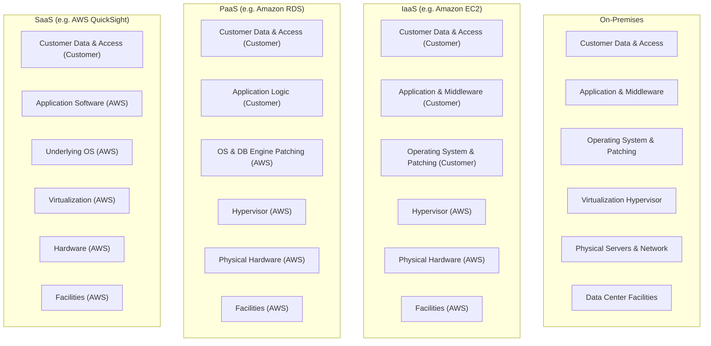
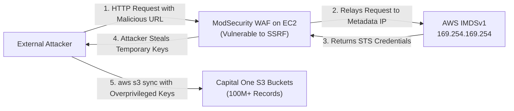
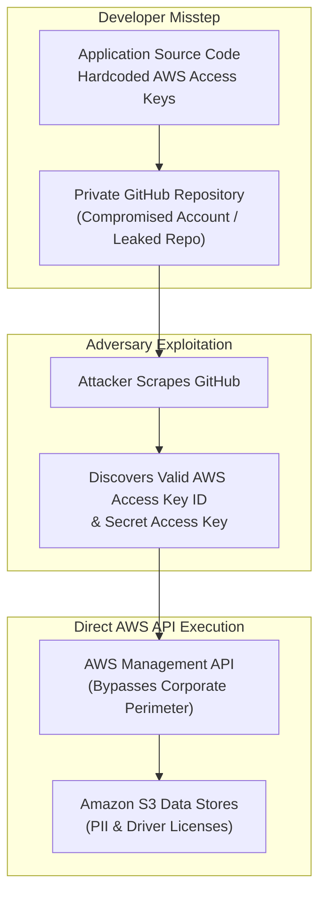
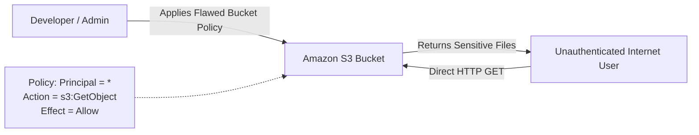

## Overview

[Shared Responsibility Model](https://tryhackme.com/room/sharedresponsibilitymodel) is Room 1.2 in Module 1 (**Welcome to AWS**) of TryHackMe's **Defending AWS** learning path. One of the most prevalent misconceptions in cloud migration is the belief that moving infrastructure to a major Cloud Service Provider (CSP) like AWS automatically absolves an organization of security management.

In reality, cloud security is a collaborative contract divided into two distinct domains:
1. **Security OF the Cloud (AWS Responsibility):** Protecting the global physical infrastructure, data centers, hardware servers, network cables, and host virtualization layer.
2. **Security IN the Cloud (Customer Responsibility):** Protecting everything deployed on top of AWS, including customer data, IAM policies, access credentials, operating system patching, application code, and firewall configurations.

This room breaks down the demarcation lines across Infrastructure as a Service (IaaS), Platform as a Service (PaaS), and Software as a Service (SaaS), followed by an architectural post-mortem of landmark cloud breaches (Capital One, Uber, and misconfigured S3 storage buckets).

---

## 1. The Anatomy of Shared Responsibility

The boundary between customer and provider responsibilities shifts dynamically depending on the selected deployment model:



### Security OF the Cloud (AWS Obligations)
AWS owns the foundational infrastructure:
- **Physical Data Center Security:** Perimeter fences, biometric access gates, security guards, surveillance cameras, and strict hardware decommissioning procedures.
- **Hardware Maintenance:** Replacement of defective hard drives, RAM, and server motherboards.
- **Global Network Backbone:** Fiber-optic transatlantic cables, edge locations, and distributed denial-of-service (DDoS) mitigation at the network layer via AWS Shield Standard.
- **Virtualization Hypervisors:** Isolation between guest virtual machines using the AWS Nitro System or customized Xen hypervisors, preventing cross-tenant memory snooping.

### Security IN the Cloud (Customer Obligations)
The customer owns everything constructed inside the cloud tenancy:
- **Data Protection:** Classifying sensitive data, applying cryptographic encryption at rest (KMS) and in transit (TLS), and managing backup retention.
- **Identity and Access Management (IAM):** Provisioning users, enforcing Multi-Factor Authentication (MFA), defining least-privilege permission policies, and rotating access keys.
- **Operating System Management (IaaS):** Applying kernel security updates, configuring local firewalls, disabling unneeded services, and hardening host configuration.
- **Network Filtering:** Creating Virtual Private Clouds (VPCs), defining Security Groups (stateful virtual firewalls), and managing Network ACLs (stateless subnet filters).

---

## 2. Comparing Service Delivery Models

| Cloud Service Model | Primary Examples | AWS Security Domain | Customer Security Domain |
|---|---|---|---|
| **IaaS (Infrastructure as a Service)** | Amazon EC2, Amazon EBS, Amazon VPC | Hardware, physical facilities, hypervisor | Guest OS, software updates, firewall rules, routing, IAM, data |
| **PaaS (Platform as a Service)** | Amazon RDS, AWS Elastic Beanstalk, AWS Lambda | Hardware, virtualization, OS patching, database engine updates | Schema design, database connection credentials, IAM, application code, data |
| **SaaS (Software as a Service)** | Amazon QuickSight, AWS WorkDocs | Full application stack, infrastructure, maintenance, patching | User provisioning, role assignment, MFA enforcement, data governance |

### The Golden Rule of Shared Responsibility
Regardless of whether you run bare-metal instances in IaaS or serverless functions in SaaS: **The customer is ALWAYS responsible for customer data and access management.** AWS never inspects or manages your data access controls.

---

## 3. Real-World Case Study 1: Capital One (Cloud Misuse Pattern)

In 2019, an attacker exfiltrated over 100 million customer credit card applications and bank account records from Capital One's AWS environment.



### Attack Mechanics and Root Cause
1. **The Entry Point (SSRF):** The attacker targeted a Web Application Firewall (WAF) deployed on an Amazon EC2 instance. The WAF software contained a Server-Side Request Forgery (SSRF) flaw, allowing external users to force the EC2 instance into executing internal network requests.
2. **Metadata Harvest:** The attacker directed the WAF to query the AWS Instance Metadata Service (IMDSv1) at `http://169.254.169.254/latest/meta-data/iam/security-credentials/`.
3. **Overpowered IAM Role:** The EC2 instance was attached to an IAM instance profile with broad wildcard permissions (`s3:*`) across hundreds of data buckets.
4. **Data Exfiltration:** Armed with the temporary STS credentials returned by IMDS, the attacker ran `aws s3 sync` from their local machine, draining customer records.

### Why this Failed the Shared Responsibility Model
The underlying AWS infrastructure (the physical server, the hypervisor, the network cables) functioned flawlessly. The breach succeeded entirely due to **customer-managed misconfigurations**:
- Capital One deployed vulnerable, misconfigured WAF software on EC2.
- Capital One assigned excessive administrative privileges to the EC2 instance role.
- Capital One had not upgraded to **IMDSv2**, which requires session-oriented PUT requests and token headers that prevent simple SSRF traversal.

---

## 4. Real-World Case Study 2: Uber (Exposed Credentials)

In 2016, attackers compromised personal data belonging to 57 million Uber users and 600,000 drivers.



### Attack Mechanics and Root Cause
- Software engineers embedded long-term AWS access keys directly inside application source code.
- This code was pushed to a private GitHub repository. When external attackers gained unauthorized access to the repository, they harvested the plaintext credentials.
- Because the keys lacked IP-restriction conditions and Multi-Factor Authentication requirements, the attackers authenticated directly to the AWS API from external workstations, downloading databases stored in S3.

### Shared Responsibility Breakdown
AWS provides native, secure secret management tools (such as AWS Secrets Manager, Systems Manager Parameter Store, and IAM Instance Roles). Storing long-term credentials in source code and leaving repositories vulnerable is an absolute failure of **Security IN the Cloud**.

---

## 5. Real-World Case Study 3: "It Was Just a Bucket"

Storage leaks remain the single most common cause of public cloud data disclosure:



### The S3 Public Exposure Reality
- By default, every newly created Amazon S3 bucket is **private**. No public read access is granted out-of-the-box.
- Breaches occur when administrators modify Access Control Lists (ACLs) to grant `Everyone` or `AllUsers` read access, or craft bucket policies allowing `Principal: *`.
- AWS subsequently introduced **S3 Block Public Access**, an account-wide and bucket-wide master kill switch that overrides any permissive ACLs or policies.
- If a customer turns off S3 Block Public Access and attaches a public policy, the resulting disclosure is 100% the customer's legal and operational responsibility.

---

## 6. Defensive Engineering Checklist

To enforce the customer side of the Shared Responsibility Model:

1. **Mandate IMDSv2 Across All EC2 Instances:**
   Prevent SSRF credential harvesting by disabling IMDSv1 globally or at launch:
   ```bash
   aws ec2 modify-instance-metadata-options \
       --instance-id i-0123456789abcdef0 \
       --http-tokens required \
       --http-put-response-hop-limit 1 \
       --http-endpoint enabled
   ```
2. **Enable Account-Level S3 Block Public Access:**
   Enforce the master override preventing public bucket configurations:
   ```bash
   aws s3control put-public-access-block \
       --account-id 123456789012 \
       --public-access-block-configuration "BlockPublicAcls=true,IgnorePublicAcls=true,BlockPublicPolicy=true,RestrictPublicBuckets=true"
   ```
3. **Automate Secret Scanning in CI/CD:**
   Prevent exposed access keys from reaching GitHub or GitLab using tools like TruffleHog and Gitleaks in pre-commit hooks.
4. **Prune IAM Role Permissions:**
   Never attach `AdministratorAccess` or wildcard `s3:*` policies to compute workloads. Scope instance profiles strictly to the specific bucket ARNs required for application operations.

---

## 7. Step-by-Step Task Walkthrough

### Task 1: Introduction

This task introduces the foundational concept of the Shared Responsibility Model, outlining how security duties are divided between cloud providers and customers.

- **Question:** I understand the goals of this room.
- **Answer:** `No answer needed`

---

### Task 2: Shared Responsibility Model Overview

Task 2 explores the structural boundary between Security OF the Cloud and Security IN the Cloud.
- In Infrastructure as a Service (IaaS), customers retain the highest degree of operational control (managing OS, software, firewalls, and data).
- In Platform as a Service (PaaS), AWS manages the underlying operating system and runtime.
- In Software as a Service (SaaS), the provider manages the entire application, but the customer remains responsible for customer data and access permissions.

#### Questions and Answers for Task 2

1. **Question:** What model of cloud service gives the customer the most control over their environment?
   - **Answer:** `IaaS`

2. **Question:** In which cloud model does the customer only manage their data and access permissions while the provider manages the entire application?
   - **Answer:** `SaaS`

---

### Task 3: Real-world Example: Capital One - Cloud Misuse Pattern

Task 3 breaks down the Capital One breach:
- The attacker exploited an unpatched Server-Side Request Forgery (SSRF) flaw in a ModSecurity Web Application Firewall running on EC2.
- The WAF requested temporary credentials from the AWS Instance Metadata Service (`169.254.169.254`).
- Over-privileged IAM role permissions allowed the attacker to dump over 100 million records from S3.

#### Questions and Answers for Task 3

1. **Question:** What type of vulnerability did the attacker exploit on the WAF to query the AWS metadata service?
   - **Answer:** `SSRF`

2. **Question:** Under the Shared Responsibility Model, who was responsible for the misconfiguration of the WAF and the overly permissive IAM role?
   - **Answer:** `Customer`

---

### Task 4: Real-world Example: Uber - Exposed Credentials

Task 4 analyzes the Uber credential exposure:
- Developers committed source code containing hardcoded AWS access keys into a private GitHub repository.
- Attackers compromised the repository and used the keys to access S3 data stores directly.

#### Questions and Answers for Task 4

1. **Question:** Where were the AWS credentials improperly stored and exposed in the Uber breach?
   - **Answer:** `GitHub`

2. **Question:** Under the Shared Responsibility Model, who is responsible for managing, rotating, and securing API credentials?
   - **Answer:** `Customer`

---

### Task 5: Real-world Example: "It Was Just a Bucket"

Task 5 covers storage bucket misconfigurations:
- Amazon S3 buckets are private by default.
- Permissive bucket policies or disabled S3 Block Public Access expose data to unauthenticated internet users.

#### Questions and Answers for Task 5

1. **Question:** What is the default access permission status for newly created Amazon S3 buckets?
   - **Answer:** `Private`

2. **Question:** Who is responsible for configuring access policies and ensuring S3 buckets are not inadvertently made public?
   - **Answer:** `Customer`

---

### Task 6: Recap Exercise

Task 6 provides an interactive matching exercise testing classification of responsibilities across IaaS, PaaS, and SaaS environments:
- Categorizing physical security, hypervisor isolation, guest OS patching, and data encryption.
- Successfully categorizing all components completes the challenge and provides the flag.

#### Questions and Answers for Task 6

1. **Question:** Complete the recap exercise. What is the completion flag?
   - **Answer:** `THM{flag_as_a_service!}`

---

### Task 7: Conclusion

Task 7 summarizes the fundamental rule: Cloud migration changes how infrastructure is consumed, but accountability for data and access controls remains permanently with the customer.

- **Question:** I understand the Shared Responsibility Model and am ready to proceed!
- **Answer:** `No answer needed`

---

## Complete Question and Answer Summary

| Task | Question / Scenario | Answer |
|---|---|---|
| **Task 1** | I understand the goals of this room. | `No answer needed` |
| **Task 2 (Q1)** | What model of cloud service gives the customer the most control over their environment? | `IaaS` |
| **Task 2 (Q2)** | In which cloud model does the customer only manage data and access while the provider manages the application? | `SaaS` |
| **Task 3 (Q1)** | What type of vulnerability did the attacker exploit on the WAF to query the AWS metadata service? | `SSRF` |
| **Task 3 (Q2)** | Under the Shared Responsibility Model, who was responsible for the WAF and IAM misconfigurations? | `Customer` |
| **Task 4 (Q1)** | Where were the AWS credentials improperly stored and exposed in the Uber breach? | `GitHub` |
| **Task 4 (Q2)** | Under the Shared Responsibility Model, who is responsible for securing API credentials? | `Customer` |
| **Task 5 (Q1)** | What is the default access permission status for newly created Amazon S3 buckets? | `Private` |
| **Task 5 (Q2)** | Who is responsible for configuring access policies and preventing public exposure? | `Customer` |
| **Task 6** | Complete the recap exercise. What is the completion flag? | `THM{flag_as_a_service!}` |
| **Task 7** | I understand the Shared Responsibility Model and am ready to proceed! | `No answer needed` |

---

## You can find me online at:


- **GitHub:** [Mhdomer](https://github.com/Mhdomer)
- **LinkedIn:** [mhd3omar](https://www.linkedin.com/in/mhd3omar/)
- **Tryhackme:** [nonlouy](https://tryhackme.com/p/nonlouy)
