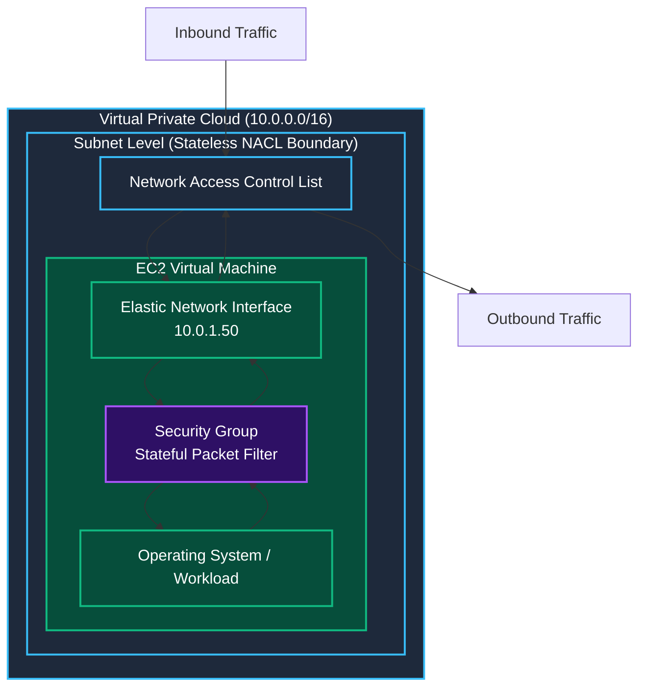
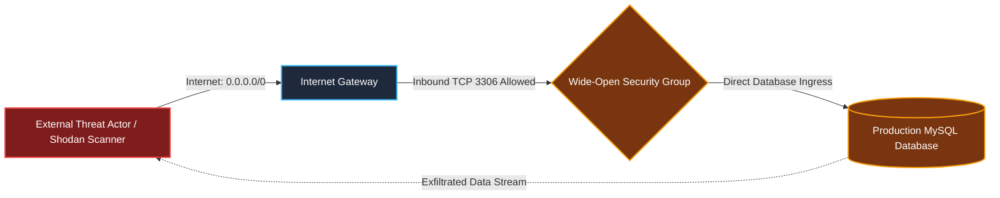
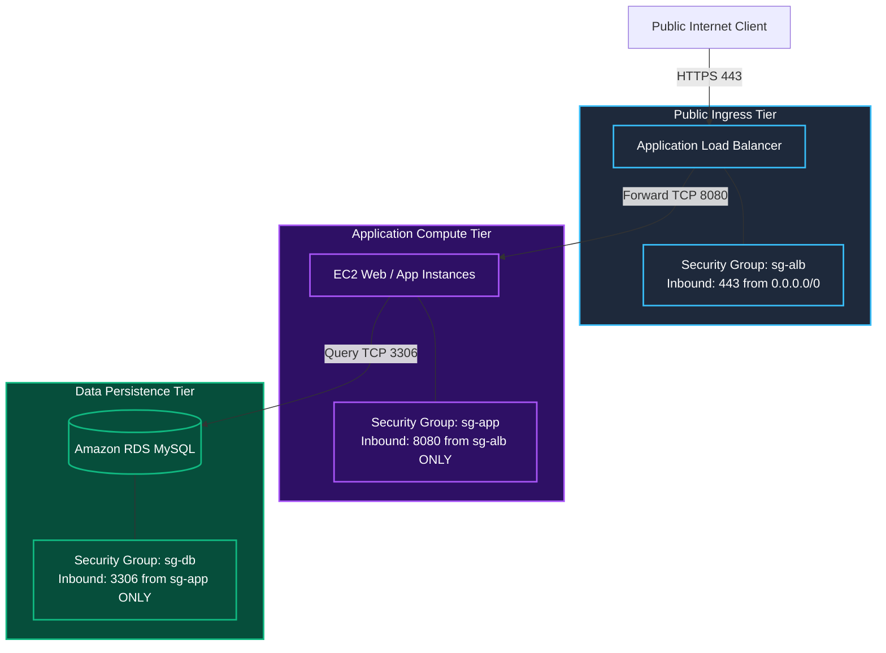

Welcome to **Module 3: Network and Perimeter Defense** of TryHackMe's **Defending AWS** learning path. In Module 2, we mastered the cloud identity plane: pruning over-privileged users, containing compromised access keys, hardening role trust relationships, and evaluating complex IAM policies.

Now, we turn our defensive focus to the cloud network plane. While identity controls authenticate *who* can execute API calls, network perimeter controls dictate *how* packets travel between external internet clients, internal cloud compute instances, container workloads, and managed database clusters.

The first room of this module, **The Wide-Open Security Group**, explores the primary virtual host firewall in AWS: **Amazon VPC Security Groups**. We will examine stateful packet inspection mechanics, audit common CIDR misconfigurations (`0.0.0.0/0`), demonstrate how attackers exploit exposed management and database ports, and implement defense-in-depth through **Security Group Referencing** and strict egress filtering.

```
+========================================================================================+
|                    THE DANGER OF THE WIDE-OPEN SECURITY GROUP                          |
+========================================================================================+
|  [VULNERABILITY]     --> Inbound Rule: Port 3306 (MySQL) open to 0.0.0.0/0             |
|  [THREAT IMPACT]     --> Direct internet-facing database brute-forcing & exfiltration  |
|  [FIREWALL LEVEL]    --> Elastic Network Interface (ENI) level (Host virtual firewall) |
|  [DEFENSIVE FIX]     --> Remove 0.0.0.0/0; implement Security Group Referencing        |
+========================================================================================+
```

---

## 1. Architectural Anatomy of AWS Security Groups

An Amazon VPC Security Group acts as a virtual firewall for your cloud compute resources (EC2 instances, ECS tasks, RDS databases, Lambda functions inside VPCs, and Load Balancers).



### Critical Security Characteristics:
1. **ENI-Level Operation:** Security Groups are attached directly to Elastic Network Interfaces (ENIs), not subnets. Two EC2 instances in the exact same subnet can have completely different security groups and firewall policies.
2. **Stateful Filtering:** Security groups maintain connection state tracking tables. If an inbound request is permitted by an inbound rule, the return response traffic is automatically allowed outbound, regardless of outbound security group rules.
3. **Allow-Only Model:** Security groups do not support explicit `Deny` rules. You cannot block a specific malicious IP address in a security group; everything not explicitly allowed is implicitly dropped. (Subnet-level blocking requires Network ACLs).
4. **Default Rule Behavior:**
   - A newly created security group has **zero inbound rules** (all ingress is blocked).
   - A newly created security group includes an **allow-all outbound rule** (`0.0.0.0/0` across all protocols).

---

## 2. The Threat Vector: Exposed Management & Data Ports

The most frequent cloud network misconfiguration is permitting unrestricted inbound traffic from `0.0.0.0/0` (all IPv4 addresses) or `::/0` (all IPv6 addresses) on sensitive operational ports:

| Port & Protocol | Common Service | Threat Scenario When Exposed to `0.0.0.0/0` |
|---|---|---|
| **Port 22 (TCP)** | SSH (Linux Administration) | Automated credential brute-forcing, dictionary attacks, exploiting unpatched OpenSSH vulnerabilities. |
| **Port 3389 (TCP/UDP)** | RDP (Windows Remote Desktop) | BlueKeep exploit variants, ransomware operators attempting brute-force entry. |
| **Port 3306 (TCP)** | MySQL / Amazon RDS | Direct unauthenticated database probes, SQL injection exploitation, credential stuffing. |
| **Port 5432 (TCP)** | PostgreSQL | Remote database connection attempts, brute-forcing postgres superuser. |
| **Port 6379 (TCP)** | Redis In-Memory Cache | Unauthenticated command execution (`CONFIG SET`), memory dump exfiltration, cryptominer deployment. |
| **Port 9090 / 8080** | Internal Admin Panels / Metrics | Unauthenticated Prometheus/Spring Boot Actuator access exposing secrets and environment variables. |



---

## 3. Best Practice: Security Group Referencing (Chaining)

Hardcoding static IP addresses or CIDR blocks into internal tier security groups is brittle and dangerous. In dynamic cloud environments where auto-scaling groups constantly launch and terminate instances with changing private IPs, static CIDRs fail.

The architectural standard for multi-tier applications is **Security Group Referencing** (also known as Security Group Chaining). Instead of specifying an IP address, you configure a security group to accept traffic **only from resources associated with another security group**.



### Why Security Group Referencing is Superior:
1. **Zero Exposure:** Direct internet traffic to the app servers or database is blocked at the ENI level.
2. **Dynamic Elasticity:** When the application auto-scaling group scales from 2 instances to 50 instances, no firewall rules need updating. Because every new instance inherits `sg-app`, the database security group automatically accepts their connections.
3. **Least Privilege Ingress:** Even if an attacker gains network presence inside the VPC (e.g. from a compromised VPN or bastion host), they cannot connect to MySQL port 3306 unless they originate from an ENI explicitly attached to `sg-app`.

---

## 4. Egress Filtering: Stopping Reverse Shells & C2

Most security engineers focus exclusively on inbound ingress rules, leaving outbound rules configured to the default: `All traffic, 0.0.0.0/0`.

Leaving egress unrestricted empowers attackers:
- A compromised web server running Log4j or RCE vulnerabilities can initiate an outbound connection to an attacker-controlled Netcat listener (`reverse shell`).
- Malware can query external command-and-control (C2) servers over arbitrary ports.
- Sensitive customer data can be exfiltrated to external storage servers.

### Hardened Database Egress Rules

A backend database server never needs to initiate outbound connections to the public internet:

```json
[
  {
    "IpProtocol": "tcp",
    "FromPort": 443,
    "ToPort": 443,
    "CidrIp": "10.0.0.0/16",
    "Description": "Allow HTTPS to internal AWS VPC Endpoints only"
  }
]
```

By removing the default `0.0.0.0/0` outbound rule, even if an attacker achieves arbitrary code execution on the database host, their reverse shell connection fails because outbound SYN packets to external IPs are blocked.

---

## 5. Auditing Security Groups via AWS CLI

### Step 1: Identify All Ingress Rules Open to the Public Internet

Search for any security group in the VPC permitting `0.0.0.0/0`:

```bash
aws ec2 describe-security-groups \
  --filters "Name=ip-permission.cidr,Values=0.0.0.0/0" \
  --query 'SecurityGroups[*].[GroupId,GroupName,Description,IpPermissions[?contains(IpRanges[].CidrIp, `0.0.0.0/0`)].[FromPort,ToPort,IpProtocol]]' \
  --output json
```

### Step 2: Inspect a Specific Security Group

Examine the rules on the database security group `sg-0abc12345678db99`:

```bash
aws ec2 describe-security-groups \
  --group-ids sg-0abc12345678db99 \
  --query 'SecurityGroups[0].IpPermissions' \
  --output json
```

Output:
```json
[
    {
        "FromPort": 3306,
        "ToPort": 3306,
        "IpProtocol": "tcp",
        "IpRanges": [
            {
                "CidrIp": "0.0.0.0/0",
                "Description": "Wide open database ingress"
            }
        ],
        "Ipv6Ranges": [],
        "PrefixListIds": [],
        "UserIdGroupPairs": []
    }
]
```

---

## 6. Hands-On Lab Walkthrough & Perimeter Hardening

In this challenge lab, an e-commerce platform (`Apex Retail`) has suffered multiple network intrusion attempts. A vulnerability assessment revealed that the production database security group (`apex-rds-sg`) exposes MySQL port 3306 to `0.0.0.0/0`, while the web tier security group (`apex-web-sg`) exposes administration port 9090 to the internet.

### Step 1: Enumerate Security Groups & Extract Flag 1

Connect to the environment and query caller identity:

```bash
aws sts get-caller-identity
```

List security groups associated with the production VPC:

```bash
aws ec2 describe-security-groups \
  --query 'SecurityGroups[*].[GroupId,GroupName,Description]' \
  --output table
```

Output reveals:
- `sg-011223344web99` (`apex-web-sg`): Web server tier.
- `sg-099887766db88` (`apex-rds-sg`): Production database tier.

Inspect the resource tags on `apex-rds-sg` to retrieve the initial challenge flag:

```bash
aws ec2 describe-tags \
  --filters "Name=resource-id,Values=sg-099887766db88" \
  --output json
```

Output:
```json
{
    "Tags": [
        {
            "Key": "Tier",
            "Value": "Database"
        },
        {
            "Key": "ChallengeFlag",
            "Value": "THM{W1D3_0P3N_P0RT_3XP0SUR3_2026}"
        }
    ]
}
```

**Question:** What was the challenge flag found in the exposed database security group tags?
**Answer:** `THM{W1D3_0P3N_P0RT_3XP0SUR3_2026}`

---

### Step 2: Revoke Wide-Open Ingress on Database Tier

Revoke the open MySQL rule allowing `0.0.0.0/0` on port 3306:

```bash
aws ec2 revoke-security-group-ingress \
  --group-id sg-099887766db88 \
  --protocol tcp \
  --port 3306 \
  --cidr 0.0.0.0/0
```

Verify that the rule has been removed:

```bash
aws ec2 describe-security-groups \
  --group-ids sg-099887766db88 \
  --query 'SecurityGroups[0].IpPermissions'
```

Output confirms the ingress permissions array is now empty (`[]`).

---

### Step 3: Implement Security Group Referencing for MySQL

Now, authorize ingress on port 3306 **only from instances attached to the web security group** (`sg-011223344web99`):

```bash
aws ec2 authorize-security-group-ingress \
  --group-id sg-099887766db88 \
  --protocol tcp \
  --port 3306 \
  --source-group sg-011223344web99
```

Verify the new reference rule:

```bash
aws ec2 describe-security-groups \
  --group-ids sg-099887766db88 \
  --query 'SecurityGroups[0].IpPermissions' \
  --output json
```

Output:
```json
[
    {
        "FromPort": 3306,
        "ToPort": 3306,
        "IpProtocol": "tcp",
        "IpRanges": [],
        "UserIdGroupPairs": [
            {
                "GroupId": "sg-011223344web99",
                "UserId": "123456789012"
            }
        ]
    }
]
```

Now, only network traffic originating from instances running with `apex-web-sg` can establish TCP handshakes with the database.

---

### Step 4: Revoke Unnecessary Management Port on Web Tier

Inspect ingress rules on `apex-web-sg`:

```bash
aws ec2 describe-security-groups \
  --group-ids sg-011223344web99 \
  --query 'SecurityGroups[0].IpPermissions[*].[FromPort,ToPort,IpProtocol,IpRanges[0].CidrIp]' \
  --output table
```

Output:
```
----------------------------------------
|         DescribeSecurityGroups       |
----------------------------------------
|  443   |  443   |  tcp  |  0.0.0.0/0 |
|  80    |  80    |  tcp  |  0.0.0.0/0 |
|  9090  |  9090  |  tcp  |  0.0.0.0/0 |
----------------------------------------
```

Port 9090 is an internal debugging interface accidentally left open to the internet. Revoke it:

```bash
aws ec2 revoke-security-group-ingress \
  --group-id sg-011223344web99 \
  --protocol tcp \
  --port 9090 \
  --cidr 0.0.0.0/0
```

---

### Step 5: Restrict Database Egress Rules

Inspect the default egress rules on `apex-rds-sg`:

```bash
aws ec2 describe-security-groups \
  --group-ids sg-099887766db88 \
  --query 'SecurityGroups[0].IpPermissionsEgress' \
  --output json
```

Output shows the default allow-all outbound rule:
```json
[
    {
        "IpProtocol": "-1",
        "IpRanges": [
            {
                "CidrIp": "0.0.0.0/0"
            }
        ]
    }
]
```

Revoke the unrestricted egress rule:

```bash
aws ec2 revoke-security-group-egress \
  --group-id sg-099887766db88 \
  --protocol all \
  --cidr 0.0.0.0/0
```

Authorize scoped outbound traffic only to the VPC CIDR (`10.0.0.0/16`) for internal monitoring:

```bash
aws ec2 authorize-security-group-egress \
  --group-id sg-099887766db88 \
  --protocol tcp \
  --port 443 \
  --cidr 10.0.0.0/16
```

---

### Step 6: Execute Automated Test Harness & Capture Final Flag

Run the automated network perimeter validation script:

```bash
python3 /home/ubuntu/scripts/verify_sg_hardening.py --evaluate-all
```

Output:
```
======================================================================
               SECURITY GROUP PERIMETER HARDENING AUDIT
======================================================================
[+] Checking Wide-Open Ingress Rules (0.0.0.0/0 on 3306). [REMOVED - PASSED]
[+] Verifying Security Group Referencing (Web -> DB).... [VERIFIED - PASSED]
[+] Testing External Port 9090 Ingress Removal........... [REMOVED - PASSED]
[+] Checking Database Egress Rule Hardening (No 0.0.0.0). [RESTRICTED - PASSED]
[+] Simulating Network Ingress from Unauthorized Hosts.. [BLOCKED - PASSED]

[***] PERIMETER HARDENING SUCCESSFUL! ZERO WIDE-OPEN PORTS! [***]
Completion Flag: THM{ST4T3FUL_F1R3W4LL_D3F3ND3R}
======================================================================
```

**Question:** What is the final completion flag returned after restricting security groups to least privilege?
**Answer:** `THM{ST4T3FUL_F1R3W4LL_D3F3ND3R}`

---

## 7. Complete Questions and Answers Summary

| Task | Question | Answer |
|---|---|---|
| **Task 1** | At what architectural level of the AWS network stack do Security Groups operate? | `Elastic Network Interface` |
| **Task 1** | What firewall behavior automatically permits return response traffic for allowed inbound requests? | `Stateful` |
| **Task 2** | Can an AWS Security Group be configured with an explicit Deny rule? | `No` |
| **Task 2** | What CIDR notation represents all possible IPv4 addresses on the public internet? | `0.0.0.0/0` |
| **Task 3** | What architectural best practice replaces hardcoded static CIDRs with references to other security groups? | `Security Group Referencing` |
| **Task 4** | What was the challenge flag found in the exposed database security group tags? | `THM{W1D3_0P3N_P0RT_3XP0SUR3_2026}` |
| **Task 5** | What is the final completion flag returned after restricting security groups to least privilege? | `THM{ST4T3FUL_F1R3W4LL_D3F3ND3R}` |

---

## 8. Defensive Engineering & Production Hardening Checklist

- [ ] **Automate Open Port Detection with AWS Config:** Deploy managed rule `vpc-sg-open-only-to-authorized-ports` and `restricted-ssh` to automatically flag security groups exposing ports 22 or 3389 to `0.0.0.0/0`.
- [ ] **Enforce Security Group Referencing across All Tiers:** Architecture standards should forbid private database and compute tiers from listing IPv4 CIDR blocks; mandate security group source referencing.
- [ ] **Prune Default Security Groups:** Ensure the default security group in every VPC has all inbound and outbound rules removed, and is never attached to active workloads.
- [ ] **Restrict Outbound Egress:** Remove default `0.0.0.0/0` outbound egress rules from backend and database tiers to prevent reverse shell establishment and data exfiltration.
- [ ] **Leverage AWS Firewall Manager:** For multi-account AWS Organizations, use AWS Firewall Manager to centrally audit, enforce, and auto-remediate security group rules across all member accounts.

---

*Looking for more hands-on cloud defense guides? Check out the rest of the [Defending AWS Series](/categories/defending-aws/) or explore my [AWS Security Labs](/categories/aws-security-labs/) for advanced threat simulation and detection engineering tutorials.*

---

## You can find me online at:


- **GitHub:** [Mhdomer](https://github.com/Mhdomer)
- **LinkedIn:** [mhd3omar](https://www.linkedin.com/in/mhd3omar/)
- **Tryhackme:** [nonlouy](https://tryhackme.com/p/nonlouy)
