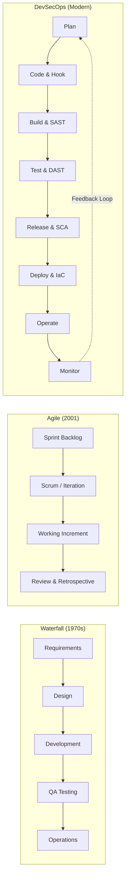
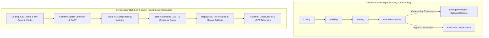
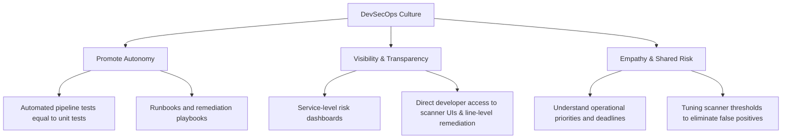

## Overview

[Introduction to DevSecOps](https://tryhackme.com/room/introductiontodevsecops) is the foundational room of TryHackMe's DevSecOps Learning Path. Before configuring automated SAST scanners, writing custom Semgrep rules, or hardening container runtimes, security engineers must understand the organizational and structural shifts that produced modern delivery pipelines.

Historically, software security was treated as a gatekeeper function positioned at the very end of the release lifecycle. This architecture inevitably produced severe velocity bottlenecks, toxic blame cycles between development and operations teams, and critical vulnerabilities leaking into production environments. DevSecOps resolves this friction by transforming security from an external audit gate into an automated, distributed, and shared engineering discipline.

---

## 1. The Evolution of Software Delivery Models

Software engineering methodologies evolved directly in response to scaling challenges, delivery friction, and infrastructure advancements.

### The Waterfall Model (1970s)
The Waterfall model adopted a strict linear-sequential structure inherited from traditional manufacturing and civil engineering disciplines. In this model, each phase had to be fully completed and signed off before the next could commence:

1. **Requirements Gathering:** Business analysts document specifications.
2. **System Design:** Architects design the technical framework.
3. **Implementation:** Developers build features in isolation.
4. **Verification (QA):** Quality assurance engineers run functional tests.
5. **Maintenance (Sysadmins):** System administrators deploy and monitor the software.

#### The Wall of Confusion and Blame Culture
In Waterfall organizations, rigid hierarchies created distinct silos. Developers were incentivized purely on feature delivery velocity, while system administrators were judged on infrastructure uptime and stability. 

When bugs or security flaws were discovered during testing or after deployment, the separation of responsibilities triggered friction and blame games:
- Developers claimed the code executed cleanly in their local development environment.
- System administrators pointed to configuration defects or stability issues.
- Security teams rejected releases days before deployment deadlines, forcing expensive code rewrites and severe backlog accumulation.

### The Agile Methodology (2001)
To break the rigid schedules of Waterfall, the [Agile Manifesto](https://agilemanifesto.org/) was established around four foundational values:
1. **Individuals and interactions** over processes and tools.
2. **Working software** over comprehensive documentation.
3. **Customer collaboration** over contract negotiation.
4. **Responding to change** over following a plan.

Agile introduced iterative sprints (typically 1 to 4 weeks), self-organizing teams, and continuous customer feedback. While Agile significantly accelerated feature iteration, it left deployment, infrastructure provisioning, and production operations largely unaddressed.

### DevOps: Uniting Delivery and Operations (2008-2009)
In 2008, discussions between Andrew Clay Shafer and Patrick Debois highlighted the ongoing gap between development speed and operational stability. Following the first "DevOpsDays" conference in Belgium in 2009, DevOps emerged as a transformative philosophy.

DevOps focuses on **cultural change** powered by automation, continuous feedback, and unified metrics (often formalized under the **C.A.L.M.S.** framework: Culture, Automation, Lean, Measurement, and Sharing).

#### Key DevOps Infrastructure Shifts
- **Self-Service Cloud Provisioning:** Developers spin up cloud resources without waiting weeks for manual IT tickets.
- **CI/CD Pipelines:** Automated workflows execute tests, build packages, and deploy software across ephemeral testing, staging, and production environments.
- **Declarative Infrastructure as Code (IaC):** Tools like Terraform, OpenTofu, and CloudFormation define target system states declaratively rather than running manual, error-prone imperative scripts.

---

## 2. The Shift-Left Security Paradigm

In traditional development, security was an external audit applied at the very end of the release pipeline. If testing revealed critical vulnerabilities, the application was blocked at the release gate, creating intense friction between security teams and engineering leadership under strict business deadlines.

### Why Organizations Shift Left
The fundamental driver for shifting left is the **Cost of Defect Resolution** (Boehm's Cost Curve). The economic cost to remediate a software vulnerability escalates exponentially across the delivery lifecycle:

| Phase | Relative Remediation Cost | Typical Impact |
|---|---|---|
| **Requirements / Design** | 1x (Baseline) | Immediate architecture correction, zero code refactoring |
| **Development (Coding)** | 5x | Developer updates code in branch before PR submission |
| **Build & Test** | 10x - 15x | CI build breaks, developer context-switches to fix branch |
| **Pre-Production Staging** | 20x - 30x | Release blocked, coordination across QA, Sec, and Dev |
| **Production** | 50x - 100x+ | Emergency hotfix, customer downtime, data breach exposure, legal liabilities |

Shifting left integrates security testing into early developer workflows so issues are surfaced when they are cheapest and fastest to fix.

---

## 3. Core DevSecOps Challenges and Antipatterns

Transitioning to DevSecOps is primarily an organizational and cultural transformation rather than a matter of buying security tools. Organizations frequently fall into three primary failure modes:

### 1. Security Silos
When organizations establish DevSecOps by simply rebranding an existing security team or assigning dedicated security engineers as manual pipeline gatekeepers, the silo persists.
- **Problem:** Specialized security engineers cannot scale alongside growing development teams. When developer-to-security ratios reach 50:1 or 100:1, manual code reviews grind delivery to a halt.
- **Remediation:** Security must operate as an engineering enablement platform. Rather than reviewing individual pull requests, security engineers build automated guardrails, provide self-service tools, and train development champions to make secure choices independently.

### 2. Lack of Visibility and Prioritization
Deploying automated security scanners without contextual tuning floods developers with hundreds of low-severity or irrelevant alerts.
- **Problem:** Without business context, developers suffer alert fatigue and ignore security notifications altogether. Critical risks become buried in noise.
- **Remediation:** Security telemetry must map directly to service ownership. Teams should have central dashboards displaying actionable risk metrics based on service criticality and exploitability. Scanners should run with tuned rule profiles that fail builds only on verifiable, high-impact flaws.

### 3. Stringent, Inflexible Processes
Forcing early-stage experiments or prototypes through the same heavy compliance audits required for payment-processing services stifles innovation.
- **Problem:** Developers seek ways to circumvent security controls (Shadow IT, untracked repositories) to meet deadlines.
- **Remediation:** Establish risk-tiered deployment paths. Provide isolated **Sandbox environments** (ephemeral environments with zero connectivity to internal production networks and zero sensitive data) where developers can test third-party libraries and novel architectures freely.

---

## 4. Building a High-Performance DevSecOps Culture

A sustainable DevSecOps practice rests on three operational pillars:

### Pillar 1: Promote Autonomy of Teams
Security tests must behave like standard automated tests (such as unit tests or integration suites). When a security check fails, developers should receive immediate, actionable feedback containing:
- The exact file and line number triggering the finding.
- A concise explanation of the vulnerability and exploitation mechanic.
- A concrete, copy-pasteable remediation recommendation or pull-request suggestion.

### Pillar 2: Visibility and Transparency
Both development and security teams must operate from the same telemetry:
- **Dashboards:** Service owners should track defect resolution rates and security debt across their own services.
- **Tool Accessibility:** Developers must have direct access to scanner interfaces (e.g., Semgrep dashboards, SonarQube consoles, Snyk reports) rather than receiving filtered PDF exports weeks later.

### Pillar 3: Empathy and Shared Risk
Security teams must recognize that security is one attribute of product quality alongside reliability, performance, and feature velocity:
- A platform team managing a non-exposed internal utility has a different risk profile than a public-facing API gateway handling credit card transactions.
- Security engineers who take the time to understand team architecture and delivery constraints build credibility, turning security from a policing function into a trusted partnership.

---

## 5. Task 7 Exercise Walkthrough: Fuel Trouble

Task 7 presents a scenario evaluating how three distinct project management approaches handle an exploratory space mission:
- **Objective:** Travel to the planet with the lowest risk.
- **Resource Constraints:** 130,000 Light Years of fuel available.
- **Crew:** SEC3PO (Security), X Fighter Dev (Developer), Chewba-QA (QA Tester), S2-A2 (Operations).
- **Candidates:** Testooine (125k LY), Hackboo (100k LY), TryHothMe (80k LY), Dagobug (60k LY).

### Scenario Analysis

```mermaid
flowchart TD
    subgraph Comic1["Comic 1: The Rigid Path"]
        C1A[Initial Decision: Testooine 125k LY] --> C1B[Follow original plan regardless of risk]
        C1B --> C1C[Outcome: Waterfall Model]
    end

    subgraph Comic2["Comic 2: The Adaptive Pivot"]
        C2A[High Risk flagged on Testooine] --> C2B[Test Naboo] --> C2C[Pivot course to Hoth based on feedback]
        C2C --> C2D[Outcome: Agile Model]
    end

    subgraph Comic3["Comic 3: Unified Cross-Functional Collaboration"]
        C3A[X Fighter Dev proposes Hoth] --> C3B[SEC3PO questions costs & calculates new trajectory parameters]
        C3B --> C3C[Chewba-QA validates data & routes safely to Dagobah]
        C3C --> C3D[Outcome: DevOps Model]
    end
```

#### Comic 1 Breakdown
- **Observation:** The team follows X Fighter Dev's initial decision to visit Testooine (125,000 Light Years away), pushing fuel limits to maximum capacity with zero flexibility or reassessment.
- **Methodology:** **Waterfall** (rigid execution of upfront plans despite operational risk).

#### Comic 2 Breakdown
- **Observation:** When high-risk indicators emerge regarding Testooine, the team reassesses and adaptively pivots flight course to Hoth.
- **Methodology:** **Agile** (iterative flexibility and responsiveness to changing environmental conditions).

#### Comic 3 Breakdown
- **Observation:** X Fighter Dev, SEC3PO, and Chewba-QA work in a synchronized loop. SEC3PO analyzes trajectory parameters, questions resource consumption, and re-tunes test parameters. Chewba-QA validates the findings, and the crew collectively decides to redirect orbit to Dagobah (60,000 Light Years).
- **Methodology:** **DevOps** (shared responsibility, cross-disciplinary integration, continuous optimization).
- **Flag Capture:** Completing the challenge awards the completion flag: `THM{ONE_TWO_THREE}`.

---

## 6. Question, Answer, and Flag Summary

| Task # | Task Title | Question / Challenge | Answer / Flag |
|---|---|---|---|
| **Task 1** | Introduction | I'm ready to start! | *No answer needed* |
| **Task 2** | DevOps: A New Hope | What methodology relies on self-organising teams that focus on constructive collaboration? | `Agile` |
| **Task 2** | DevOps: A New Hope | What methodology relies on automation and integration to drive cultural change and unite teams? | `DevOps` |
| **Task 2** | DevOps: A New Hope | What traditional approach to project management led to mistrust and poor communication between development teams? | `Waterfall` |
| **Task 2** | DevOps: A New Hope | What does DevOps emphasize? | `Cultural change` |
| **Task 3** | The Infinite Loop | What term is it used to describe accounting for security from the earliest stages in a development lifecycle? | `Shifting Left` |
| **Task 3** | The Infinite Loop | What is the development approach where security is introduced from the early stages of a development lifecycle until the final stages? | `DevSecOps` |
| **Task 5** | DevSecOps: Security Strikes Back | What DevSecOps challenge can lead to a siloed culture? | `Security Silos` |
| **Task 5** | DevSecOps: Security Strikes Back | What DevSecOps challenge can affect not prioritizing the right risks at the right times? | `Lack of visibility` |
| **Task 5** | DevSecOps: Security Strikes Back | What DevSecOps challenge stems from needlessly overcomplicated security processes? | `Stringent Processes` |
| **Task 6** | DevSecOps Culture | How can you make security scalable so it's not left behind when start ups face hypergrowth or in large corporations? | `Promote autonomy of teams` |
| **Task 6** | DevSecOps Culture | How can you support teams in understanding risk and educating on security flaws? | `Leading by example and promoting education` |
| **Task 6** | DevSecOps Culture | What are key factors to successfully instill security in the development process by accounting for flexibility? | `Understanding and empathy` |
| **Task 7** | Exercise: Fuel Trouble | What Software Development Model did the team in Comic 1 follow? | `Waterfall` |
| **Task 7** | Exercise: Fuel Trouble | What Software Development Model did the team in Comic 2 follow? | `Agile` |
| **Task 7** | Exercise: Fuel Trouble | What Software Development Model did the team in Comic 3 follow? | `DevOps` |
| **Task 7** | Exercise: Fuel Trouble | What is the flag? | `THM{ONE_TWO_THREE}` |

---

## You can find me online at:

- **GitHub:** [Mhdomer](https://github.com/Mhdomer)
- **LinkedIn:** [mhd3omar](https://www.linkedin.com/in/mhd3omar/)
- **Tryhackme:** [nonlouy](https://tryhackme.com/p/nonlouy)
