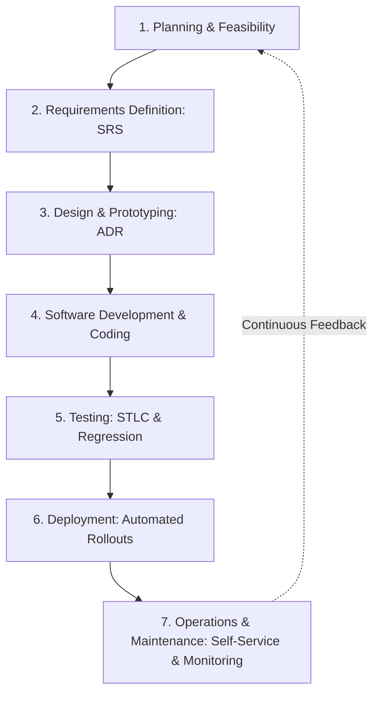
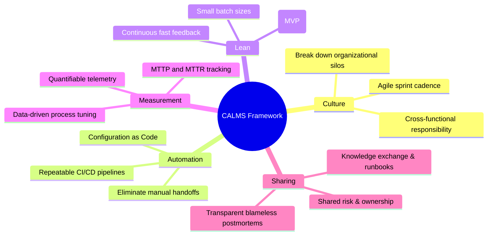
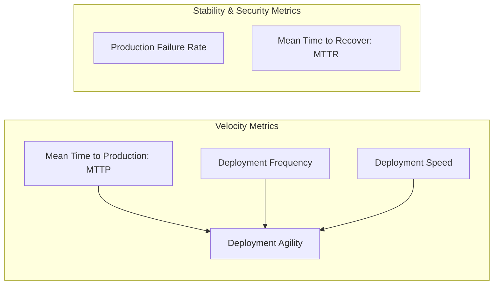

## Overview

The [SDLC](https://tryhackme.com/room/sdlc) room in TryHackMe's DevSecOps path examines the foundational stages through which software applications are planned, designed, implemented, tested, deployed, and maintained. Building secure software at scale requires an intimate understanding of each stage's deliverables, operational metrics, and governance models.

In this walkthrough, we break down standard 6-to-8 phase SDLC architectures, explore the **CALMS** organizational readiness framework, dissect critical DevOps delivery telemetry (MTTP, MTTR, Deployment Agility, and Change Failure Rates), and solve the **Production of the Droids** optimization simulation.

---

## 1. What is the Software Development Lifecycle (SDLC)?

The Software Development Lifecycle is a structured framework establishing repeatable processes and predictable outcomes across software development. By breaking complex engineering initiatives into defined phases, organizations can:
- Standardize technical specifications and architectural boundaries.
- Track developer velocity, resource utilization, and cost estimates.
- Introduce verifiable quality and security verification criteria before releasing artifacts to production.

Organizations typically structure their delivery workflows into **6 to 8 phases**, frequently combining or splitting stages based on their delivery model (e.g., merging testing and building in continuous integration pipelines).



---

## 2. Granular Breakdown of SDLC Phases

### Phase 1: Planning (Feasibility Stage)
The planning phase establishes project boundaries, business objectives, and resource allocation:
- **Scope Definition:** Identifies the technical problems being solved and demarcates project boundaries.
- **Feasibility Assessment:** Evaluates economic viability, infrastructure costs, and technical staffing requirements.
- **Risk Mitigation:** Detects scheduling risks, platform constraints, and delivery blockers early before capital is committed.

### Phase 2: Requirements Definition
Requirements engineering bridges customer expectations and technical implementation:
- **User Stories & Feature Sets:** Documents functional capabilities (e.g., social login, search indexing, transaction logging).
- **Software Requirement Specification (SRS):** A formal document outlining functional and non-functional requirements (throughput, latency, compliance targets, availability).
- **Resource Sizing:** Defines hardware dependencies, external API quotas, and storage tiers.

### Phase 3: Design and Prototyping
Translates business requirements into logical system architecture:
- **Architecture Design Review (ADR):** Collaborative architecture reviews ensuring database schemas, network topologies, API endpoints, authentication flows, and data boundary controls are agreed upon across engineering teams.
- **Platform Selection:** Selects programming runtimes, framework boilerplates, database instances (SQL vs NoSQL), and communication protocols (REST, gRPC, event-driven queues).
- **Security Baseline:** Outlines data-at-rest encryption, transport security (TLS), session handling, and secret storage architectures.

### Phase 4: Software Development (Implementation)
Engineers construct features according to design documents:
- **Code Hygiene & Guidelines:** Adherence to organizational linting standards, language-specific best practices, and code review checklists.
- **Playbooks & Documentation:** Internal runbooks and architecture decision records guiding code structure and dependencies.
- **Tooling:** Developers utilize local debuggers, compilers, interpreters, and pre-commit hooks to validate changes locally.

### Phase 5: Testing (Software Testing Lifecycle - STLC)
Testing validates that software components execute reliably and fulfill quality criteria without regressing existing features:
- **Test Case Design & Development:** QA engineers write simple, unique, and repeatable test cases validating functional edge cases and core workflows.
- **Test Environment Setup:** Mirroring target production environments (operating system versions, network constraints, memory quotas, and synthetic test datasets).
- **Test Execution:** Automated execution of functional unit tests, integration tests, performance stress tests, and regression suites.
- **Velocity Enablement:** Automated test suites run in minutes rather than days, maintaining high **developer velocity** (the measure of working engineering output delivered in a given timeframe).

### Phase 6: Deployment
Moving verified artifacts into live user-facing environments:
- **Release Automation:** Modern platforms leverage continuous delivery tools (e.g., Argo CD for Kubernetes, Netlify, or AWS CodeDeploy) to eliminate manual deployment errors.
- **Deployment Strategies:** Utilizing blue/green, rolling, or canary deployments to minimize user disruption.
- **Rollback Capabilities:** Immediate automated rollback mechanisms if health checks fail post-deployment.

### Phase 7: Operations and Maintenance
Post-release operational support and platform longevity:
- **Bug Remediation:** Triaging residual flaws and edge cases surfaced by real-world user traffic.
- **Self-Service Enablement:** Operations teams provide standardized, secure cloud templates and environments on-demand to developers.
- **Extensible Automation:** Managing systems through declarative "Everything as Code" (Ansible, Terraform, Vagrant) with integrated alerting and telemetry.

---

## 3. The CALMS Framework for DevOps Readiness

Coined by Jez Humble, the **CALMS** framework evaluates an organization's maturity and operational readiness to adopt DevOps culture:



- **Culture:** DevOps requires a cultural shift across engineering, QA, product, and operations. Organizations move away from monolithic releases toward rapid, iterative sprints where failure is treated as a learning opportunity.
- **Automation:** Replaces error-prone manual handoffs with automated pipelines. Mature teams adopt **Configuration as Code**, defining application parameters dynamically across development, staging, and production tiers.
- **Lean:** Embraces small batch sizes. Shipping a lean first iteration into users' hands provides immediate feedback and eliminates wasted engineering on unwanted features.
- **Measurement:** Every pipeline step must be monitored with actionable metrics to systematically eliminate bottlenecks.
- **Sharing:** Responsibility for uptime, security, and performance is shared collectively between developers and platform engineers.

---

## 4. Essential DevOps & Delivery Metrics

To integrate security smoothly into continuous delivery, security engineers must speak the language of operational velocity and reliability metrics:



### 1. Mean Time to Production (MTTP)
- **Definition:** The turnaround time from the moment a code commit is pushed to the repository until that code is running in a deployed production state.
- **Optimization:** Working in small batch sizes and maintaining high-speed automated testing pipelines dramatically shortens MTTP.

### 2. Deployment Frequency & Speed
- **Deployment Frequency:** How often an organization pushes changes into live production (ranging from multiple times per day to bi-weekly).
- **Deployment Speed:** The duration required to transition code from staging through rollout gates into live production.
- **Deployment Agility:** The composite metric calculated by combining deployment speed and deployment frequency.

### 3. Production Failure Rate
- **Definition:** The percentage of production releases that cause outages, degraded performance, or require emergency rollbacks and hotfixes.
- **Security Context:** Tracking failure rates in production verifies whether automated security scans and regression suites are catching critical flaws before release.

### 4. Mean Time to Recover (MTTR)
- **Definition:** The average duration required to restore full service after an unplanned disruption, outage, or critical security incident occurs in production.
- **Optimization:** Fast MTTR relies on automated monitoring, automated rollback triggers, and standardized runbooks.

### Communicating Risk Across Disciplines
- **DevSecOps perspective:** Risk represents the exploitability and business damage of an unpatched vulnerability.
- **DevOps perspective:** Risk represents high production failure rates, failed releases, or long MTTR.
- By framing security findings in terms of platform stability and deployment agility, security teams gain immediate developer buy-in.

---

## 5. Task 7 Simulation Walkthrough: Production of the Droids

Task 7 puts SDLC planning and resource optimization into practice through an interactive factory management simulation:

### Challenge Parameters
- **Seed Capital:** $1,000,000 provided by the Empire.
- **Target Goal:** Double the investment to at least $2,000,000 in net value.
- **Governing Law:** **Brooks's Law** (*The Mythical Man-Month*): *"Adding human resources to a late software project will make it later."*
- **Mechanism:** Hiring developers consumes budget, while allocating developer sprints across SDLC phases impacts manufacturing efficiency and defect rates.

```mermaid
flowchart TD
    A[Initial Capital: $1,000,000] --> B[Optimize Developer Headcount]
    B --> C[Mitigate Brooks's Law: Avoid Overhiring]
    C --> D[Balanced Sprint Allocation: Planning, Design, Dev, Testing]
    D --> E[Start Production Engine]
    E --> F[Double Investment: Value > $2,000,000]
    F --> G[Flag Captured: THM{Ruler.of.the.SDLC.Droids}]
```

### Optimal Strategy & Resolution
1. **Developer Allocation:** Hiring too many developers inflates communication overhead and exhausts seed capital without increasing output. A balanced team size (typically 3-5 developers) avoids the Brooks's Law penalty.
2. **Phase Distribution:** Distributing sprints heavily into **Planning** and **Testing** prevents costly defect remediation downstream, ensuring the droids pass production quality gates on first run.
3. **Execution:** Launching production with balanced sprint ratios easily exceeds the $2,000,000 return threshold, unlocking the challenge flag:

```text
THM{Ruler.of.the.SDLC.Droids}
```

---

## 6. Question, Answer, and Flag Summary

| Task # | Task Title | Question / Challenge | Answer / Flag |
|---|---|---|---|
| **Task 1** | Introduction | I'm ready to start! | *No answer needed* |
| **Task 2** | What is SDLC? | How many phases can an SDLC have? (Format X-Y) | `6-8` |
| **Task 3** | SDLC Phases Part 1 | What phase focuses on determining the first idea for a prototype? | `Requirements Definition` |
| **Task 3** | SDLC Phases Part 1 | What stage is also known as the "Feasibility Stage"? | `Planning Stage` |
| **Task 3** | SDLC Phases Part 1 | When do you outline the user interfaces and network requirements? | `Design and Prototyping` |
| **Task 4** | SDLC Phases Part 2 | What phase focuses on handling issues or bugs reported by end-users? | `Operations and Maintenance` |
| **Task 4** | SDLC Phases Part 2 | What phase involves releasing new versions of software? | `Deployment` |
| **Task 4** | SDLC Phases Part 2 | What phase ensures software meets the standards defined in the requirements phase? | `Testing` |
| **Task 5** | Keep CALMS | What does CALMS stand for? | `Culture, Automation, Lean, Measurement, and Sharing` |
| **Task 6** | DevOps Metrics | What 2 metrics are used to measure deployment agility? | `deployment speed and frequency` |
| **Task 6** | DevOps Metrics | What is an essential rate for engineers in Production environments to know if code meets security requirements? | `Production failure rate` |
| **Task 6** | DevOps Metrics | What is the measurement for recovery time after a failure? | `MTTR` |
| **Task 7** | Production of the Droids | What is the flag that you receive once you have doubled the empire's investment? | `THM{Ruler.of.the.SDLC.Droids}` |

---

## You can find me online at:


- **GitHub:** [Mhdomer](https://github.com/Mhdomer)
- **LinkedIn:** [mhd3omar](https://www.linkedin.com/in/mhd3omar/)
- **Tryhackme:** [nonlouy](https://tryhackme.com/p/nonlouy)
