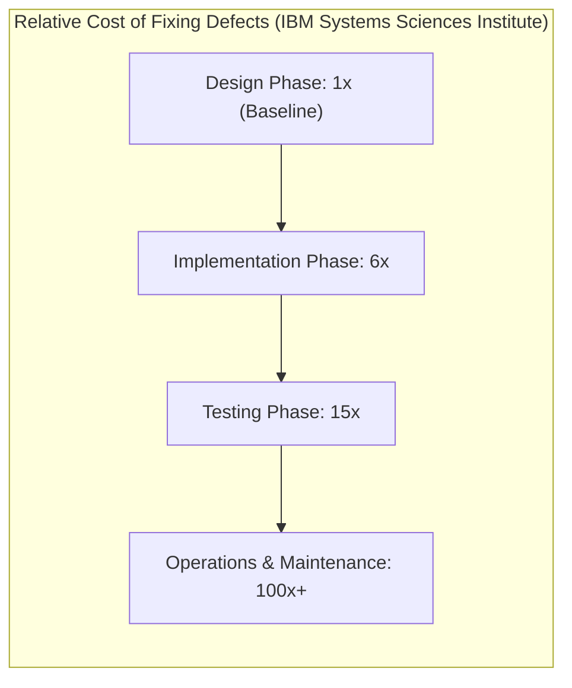
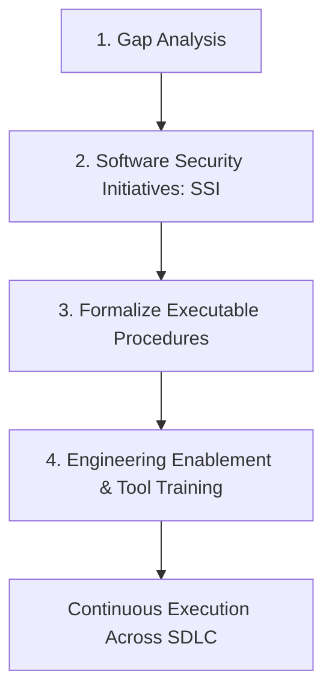
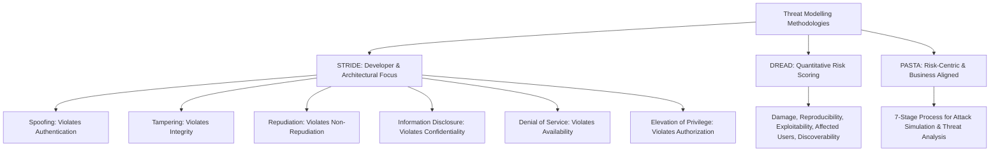
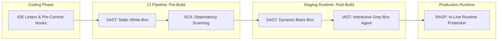
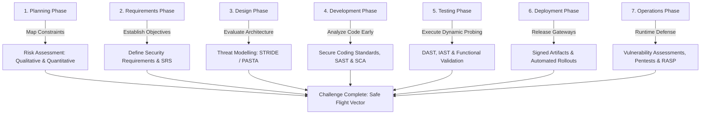

## Overview

The [SSDLC](https://tryhackme.com/room/ssdlc) room in TryHackMe's DevSecOps Learning Path explores the processes, threat assessment frameworks, and automated testing tools required to construct a comprehensive **Secure Software Development Lifecycle (S-SDLC)**. 

Rather than relying on end-of-cycle penetration tests that delay release schedules and require expensive architecture rewrites, modern DevSecOps integrates verification gates directly into planning, design, implementation, testing, deployment, and operations.

In this walkthrough, we examine the economics of early defect remediation, dissect qualitative and quantitative risk assessments, contrast threat modelling methodologies (STRIDE, DREAD, PASTA), compare automated code analysis tooling (SAST, SCA, DAST, IAST, RASP), review industry maturity models (Microsoft SDL, OWASP SAMM, BSIMM), and complete the **Secure Space Lifecycle** interactive challenge.

---

## 1. The Economics of the Secure SDLC

Traditional software models deferred security testing until pre-release quality assurance or post-deployment monitoring. Research published by the Systems Sciences Institute at IBM demonstrates why this sequential gating is economically unviable:



- **Design Phase (1x):** Resolving a security flaw during architectural design requires only a technical discussion (for example, mandating parameterized queries to eliminate SQL injection).
- **Implementation Phase (6x):** Resolving a flaw during active coding requires refactoring components, modifying local tests, and re-running code reviews.
- **Testing Phase (15x):** Surfacing a flaw during automated integration or QA testing breaks the build, context-switches developers away from current sprints, and triggers extensive regression testing cycles.
- **Operations & Maintenance (100x+):** Discovering vulnerabilities in production requires emergency hotfixes, rollbacks, potential customer notifications, regulatory fines (such as GDPR or HIPAA penalties), and substantial brand damage.

---

## 2. Establishing Organizational Security Posture

Before embedding tooling into development workflows, organizations must understand their baseline **Security Posture** through systematic assessment:



1. **Gap Analysis:** Evaluates what security policies exist versus how effectively engineering teams execute them. A policy without an associated automated check or procedure is ineffective.
2. **Software Security Initiatives (SSI):** Formulates realistic, measurable milestones (such as establishing a secure coding baseline or mandating secret-free commit histories).
3. **Formalize Procedures:** Provides teams with an operational onboarding window to review guidelines and provide feedback before automated pipeline blocking is enforced.
4. **Targeted Training:** Educates developers on vulnerability classes and tool usage before rolling out scanners, ensuring developers know how to interpret and resolve scanner alerts.

---

## 3. Risk Assessment: Qualitative vs Quantitative

Risk measures the likelihood of a threat exploiting a vulnerability and the resulting business impact. In an SSDLC, risk assessment must take place during the **Planning and Requirements** phases.

### Qualitative Risk Assessment
The most common assessment model, categorizing risks into descriptive bands (Low, Medium, High, Critical):

$$\text{Risk} = \text{Severity} \times \text{Likelihood}$$

- **Severity (Impact):** The extent of harm (data exposure, service interruption, unauthorized financial transactions).
- **Likelihood (Probability):** The realistic probability of occurrence based on target accessibility, attacker motivation, and exploit complexity.

### Quantitative Risk Assessment
Assigns measurable financial or numerical metrics to risk variables, enabling data-driven security investments:

$$\text{ALE} = \text{SLE} \times \text{ARO}$$

- **Single Loss Expectancy (SLE):** Total financial loss incurred from a single compromise event (Asset Value $\times$ Exposure Factor).
- **Annual Rate of Occurrence (ARO):** Estimated frequency of the incident occurring within a twelve-month period.
- **Annual Loss Expectancy (ALE):** Expected annual financial cost of the threat. If a mitigating security control costs less than the calculated ALE, the security investment is economically justified.

---

## 4. Threat Modelling Frameworks

Threat modelling is performed during the **Design Phase** before code is written. It examines software architecture through data flow diagrams (DFDs) to systematically identify trust boundaries and potential attack paths.



### STRIDE (Microsoft)
Developed by Microsoft and built upon the **CIA Triad** (Confidentiality, Integrity, Availability), STRIDE categorizes architectural threat vectors across data flows:

| Threat Category | Security Property Violated | Definition & Typical Vector |
|---|---|---|
| **Spoofing** | Authentication | Impersonating another user, service, or system (IP spoofing, credential replay). |
| **Tampering** | Integrity | Unauthorized modification of data in transit or at rest (parameter tampering, database manipulation). |
| **Repudiation** | Non-Repudiation | An entity performing an action without verifiable logging, allowing them to deny it. |
| **Information Disclosure** | Confidentiality | Exposing sensitive data to unauthorized parties (PII leakage, error traces, credential exposure). |
| **Denial of Service** | Availability | Exhausting CPU, memory, or network bandwidth, preventing legitimate access. |
| **Elevation of Privilege** | Authorization | Gaining higher execution permissions or administrative access through exploitation. |

### DREAD (Risk Rating Matrix)
Ranks and prioritizes discovered threats by assigning numerical ratings (0-10) across five dimensions:
- **Damage Potential:** How severe is the damage if exploited?
- **Reproducibility:** How easily can the attack be replicated reliably?
- **Exploitability:** What level of skill, tools, or authentication is required?
- **Affected Users:** What percentage of the user base or tenant accounts are impacted?
- **Discoverability:** How easily can an external attacker detect the flaw?

### PASTA (Process for Attack Simulation and Threat Analysis)
A 7-stage risk-centric threat model that aligns technical findings directly with business objectives:
1. Define Objectives (business context, regulatory scope).
2. Define Technical Scope (architecture, boundaries, data flows).
3. Application Decomposition (mapping trust boundaries and dependencies).
4. Threat Analysis (threat intelligence, attack trees).
5. Vulnerability and Weakness Analysis (correlating design flaws to known weaknesses).
6. Attack/Exploit Enumeration and Modelling (simulating attack paths).
7. Risk and Impact Analysis (quantifying residual risk and prescribing mitigations).

---

## 5. Application Security Testing (AST) Automation Matrix

Automating code analysis across the pipeline requires combining multiple complementary testing methodologies:



### Static Application Security Testing (SAST)
- **Methodology:** White-Box testing. Analyzes uncompiled source code, syntax trees, and configuration files directly.
- **When to Run:** Earliest development stages (IDE plugins, pre-commit hooks, CI pull-request validation).
- **Strengths:** Direct line-of-code pinpointing, high coverage, zero running environment required.

### Software Composition Analysis (SCA)
- **Methodology:** Scans third-party package dependencies (e.g., npm, pip, Maven, NuGet) against known vulnerability databases (CVEs).
- **When to Run:** During initial coding and continuous build stages.
- **Strengths:** Identifies supply chain risks and flags restrictive open-source licenses (GPL, AGPL) that carry legal liabilities.

### Dynamic Application Security Testing (DAST)
- **Methodology:** Black-Box testing. Interrogates a running instance from the outside without source code access, mimicking an external attacker.
- **When to Run:** Testing and pre-production staging phases where the application is fully compiled and executing.
- **Strengths:** Identifies real-world runtime configuration issues, authentication misconfigurations, and environment-dependent bugs.

### Interactive Application Security Testing (IAST)
- **Methodology:** Grey-Box testing. Deploys an agent directly inside the application runtime server (JVM, Node runtime, CLR).
- **How It Works:** As functional QA tests or DAST scans send requests to the application, the IAST agent inspects internal memory, data transfers, and database queries in real time, reporting the exact code line triggering the vulnerability.

### Runtime Application Self-Protection (RASP)
- **Methodology:** Production security agent embedded into the application runtime.
- **How It Works:** Continuously inspects incoming and outgoing application traffic and runtime method calls. If a malicious payload (such as an SQL injection attempt or command injection) is executed, RASP terminates the session in real time and alerts the security team.

---

## 6. Security Assessments: Vulnerability Assessment vs Penetration Testing

Holistic assessments validate system security from an end-to-end operational perspective during the **Operations & Maintenance** phase:

```mermaid
flowchart TD
    subgraph VA["Vulnerability Assessment (Broad & Automated)"]
        V1[Automated Scanners: Nessus, OpenVAS] --> V2[Identify Known Vulnerability Signatures]
        V2 --> V3[Generate Comprehensive Finding List]
        V3 --> V4[Budget-Friendly, High False-Positive Potential]
    end

    subgraph PT["Penetration Testing (Deep & Exploitative)"]
        P1[Manual & Automated Scans] --> P2[Identify Attack Vectors]
        P2 --> P3[Active Exploitation & Privilege Escalation]
        P3 --> P4[Validate True Business Risk & Proof of Concept]
        P4 --> P5[Higher Cost, Deep Actionable Countermeasures]
    end
```



- **Vulnerability Assessment:** Focuses on breadth. Probes networks and endpoints with automated scanners to generate a comprehensive inventory of unpatched vulnerabilities. It does not validate exploitability, making it fast and budget-friendly.
- **Penetration Testing:** Focuses on depth. Authorized security testers attempt to actively penetrate defenses, chain low-risk flaws together, exploit misconfigurations, and simulate adversary tactics to demonstrate real-world impact.

---

## 7. SSDLC Governance & Maturity Frameworks

### Microsoft Security Development Lifecycle (SDL)
A structured framework embedding mandatory security practices into each development phase:
- **Core Principles:** Secure by Design, Secure by Default, Secure in Deployment, and Open Communications.
- **Core Practices:** Mandatory developer training, defining security requirements, establishing metrics, threat modelling, cryptography standards, third-party risk management, approved tools, SAST/DAST testing, and incident response readiness.

### OWASP S-SDLC & OWASP SAMM
- **OWASP S-SDLC:** Focuses on implementing **security quality gates** within Agile sprint structures (dedicated security sprints for input validation, authentication, and architectural review).
- **OWASP SAMM (Software Assurance Maturity Model):** An open, prescriptive framework helping organizations evaluate their current security practices, formulate a tailored roadmap, and score improvements across Governance, Design, Implementation, Verification, and Operations.

### BSIMM (Building Security In Maturity Model)
- An observational, descriptive study of real-world software security initiatives across hundreds of enterprises.
- Acts as a **measuring stick**, reflecting what peer organizations actually do in practice rather than prescribing theoretical mandates.

---

## 8. Task 9 Challenge Walkthrough: Secure Space Lifecycle

Task 9 challenges the practitioner to safely navigate an exploratory space project by applying the correct security activities across each SDLC phase:



### Process Mapping Strategy
1. **Planning & Requirements:** Initiate risk assessment and formalize security requirements alongside functional specifications.
2. **Design:** Execute threat modelling (identifying trust boundaries and evaluating threats via STRIDE).
3. **Implementation:** Enforce secure coding guidelines and automated SAST/SCA scanning.
4. **Testing:** Deploy DAST and IAST checks against running staging targets.
5. **Operations:** Conduct recurring vulnerability assessments and periodic penetration testing.

Successfully aligning each secure development practice to its designated lifecycle phase completes the mission and reveals the challenge flag:

```text
THM{D0-A-Barr3l-R011}
```

---

## 9. Question, Answer, and Flag Summary

| Task # | Task Title | Question / Challenge | Answer / Flag |
|---|---|---|---|
| **Task 1** | Introduction | Let's get this bread | *No answer needed* |
| **Task 2** | What is SSDLC? | How much more does it cost to identify vulnerabilities during the testing phase? | `15` |
| **Task 3** | Implementing SSDLC | What should you understand before implementing Secure SDLC processes? | `Security Posture` |
| **Task 3** | Implementing SSDLC | During which stages should you perform a Risk Assessment? | `Planning and requirements` |
| **Task 3** | Implementing SSDLC | What should be carried out during the design phase? | `Threat Modelling` |
| **Task 4** | Risk Assessment | What is a formula to assign a Qualitative Risk level? | `Severity x Likelihood` |
| **Task 4** | Risk Assessment | Which type of Risk Assessment assigns numerical values to determine risk? | `Quantitative Risk Assessment` |
| **Task 5** | Threat Modelling | What threat modelling methodology assigns a rating system based on risk probability? | `DREAD` |
| **Task 5** | Threat Modelling | What threat modelling methodology is built upon the CIA triad? | `STRIDE` |
| **Task 5** | Threat Modelling | What threat modelling methodology helps align technical requirements with business objectives? | `PASTA` |
| **Task 6** | Secure Coding | Is it recommended to use SAST analysis at the beginning of the SDLC? (y/n) | `y` |
| **Task 6** | Secure Coding | Which type of code analysis uses the black-box method? | `DAST` |
| **Task 6** | Secure Coding | Which type of code analysis uses the white-box method? | `SAST` |
| **Task 7** | Security Assessments | Which form of assessment is more budget-friendly and takes less time? | `Vulnerability Assessment` |
| **Task 7** | Security Assessments | Which type of assessment identifies vulnerabilities and attempts to exploit them? | `Penetration Testing` |
| **Task 7** | Security Assessments | When do you typically carry out Vulnerability Assessments or Pentests? | `Operations & Maintenance` |
| **Task 8** | SSDLC Methodologies | What methodology follows a set of mandatory procedures embedded in the SDLC? | `Microsoft Security Development Lifecycle` |
| **Task 8** | SSDLC Methodologies | What Maturity Model helps you measure tailored risks facing your organisation? | `OWASP SAMM` |
| **Task 8** | SSDLC Methodologies | What maturity model acts as a measuring stick to determine your security posture? | `BSIMM` |
| **Task 9** | Secure Space Lifecycle | What is the flag? | `THM{D0-A-Barr3l-R011}` |

---

## You can find me online at:


- **GitHub:** [Mhdomer](https://github.com/Mhdomer)
- **LinkedIn:** [mhd3omar](https://www.linkedin.com/in/mhd3omar/)
- **Tryhackme:** [nonlouy](https://tryhackme.com/p/nonlouy)
