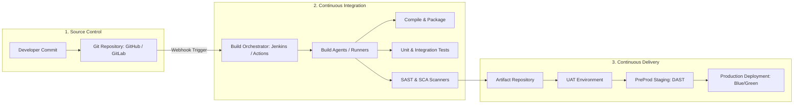
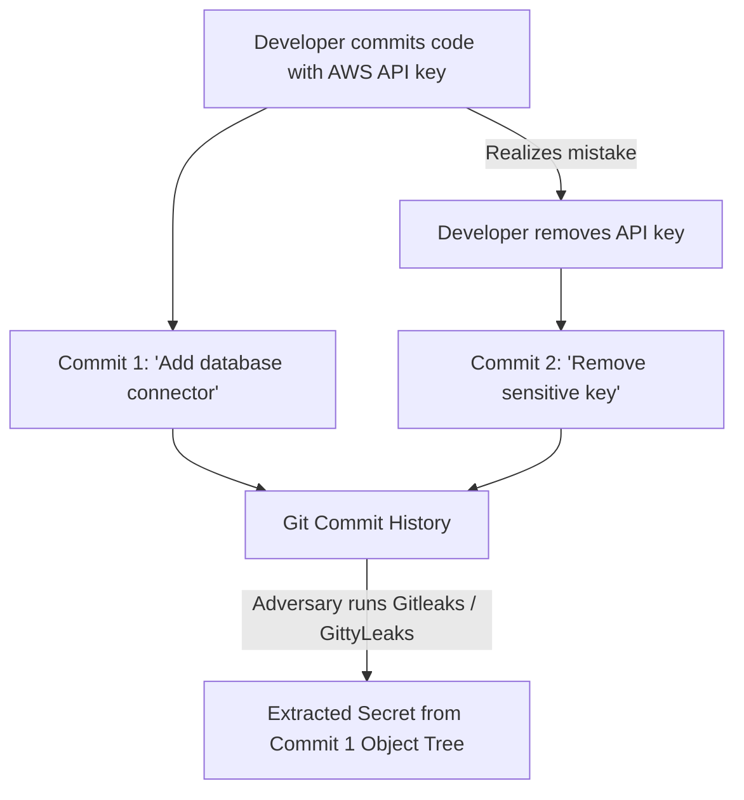
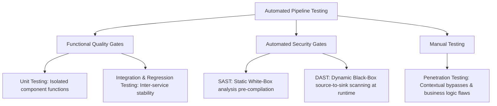
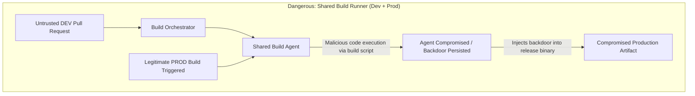

---
layout: post
title: "Intro to Pipeline Automation - CI/CD Architecture, Build Agent Security, and Environment Segmentation"
date: 2026-05-19T10:00:00+03:00
categories:
  - TryHackMe
  - DevSecOps
tags:
  - tryhackme
  - devsecops
  - pipeline-automation
  - cicd
  - build-security
  - supply-chain
  - environments
author: muhammed
description: Technical walkthrough of TryHackMe Intro to Pipeline Automation covering the pipeline stages, version control security, dependency supply chains, build agent contamination, and environment segregation from DEV to PROD.
toc: true
pin: false
math: false
mermaid: true
image:
---

## Overview

[Intro to Pipeline Automation](https://tryhackme.com/room/introtopipelineautomation) kicks off Section 2 (Security of the Pipeline) in TryHackMe's DevSecOps Learning Path. As organizations modernize their software development lifecycle, automation replaces manual human handoffs with continuous, code-driven workflows.

While automated pipelines drastically accelerate release velocity and feature delivery, they introduce a high-value attack surface. In a manual workflow, an adversary must compromise individual developer workstations or credentials. In an automated ecosystem, an attacker who compromises the pipeline infrastructure can compromise the entire software supply chain, injecting backdoors directly into production releases.

In this walkthrough, we examine the anatomy of automated CI/CD pipelines, evaluate source code security and historical git exposure, analyze third-party dependency vulnerabilities (Log4Shell case study), dissect build agent contamination risks, map environment segmentation from DEV to PROD, and solve the **Pipeline Automation Challenge**.

---

## 1. Anatomy of the Automated DevOps Pipeline

A modern delivery pipeline connects code creation directly to production runtime through coordinated automation stages:



The automated pipeline consists of five primary components:
1. **Source Code Management (SCM):** Central or distributed repositories tracking revisions and handling developer contributions.
2. **Build Orchestrator:** The brain of the pipeline (e.g., Jenkins, GitHub Actions, GitLab CI/CD) listening for triggers and scheduling build jobs.
3. **Build Agents (Runners):** Worker nodes or ephemeral container instances that execute build actions, run test scripts, and package software artifacts.
4. **Automated Testing Gates:** Quality and security suites (unit tests, SAST, SCA, and DAST) enforcing compliance criteria.
5. **Environments:** Progressive hosting tiers (DEV, UAT, PreProd, PROD) where artifacts are verified, staged, and served to end-users.

---

## 2. Source Code and Version Control Security

Source code management forms the root of trust for all downstream build operations. Modern pipelines primarily utilize distributed version control (Git) or centralized version control (SVN):
- **Git (Distributed):** Every contributor maintains a full clone of the repository history locally (GitHub, self-hosted GitLab).
- **Subversion / SVN (Centralized):** A single central server manages the master repository (TortoiseSVN, Apache SVN).

### Attack Surface: "Git Never Forgets"
A critical failure mode in version control is treating source repositories as secret storage vaults. Developers frequently commit hardcoded database credentials, private API tokens, or encryption keys during local testing.



Because Git computes cryptographic object trees (blobs and commits) across the entire project history, deleting a credential in a subsequent commit does not purge it from historical objects. Attackers with read access use automated scanners like **GittyLeaks** or **Gitleaks** to parse the commit history and recover purged credentials.

---

## 3. Dependency Management and Supply Chain Risks

Modern applications are assembled rather than written from scratch. Open-source libraries and Software Development Kits (SDKs) comprise 80% to 90% of typical application codebases.

### Internal vs External Dependencies

| Attribute | Internal Dependencies | External Dependencies |
|---|---|---|
| **Origin** | In-house shared libraries (e.g., internal SSO auth) | Public registries (PyPI, npm, NuGet, RubyGems) |
| **Management** | Private artifact managers (JFrog Artifactory, Azure Artifacts) | Public package managers and Content Delivery Networks (CDNs) |
| **Primary Risk** | Stale unmaintained code, organizational blast radius if flawed | Zero-day vulnerabilities, malicious typosquatting, CDN compromise |
| **Control** | Full access to source and maintenance lifecycle | Zero direct control; requires Software Composition Analysis (SCA) |

### Case Study: Log4Shell (CVE-2021-44228)
In late 2021, a critical zero-day vulnerability in Apache Log4j (a ubiquitous Java logging library) illustrated the fragility of software supply chains:
- **Mechanic:** JNDI (Java Naming and Directory Interface) lookups embedded in logged strings allowed unauthenticated remote attackers to execute arbitrary code via LDAP/RMI servers.
- **Impact:** Because Log4j was transitively nested inside thousands of enterprise software products, thousands of organizations were compromised simultaneously, proving that unvetted dependencies represent massive systemic risk.

---

## 4. Automated Testing Gates: SAST, DAST, and Penetration Testing

Automated testing enforces quality and security gates directly within the CI/CD pipeline:



### Why Automated AST Cannot Fully Replace Penetration Testing
While SAST detects insecure functions and DAST detects reflected inputs (sources and sinks), automated scanners struggle with **contextual vulnerabilities**:
- **Business Logic Bypasses:** An e-commerce checkout flow where modifying parameter steps bypasses credit card authorization requires human contextual comprehension.
- **Access Control & Authorization:** Scanners cannot easily determine if User A should be permitted to view Tenant B's invoice data. Manual penetration testing remains mandatory for high-assurance applications.

### The Proof-of-Concept (PoC) Trap
Deploying uncalibrated SAST/DAST tooling into live pipelines without performance tuning can paralyze engineering operations:
- **Scan Latency:** Scanning entire monorepos during every developer merge request exhausts runner capacity and delays deployments.
- **False Positive Friction:** Blocking builds on low-confidence warnings frustrates developers and leads to security bypasses.
- **Best Practice:** Run initial scans out-of-band or off-peak, calibrate rule profiles, and enforce blocking only on validated high-severity findings.

---

## 5. CI/CD Architecture and Build Agent Compromise

CI/CD pipelines rely on an architecture of **Build Orchestrators** (scheduling and trigger management) and **Build Agents** (execution hosts or runners):



### The Dev-to-Prod Contamination Threat
A severe architectural vulnerability occurs when an organization shares build agents between Development and Production builds:
1. Low-privilege developers frequently have direct push access to feature branches triggering DEV builds.
2. If an attacker compromises a developer account, they can push a malicious pull request containing build script commands that execute arbitrary code on the build agent.
3. If that same build agent is later reused to compile Production releases, the attacker can persist on the host, tamper with the compiler, and inject backdoors into the final production binary without altering source code repository history.
4. **Remediation:** Enforce strict build agent isolation: ephemeral single-use containers, dedicated production runners, and isolated network boundaries.

---

## 6. Multi-Tier Environment Segmentation

Security posture and stability requirements vary drastically across the delivery path:

| Environment | Purpose | Stability Tier | Security Posture | Customer Data Permitted? |
|---|---|---|---|---|
| **DEV (Development)** | Developer playground, continuous changes | Highly Unstable | Weakest (broad access) | **No** |
| **UAT (User Acceptance)** | Functional validation, feature verification | Semi-Stable | Second Weakest | **No** |
| **PreProd (Staging)** | Production mirror, final DAST/performance tests | Stable | Second Strongest | **No** (Synthetic only) |
| **PROD (Production)** | Live customer-facing environment | Maximum Stability | Strongest | **Yes** |
| **DR / HA (Disaster Recovery)** | Failover mirror for high-availability systems | Maximum Stability | Strongest (Mirrors PROD) | **Yes** |

### Release Deployment Strategies
- **Blue/Green Deployments:** Two identical production environments exist. Blue serves current traffic; Green runs the new version. Once validated, router traffic cuts over to Green. If an issue arises, traffic cuts back to Blue immediately.
- **Canary Deployments:** Releases are phased incrementally (e.g., 10% of users first). Telemetry is monitored before gradually scaling traffic to 100%.

### Case Study: Developer Bypasses Leaking to PROD
During local feature development, engineers frequently implement developer bypasses:
- Hardcoded test OTP codes (e.g., `000000` always accepted).
- Disabled CAPTCHA verification.
- Mocked authentication headers.

If automated security gates do not sanitize these bypasses before code promotes from DEV to PROD, attackers can exploit the hardcoded bypasses to take over customer accounts.

---

## 7. Task 8 Pipeline Automation Challenge Walkthrough

Task 8 challenges the security engineer to construct an automated pipeline matching specific security controls across each stage:
1. **Source Control:** Git repository secured with access control and pre-commit secret detection.
2. **Build Stage:** Isolated build runner preventing cross-contamination.
3. **Testing Gates:** Automated SAST and SCA scans verifying dependencies and syntax trees.
4. **Staging:** Deployment to PreProd for dynamic runtime verification.
5. **Production:** Gated release enforcing sanitization of developer bypasses.

Configuring the pipeline with the correct sequential validation controls successfully executes the build and reveals the challenge flag:

```text
THM{Pipeline.Automation.Is.Fun}
```

---

## 8. Question, Answer, and Flag Summary

| Task # | Task Title | Question / Challenge | Answer / Flag |
|---|---|---|---|
| **Task 1** | Introduction | I'm ready to learn about pipeline automation and how to make sure it is secure! | *No answer needed* |
| **Task 2** | DevOps Pipelines Explained | Where in the pipeline is our end product deployed? | `Environments` |
| **Task 3** | Source Code and Version Control | Who is the largest online provider of Git? | `GitHub` |
| **Task 3** | Source Code and Version Control | What popular Git product is used to host your own Git server? | `GitLab` |
| **Task 3** | Source Code and Version Control | What tool can be used to scan the commits of a repo for sensitive information? | `GittyLeaks` |
| **Task 4** | Dependency Management | What do we call the type of dependency that was created by our organisation? (Internal/External) | `Internal` |
| **Task 4** | Dependency Management | What type of dependency is JQuery? (Internal/External) | `External` |
| **Task 4** | Dependency Management | What is the name of Python's public dependency repo? | `PyPi` |
| **Task 4** | Dependency Management | What dependency 0day vulnerability set the world ablaze in 2021? | `Log4Shell` |
| **Task 5** | Automated Testing | What type of tool scans code to look for potential vulnerabilities? | `SAST` |
| **Task 5** | Automated Testing | What type of tool runs code and injects test cases to look for potential vulnerabilities? | `DAST` |
| **Task 5** | Automated Testing | Can SAST and DAST be used as a replacement for penetration tests? (Yea,Nay) | `Nay` |
| **Task 6** | Continuous Integration and Delivery | What does CI in CI/CD stand for? | `Continuous Integration` |
| **Task 6** | Continuous Integration and Delivery | What does CD in CI/CD stand for? | `Continuous Delivery` |
| **Task 6** | Continuous Integration and Delivery | What do we call the build infrastructure element that controls all builds? | `Build Orchestrator` |
| **Task 6** | Continuous Integration and Delivery | What do we call the build infrastructure element that performs the build? | `Build Agent` |
| **Task 7** | Environments | Which environment usually has the weakest security configuration? | `DEV` |
| **Task 7** | Environments | Which environment is used to test the application? | `UAT` |
| **Task 7** | Environments | Which environment is similar to PROD but is used to verify that everything is working before it is pushed to PROD? | `PrePROD` |
| **Task 7** | Environments | What is a common class of vulnerabilities that is discovered in PROD due to insecure code creeping in from DEV? | `Developer Bypasses` |
| **Task 8** | Challenge | What is the flag received after successfully building your pipeline? | `THM{Pipeline.Automation.Is.Fun}` |
| **Task 9** | Conclusion | I understand the basic pipeline structure, and I'm ready to do a deep dive into each element! | *No answer needed* |

---

## You can find me online at:


- **GitHub:** [Mhdomer](https://github.com/Mhdomer)
- **LinkedIn:** [mhd3omar](https://www.linkedin.com/in/mhd3omar/)
- **Tryhackme:** [nonlouy](https://tryhackme.com/p/nonlouy)
