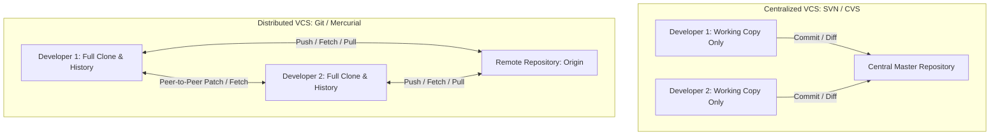
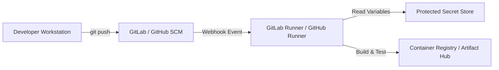
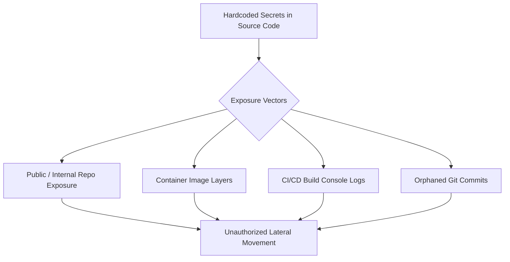
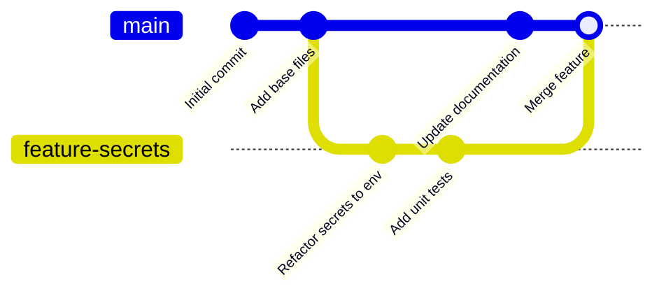
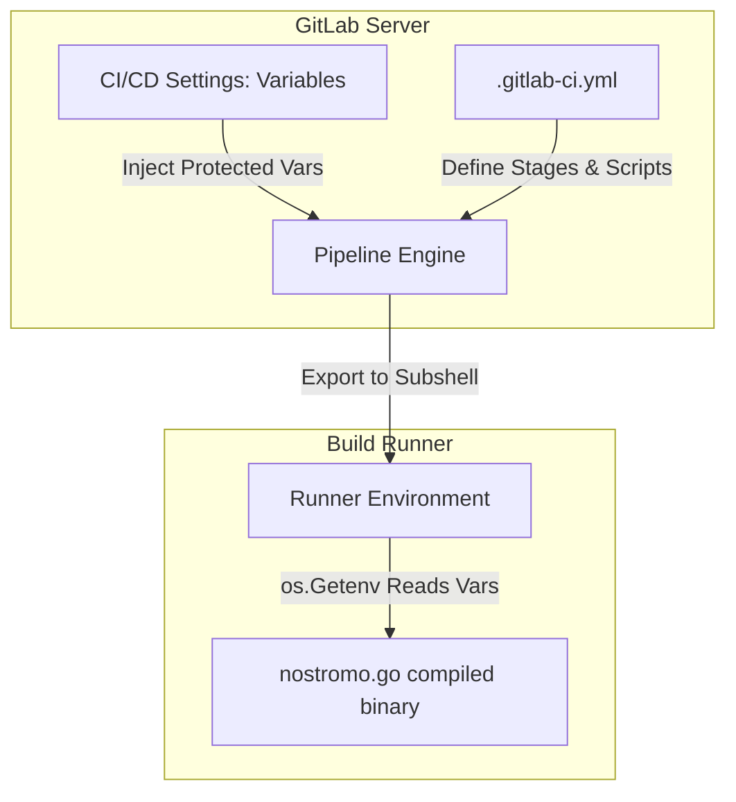

---
layout: post
title: "Source Code Security - Git Internals, Credential Hygiene, and Secrets Management in CI/CD"
date: 2026-05-20T10:00:00+03:00
categories:
  - TryHackMe
  - DevSecOps
tags:
  - tryhackme
  - devsecops
  - source-code-security
  - git
  - credential-hygiene
  - secrets-management
  - gitlab
author: muhammed
description: In-depth technical walkthrough of TryHackMe Source Code Security covering Git architecture, BitKeeper history, centralized vs distributed VCS, credential hygiene, environment variables, and GitLab secret management.
toc: true
pin: false
math: false
mermaid: true
image:
---

## Overview

[Source Code Security](https://tryhackme.com/room/sourcecodesecurity) is the second room in Section 2 (Security of the Pipeline) of TryHackMe's DevSecOps Learning Path. In modern software engineering, the source code repository represents the primary repository of intellectual property and operational logic for an organization. If source code management (SCM) systems are poorly configured or contaminated with static credentials, the entire downstream delivery pipeline is compromised.

This room explores the history and architectural mechanics of version control systems, contrasting centralized models (SVN) with distributed DAG-based models (Git). It investigates common credential hygiene failures, details the role and limits of environment variables, and walks through hands-on remediation of the **USCSS Nostromo** project in GitLab, refactoring hardcoded secrets into secure environment variables and configuring protected CI/CD secrets.

---

## 1. The Genesis of Git and Distributed Version Control

Understanding Git requires understanding the problem Linus Torvalds set out to solve in 2005.

### From BitKeeper to Git

Between 1991 and 2002, the Linux kernel project was maintained through manual patch distribution and tarball archives. In 2002, the community adopted **BitKeeper**, a proprietary Distributed Version Control System (DVCS) developed by Larry McVoy. BitKeeper offered distributed branching and history tracking that matched the decentralized nature of Linux kernel development.

In early 2005, relations between Larry McVoy's company (BitMover) and the Linux community deteriorated after Andrew Tridgell reverse-engineered BitKeeper protocols. BitMover revoked the free licensing tier for Linux developers.

Linus Torvalds stepped away from kernel development in April 2005 to design and implement a replacement from scratch:
- **Performance:** Designed to apply thousands of patches rapidly without server roundtrips.
- **Distributed Architecture:** Every contributor holds an identical, complete clone of repository history.
- **Cryptographic Integrity:** Every object (blob, tree, commit, tag) is addressed by its SHA-1 cryptographic hash, ensuring tamper-resistance.
- **Snapshot Storage:** Git records filesystem snapshots rather than recording file differences or delta chains.



### Centralized vs Distributed Version Control

| Dimension | Centralized VCS (SVN, CVS, Perforce) | Distributed VCS (Git, Mercurial) |
|---|---|---|
| **Architecture** | Single central server storing complete history | Every clone contains full history and object graph |
| **Offline Work** | Limited: cannot commit, branch, or view history offline | Full: all operations local except remote push/fetch |
| **Performance** | Network-bound for most branching and history queries | Local disk speed: commits, diffs, and logs are instantaneous |
| **Resilience** | Single point of failure if server corrupts without backup | High: every developer workstation acts as an offsite backup |
| **Branching** | Heavyweight directories in repository tree | Lightweight 41-byte pointers to commit snapshots |

---

## 2. Cloud-Based VCS and the CI/CD Ecosystem

Modern engineering organizations rarely maintain raw Git daemons over bare SSH. Instead, cloud-hosted or self-hosted platforms provide web interfaces, code review tools, issue tracking, and automated CI/CD runners.



### GitHub
- **Founded:** 2007 by Chris Wanstrath, P.J. Hyett, Tom Preston-Werner, and Scott Chacon; built on Ruby on Rails.
- **Evolution:** Launched **GitHub Actions** in 2018 to natively embed CI/CD workflows alongside code repositories, triggered by events like push, pull request, or release.

### GitLab
- **Founded:** 2014 by Dmitriy Zaporozhets and Sytse Sijbrandij.
- **Design Philosophy:** Built from the start as an integrated, single-application DevOps platform containing native issue tracking, code review, CI/CD runners, container registries, and deployment management without mandatory third-party plugins.
- **Configuration:** Pipelines are declared deterministically in `.gitlab-ci.yml` at the repository root.

---

## 3. Credential Hygiene in Modern Pipelines

Hardcoded credentials remain one of the most prevalent initial access vectors identified during security audits and red team operations. 

### Why Credential Leaks Happen
1. **Convenience over Hygiene:** Developers embed API keys, database passwords, or staging tokens into configuration files during local debugging.
2. **Context Switching:** Secrets are committed accidentally across feature branches and merged into main branches.
3. **Container Layer Stacking:** Developers copy configuration files with secrets into Dockerfiles, then delete them in a later `RUN` step, leaving the secret stored in an intermediate layer.
4. **Console Output Leakage:** Build scripts echo environment variables or debug logs into pipeline console streams accessible to unauthorized viewers.
5. **Stale Secrets:** Static credentials remain unchanged for months or years without automated rotation schedules.



### Remediation Principles: Defense in Depth

1. **Principle of Least Privilege:** Scope tokens strictly to required actions, repository scopes, and IP addresses.
2. **Ephemeral Credentials:** Replace static long-lived credentials with short-lived tokens (e.g., OpenID Connect federation with AWS/GCP).
3. **Automated Secret Detection:** Implement pre-commit hooks (TruffleHog, Gitleaks) to block secrets before they enter the Git object tree.
4. **Console Masking:** Configure pipeline runners to scrub secret patterns from output logs.
5. **Artifact Verification:** Inspect final container layers and binary outputs to ensure secrets are excluded.

### The Role and Limits of Environment Variables

Environment variables decouple configuration data and secrets from source code:
- Stored outside the repository tree in the operating system or process runtime.
- Injected into application processes via standard library functions (e.g., `os.Getenv()` in Go, `process.env` in Node.js, `os.environ` in Python).

> [!WARNING]
> Environment variables are a **carrier mechanism**, not a security control. Using environment variables does **not** automatically make your system immune to compromise. If a server is vulnerable to Server-Side Request Forgery (SSRF) accessing metadata endpoints, Local File Inclusion (LFI) reading `/proc/self/environ`, or remote code execution, an attacker can dump all environment variables immediately.

---

## 4. Git Branching Model and Command Mechanics

Git branches are lightweight, moveable pointers to specific commit snapshots.



### Key Git Commands and Concepts

- `git clone <repository_url>`: Creates a full local copy of a remote repository, including its entire commit history.
- `git clone -branch <branch_name> <repository_url>`: Clones and checks out a specified branch directly.
- `origin`: The default alias Git assigns to the remote repository from which the local copy was cloned.
- `branches`: Independent, isolated lines of development allowing parallel experimentation without contaminating the main release branch.
- `git branch -a`: Lists all local and remote-tracking branches.
- `git checkout -b <branch_name>`: Creates a new local branch and immediately switches the working directory to it.
- `git add <file>`: Stages modified content into the index for the next commit snapshot.
- `git commit -m "message"`: Persists staged changes as a new immutable commit object with metadata and author details.
- `git push -u origin <branch_name>`: Pushes the local branch commits to the remote repository and sets an upstream tracking reference.

---

## 5. Lab Walkthrough: USCSS Nostromo (Task 7)

In Task 7, we access the GitLab instance running on the lab VM (`http://MACHINE_IP` or `https://LAB_WEB_URL.p.thmlabs.com`) with the provided credentials (`TryHackMe` / `TryHackMe!`).

### Step 1: Identifying Hardcoded Credentials

Navigating to the `uscss-nostromo` project repository, we inspect the Go application file `nostromo.go`. Inside the initialization block, we discover plaintext hardcoded credentials:

```go
func init () {
    apiURL = "https://example.com"
    username = "admin"
    password = "p@ssw0rd"
}
```

Leaving credentials hardcoded in source code exposes production infrastructure to anyone with read access to the repository, including developers, contractors, and compromised CI runner jobs.

### Step 2: Refactoring with Go `os` Package

To remediate this vulnerability, we refactor the code to read the credentials dynamically from process environment variables using Go's standard `os` package.

First, update the import declaration to include the `"os"` package:

```go
import (
    "fmt"
    "net/http"
    "os"
)
```

Second, refactor the `init()` function to populate the variables using `os.Getenv()`:

```go
func init () {
    apiURL = "https://example.com"
    username = os.Getenv("GITLAB_USERNAME")
    password = os.Getenv("GITLAB_PASSWORD")
}
```

### Step 3: Branching, Committing, and Pushing

To follow proper development workflows, we perform these modifications on an isolated feature branch:

```bash
# Clone the repository
git clone http://gitlab.tryhackme.loc/tryhackme/uscss-nostromo.git
cd uscss-nostromo

# Create and checkout feature branch
git checkout -b fix-credential-hygiene

# Make the edits in nostromo.go, then stage and commit
git commit -a -m "Fixed credential hygiene by using environment variables"

# Push to the remote origin
git push -u origin fix-credential-hygiene
```

Checking the project commit history and branches reveals the Task 7 hidden flag:

```text
THM-3LL3N-RIPL3Y
```

---

## 6. Secret Management in GitLab CI/CD (Task 8)

Refactoring source code to read environment variables is only half the battle. If secrets are not managed centrally with access control and encryption, operational security collapses.

### Configuring Protected Variables in GitLab

To inject environment variables securely during CI/CD execution without exposing them in repository files:

1. Navigate to the project in GitLab: **Settings** -> **CI/CD**.
2. Expand the **Variables** section.
3. Click **Add variable**.
4. Define the variable keys:
   - Key: `GITLAB_USERNAME`, Value: `<username>`
   - Key: `GITLAB_PASSWORD`, Value: `<password>`
5. Enable **Protected** (ensures the variable is only passed to pipelines running on protected branches or tags).
6. Enable **Masked** (prevents the variable value from appearing in build logs).
7. Save the variables.



### Pipeline Configuration: `.gitlab-ci.yml`

The `.gitlab-ci.yml` file is the declarative configuration manifest that tells GitLab runners how to build, test, and deploy software. It defines:
- **Stages:** Ordered execution phases (e.g., `build`, `test`, `security_scan`, `deploy`).
- **Jobs:** Individual tasks executed within specific container images or environments.
- **Rules:** Conditions determining when jobs run (e.g., only on merge requests or main branch pushes).

Inspecting the CI/CD settings and secret configurations reveals the Task 8 hidden flag:

```text
THM_S3CUr3_4L13NS
```

---

## 7. Question, Answer, and Flag Summary

| Task # | Task Title | Question / Challenge | Answer / Flag |
|---|---|---|---|
| **Task 1** | Introduction | I'm ready! | *No answer needed* |
| **Task 2** | Git and Linus | When was Git released? | `2005` |
| **Task 2** | Git and Linus | What did Linux Kernel use for a DVCS previous to git? | `BitKeeper` |
| **Task 3** | Version Control Concepts | What type of version control is Git? | `Distributed` |
| **Task 4** | Cloud Based Version Control | When was Github founded? | `2007` |
| **Task 4** | Cloud Based Version Control | Where do Cloud-Based VCS store code? | `repositories` |
| **Task 5** | Insufficient Credential Hygiene | What is a solution to store secrets securely without revealing them? | `environment variables` |
| **Task 5** | Insufficient Credential Hygiene | Does using environment variables mean you are free from secrets being compromised (Yes or No)? | `No` |
| **Task 6** | The Git, The Branch and The Ugly | How does Git refer to isolated lines of development? | `branches` |
| **Task 6** | The Git, The Branch and The Ugly | What term does Git use to refer to the original repository you cloned from? | `origin` |
| **Task 6** | The Git, The Branch and The Ugly | What command can you use to "copy" the contents in a remote repository? | `git clone` |
| **Task 7** | USCSS Nostromo | What is the name of the package that you need to import to make use of os.getenv? | `os` |
| **Task 7** | USCSS Nostromo | What is the hidden flag? | `THM-3LL3N-RIPL3Y` |
| **Task 8** | Secret Management | What is the hidden flag? | `THM_S3CUr3_4L13NS` |
| **Task 8** | Secret Management | What do you need to keep source code secure besides environment variables? | `secret management` |
| **Task 8** | Secret Management | Which file handles the configuration to run CI/CD jobs? | `.gitlab-ci.yml` |

---

## You can find me online at:


- **GitHub:** [Mhdomer](https://github.com/Mhdomer)
- **LinkedIn:** [mhd3omar](https://www.linkedin.com/in/mhd3omar/)
- **Tryhackme:** [nonlouy](https://tryhackme.com/p/nonlouy)
