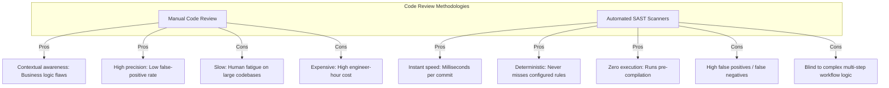
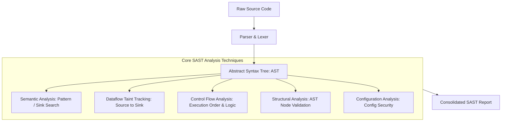
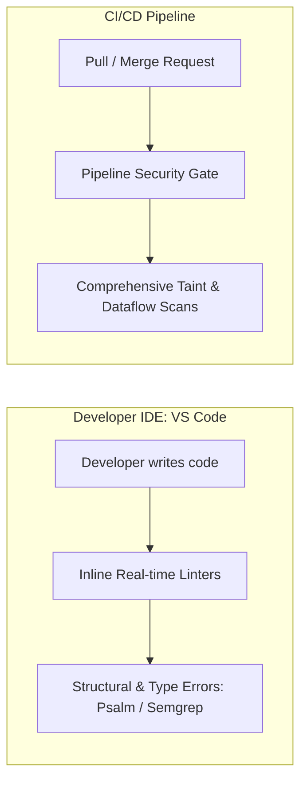

---
layout: post
title: "SAST - Static Application Security Testing, AST Modeling, Taint Analysis, and Semgrep Rules"
date: 2026-05-25T10:00:00+03:00
categories:
  - TryHackMe
  - DevSecOps
tags:
  - tryhackme
  - devsecops
  - sast
  - code-review
  - psalm
  - semgrep
  - taint-analysis
  - dataflow
author: muhammed
description: Comprehensive technical walkthrough of TryHackMe SAST covering white-box manual review vs automated analysis, Abstract Syntax Tree modeling, dataflow taint tracking with Psalm, and IDE integration with Semgrep.
toc: true
pin: false
math: false
mermaid: true
image:
---

## Overview

[SAST](https://tryhackme.com/room/sast) is the second room in Section 3 (Security in the Pipeline) of TryHackMe's DevSecOps Learning Path. Static Application Security Testing (SAST) serves as the primary automated white-box testing methodology in modern engineering pipelines, inspecting uncompiled and unexecuted source code for architectural flaws and vulnerable coding patterns.

While manual code review provides high contextual nuance for complex business logic, it scales poorly across massive enterprise codebases. Automated SAST engines solve this scalability challenge by parsing code into Abstract Syntax Trees (ASTs) and evaluating data paths from user input sources to sensitive execution sinks.

This walkthrough investigates manual security code auditing, examines how SAST parsers construct abstract models, details five foundational static analysis techniques (semantic, dataflow, control flow, structural, and configuration), demonstrates taint analysis with **Psalm**, and audits an open-source application (**ReciPHP**) using **Semgrep** in VS Code.

---

## 1. Code Review Economics: Manual vs Automated

Catching security defects during development costs an order of magnitude less than fixing them in staging or emergency post-deployment patches.



### The Hybrid Review Strategy
Neither approach replaces the other:
- **Automated SAST:** Implemented early as developer IDE linters and CI/CD pull request gates to eliminate low-hanging fruit (e.g., hardcoded credentials, raw SQL concatenation, insecure crypto keys).
- **Manual Code Review:** Conducted periodically by AppSec engineers during architecture design changes or major milestone releases to evaluate authorization models, financial process logic, and contextual bypasses.

---

## 2. Anatomy of a Manual Code Review (Task 3)

To understand automated scanners, engineers must understand how human reviewers audit source code manually.

### Step 1: Identifying Dangerous Sinks
Reviewers search for sensitive functions that interact with operating system commands, databases, or file systems:

| Vulnerability Class | Vulnerable Sinks (PHP / MySQL) |
|---|---|
| **SQL Injection (SQLi)** | `mysqli_query()`, `mysql_query()`, `mysqli_prepare()`, `query()`, `prepare()` |
| **Local File Inclusion (LFI)** | `include()`, `include_once()`, `require()`, `require_once()` |
| **Command Injection** | `exec()`, `passthru()`, `shell_exec()`, `system()`, `popen()` |
| **Cross-Site Scripting (XSS)** | `echo`, `print`, `printf()`, `vprintf()` |

Searching recursively for SQL sinks in `/simple-webapp/html/`:

```bash
grep -rn 'mysqli_query(' /home/ubuntu/Desktop/simple-webapp/html/
# Output: db.php:18: $result = mysqli_query($conn, $query);
```

### Step 2: Contextual Tracing and Input Flow
In `db.php`, `mysqli_query()` is wrapped in `db_query()`:

```php
function db_query($conn, $query){
    $result = mysqli_query($conn, $query);
    return $result;
}
```

Because `db_query()` accepts `$query` without sanitization, we trace all calls to `db_query()` across the project:

```bash
grep -rn 'db_query(' /home/ubuntu/Desktop/simple-webapp/html/
# hidden-panel.php:7:  $result  = db_query($conn, $sql);
# hidden-panel.php:20: $result2 = db_query($conn, $sql2);
# hidden-panel.php:23: $result3 = db_query($conn, $sql3);
```

### Evaluating Filter Bypass Mechanics

1. **Call 1 (`hidden-panel.php:7`): Unsanitized SQLi**
   ```php
   $sql = "SELECT id, firstname, lastname FROM MyGuests WHERE id=".$_GET['guest_id'];
   $result = db_query($conn, $sql);
   ```
   Direct concatenation of `$_GET['guest_id']` allows complete SQL injection.

2. **Call 2 (`hidden-panel.php:20`): Secure Sanitization**
   ```php
   $sql2 = "SELECT id, logtext FROM logs WHERE id='".preg_replace('/[^a-z0-9A-Z"]/', "", $_GET['log_id']). "'";
   $result2 = db_query($conn, $sql2);
   ```
   `preg_replace` strips all characters except alphanumeric characters and double quotes. Because the query encloses the value in single quotes (`'`), double quotes cannot break string encapsulation. Not vulnerable.

3. **Call 3 (`hidden-panel.php:23`): Incomplete Filter Bypass**
   ```php
   $sql3 = "SELECT id, name FROM asciiart WHERE id=".preg_replace("/[^0-9]/", "", $_GET['art_id'], 1);
   $result3 = db_query($conn, $sql3);
   ```
   The fourth argument to `preg_replace` specifies the replacement `limit`, here set to `1`. Only the first non-numeric character is removed. Subsequent characters pass untouched, permitting SQL injection payload delivery.

### Bonus Audit: LFI via `include()`

Auditing file inclusion functions across the codebase:
- Total `include()` statements: **9** instances.
- Vulnerable line: `view.php:22`:
  ```php
  include('./gallery-files/'.$_GET['img']);
  ```
  Unsanitized concatenation of user-supplied `$_GET['img']` allows path traversal (`../../../../etc/passwd`).

---

## 3. How SAST Engines Work: ASTs and Analysis Models

SAST engines translate source code into a standardized model before running vulnerability checks:



### The 5 Core Analysis Techniques

1. **Semantic Analysis:**
   Evaluates local syntax patterns directly, similar to advanced regex grepping. Flags direct string concatenation inside dangerous functions like `mysqli_query($db, "SELECT * FROM users WHERE user=" . $_GET['user'])`.
2. **Dataflow Analysis (Taint Tracking):**
   Traces data propagation from user-controlled inputs (**sources**) through variable assignments and operations to dangerous functions (**sinks**). If tainted data reaches a sink without passing through an approved sanitization function, a vulnerability is raised.
3. **Control Flow Analysis:**
   Inspects execution order and conditions to detect uninitialized variables, dead code segments, race conditions, and unhandled null exceptions.
4. **Structural Analysis:**
   Validates compliance with programming best practices and structural patterns, such as identifying weak cryptographic parameters (e.g., RSA key length of 1024 bits) or empty exception handlers.
5. **Configuration Analysis:**
   Scans server and runtime configuration manifests (`php.ini`, `web.config`, Dockerfiles, Kubernetes YAMLs) for hazardous settings, such as `allow_url_include = On`.

---

## 4. Practical Taint Analysis with Psalm (Task 5)

Psalm (PHP Static Analysis Linting Machine) analyzes PHP applications for type errors and security vulnerabilities.

### Running Basic Structural Checks

Executing Psalm in `/home/ubuntu/Desktop/simple-webapp/`:

```bash
./vendor/bin/psalm --no-cache
```

Psalm flags structural logic flaws, such as assignment inside a comparison statement:

```text
ERROR: TypeDoesNotContainType - html/hidden-panel.php:10:5
Operand of type 0 is always falsy
if ($result->num_rows = 0) {
```

### Executing Taint Analysis

Enabling taint tracking traces untrusted inputs:

```bash
./vendor/bin/psalm --no-cache --taint-analysis
```

Psalm detects the LFI flaw in `view.php:22` and traces the first SQLi in `hidden-panel.php:6`. However, because `db_query()` wraps `mysqli_query()`, Psalm only reports the flaw at the inner wrapper on line 18 of `db.php`, masking the secondary SQLi vulnerabilities.

### Annotating Code to Specialize Taint Tracking

To help the SAST engine recognize custom functions as sinks and track each call site independently, we annotate `db_query()` in `db.php`:

```php
/**
 * @psalm-taint-sink sql $query
 * @psalm-taint-specialize
 */
function db_query($conn, $query){
    $result = mysqli_query($conn, $query);
    return $result;
}
```

- `@psalm-taint-sink sql $query`: Declares `$query` as a terminal sink for SQL injection payloads.
- `@psalm-taint-specialize`: Directs Psalm to treat every invocation of `db_query()` as a separate taint flow depending on the caller inputs.

Re-running Psalm with these annotations reports **9** distinct security issues, successfully separating the distinct call sites.

### SAST Result Discrepancies

| Query | Manual Audit | Psalm SAST Output | Result Classification |
|---|---|---|---|
| `$sql` | Vulnerable | Vulnerable | **True Positive** (Accurate detection) |
| `$sql2` | Not Vulnerable | Vulnerable | **False Positive** (Scanner missed single-quote context) |
| `$sql3` | Vulnerable | Not Vulnerable | **False Negative** (Scanner failed to model regex limit) |

---

## 5. SAST in the Development Lifecycle: VS Code & Semgrep (Task 6)

Integrating SAST into developer workflows ensures code is audited before it leaves the developer workstation.



### Auditing ReciPHP with Semgrep

In Task 6, we open the `ReciPHP` workspace in VS Code. Semgrep runs in the background against predefined rules:
- **Total Problems Detected across Project:** **27** issues.
- **Problems in `showrecipe.inc.php`:** **8** issues.
- **Rule Identifiers in `showrecipe.inc.php`:**
  1. `tainted-sql-string`: Flags user parameters passed directly to database queries (SQL Injection).
  2. `echoed-request`: Flags raw `$_GET` or `$_POST` variables printed directly to the HTML response without sanitization.
- **Vulnerability for `echoed-request`:** **Cross-site Scripting (XSS)**.

---

## 6. Question, Answer, and Flag Summary

| Task # | Task Title | Question / Challenge | Answer / Flag |
|---|---|---|---|
| **Task 1** | Introduction | Click and continue learning! | *No answer needed* |
| **Task 2** | Code Review | Are automated code reviews a substitute for manual reviewing? (yea/nay) | `nay` |
| **Task 2** | Code Review | What type of code review will run faster? (Manual/Automated) | `Automated` |
| **Task 2** | Code Review | What type of code review will be more thorough? (Manual/Automated) | `Manual` |
| **Task 3** | Manual Code Review | Which of the mentioned functions is used in the project? | `include()` |
| **Task 3** | Manual Code Review | How many instances of the function found in question 2 exist in your project's code? | `9` |
| **Task 3** | Manual Code Review | What file contains the vulnerable instance? | `view.php` |
| **Task 3** | Manual Code Review | What line in the file found on the previous question is vulnerable to LFI? | `22` |
| **Task 4** | Automated Code Review | Does SAST require a running instance of the application for analysis? (yea/nay) | `nay` |
| **Task 4** | Automated Code Review | What kind of analysis would likely flag dead code segments? | `structural analysis` |
| **Task 4** | Automated Code Review | What kind of analysis would likely detect flaws in configuration files? | `configuration analysis` |
| **Task 4** | Automated Code Review | What kind of analysis is similar to grepping the code in search of flaws? | `semantic analysis` |
| **Task 5** | Rechecking our Application with SAST Tools | What type of error occurs when the tool reports a vulnerability not present in code? | `False positive` |
| **Task 5** | Rechecking our Application with SAST Tools | How many errors are reported after annotating code and re-running Psalm? | `9` |
| **Task 6** | SAST in the Development Cycle | How many problems in total are detected by Semgrep in this project? | `27` |
| **Task 6** | SAST in the Development Cycle | How many problems are detected in the showrecipe.inc.php file? | `8` |
| **Task 6** | SAST in the Development Cycle | What other problem identifier is reported by Semgrep in this file? | `echoed-request` |
| **Task 6** | SAST in the Development Cycle | What type of vulnerability is associated with the problem identifier on the previous question? | `Cross-site Scripting` |
| **Task 7** | Conclusion | Click and continue learning! | *No answer needed* |

---

## You can find me online at:


- **GitHub:** [Mhdomer](https://github.com/Mhdomer)
- **LinkedIn:** [mhd3omar](https://www.linkedin.com/in/mhd3omar/)
- **Tryhackme:** [nonlouy](https://tryhackme.com/p/nonlouy)
