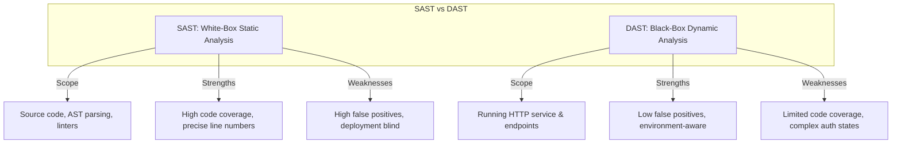
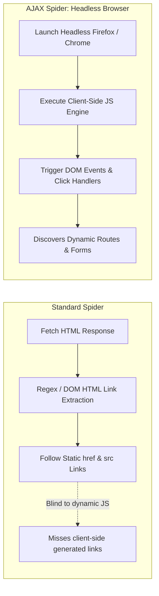
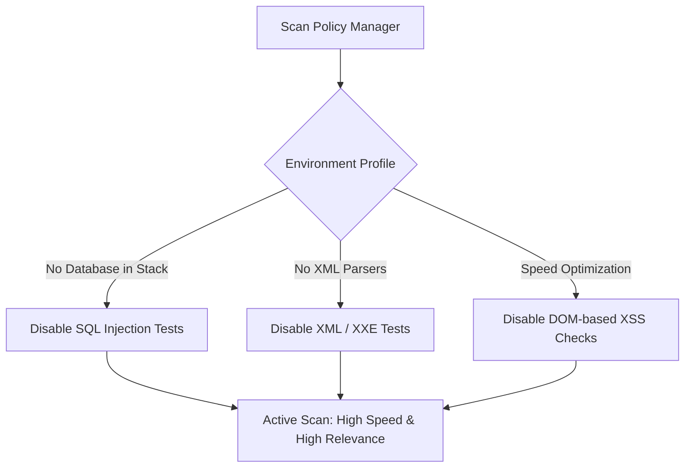
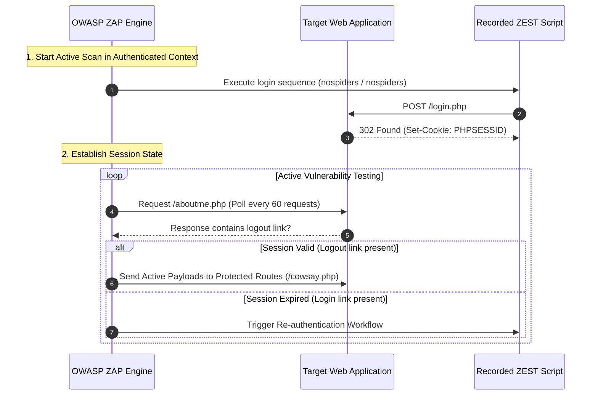
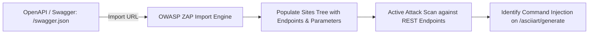

---
layout: post
title: "DAST - Dynamic Application Security Testing, OWASP ZAP, Authenticated Scans, and CI/CD Automation"
date: 2026-05-27T10:00:00+03:00
categories:
  - TryHackMe
  - DevSecOps
tags:
  - tryhackme
  - devsecops
  - dast
  - owasp-zap
  - zap2docker
  - jenkins
  - api-security
  - web-pentesting
author: muhammed
description: Comprehensive technical walkthrough of TryHackMe DAST covering black-box dynamic testing, traditional vs AJAX headless spidering, ZEST-authenticated workflows, OpenAPI Swagger audits, and zap2docker pipeline integration.
toc: true
pin: false
math: false
mermaid: true
image:
---

## Overview

[DAST](https://tryhackme.com/room/dastzap) is the third room in Section 3 (Security in the Pipeline) of TryHackMe's DevSecOps Learning Path. While Static Application Security Testing (SAST) examines uncompiled source code from a white-box perspective, Dynamic Application Security Testing (DAST) evaluates running application instances from an external, black-box perspective without access to internal source trees.

DAST simulates external adversary behavior: mapping the attack surface through crawling and spidering, probing exposed inputs with fuzzed payloads, and evaluating HTTP responses for runtime vulnerabilities such as command injection, path traversal, and cross-site scripting (XSS).

This walkthrough explores the mechanics of dynamic security analysis using **OWASP ZAP (Zed Attack Proxy)**, contrasting standard HTML crawlers with headless browser AJAX spiders, crafting **ZEST**-driven authenticated session state engines, auditing RESTful endpoints via OpenAPI (Swagger) specifications, and embedding automated containerized scans into Jenkins CI/CD pipelines using **zap2docker**.

---

## 1. DAST in the DevSecOps Lifecycle

DAST operates on live, deployed runtime instances, capturing vulnerabilities introduced by runtime environments, web server configurations, and deployment architectures that static code scanners cannot observe.



### Core Advantages and Limitations of DAST

- **Runtime & Deployment Visibility:** Identifies misconfigurations in reverse proxies, TLS ciphers, CORS policies, HTTP Request Smuggling, and cache poisoning.
- **Language Agnostic:** Evaluates applications solely through HTTP requests and responses, ignoring underlying frameworks (PHP, Java, Go, Python, Node.js).
- **Reduced False Positives:** Flags flaws based on actual observed server responses rather than theoretical syntax trees.
- **Crawling Constraints:** Modern single-page applications (SPAs) heavily reliant on client-side JavaScript rendering require headless browsers to discover dynamically loaded routes.
- **Remediation Ambiguity:** Identifies vulnerable parameter names and response bodies, but cannot pinpoint exact file paths or source code line numbers.

---

## 2. Spidering & Crawling: Traditional vs Headless AJAX (Task 3)

The initial phase of any DAST operation is mapping the target application attack surface.



### The Limitations of Standard Spiders
Standard web spiders parse raw HTML strings for static link attributes (`<a href="...">`, `<form action="...">`). When an application builds navigation on-the-fly using JavaScript (such as React, Vue, or dynamic DOM manipulation), standard crawlers fail to discover those routes.

In our lab target (`http://MACHINE_IP:8082/`):
- A regular ZAP spider discovers standard endpoints, but completely misses `/nospiders-gallery.php` because the menu link is dynamically generated in client-side JavaScript.
- Running the **AJAX Spider** utilizing a **headless browser** (an automated browser instance running without a Graphical User Interface) executes the JavaScript engine, successfully uncovering `/nospiders-gallery.php` and discovering `/view.php`.
- Analyzing the discovered parameters for `login.php` under the POST method reveals two input fields: **`pass, user`**.

---

## 3. Vulnerability Scanning & Scan Policy Tuning (Task 4)

Active scanning launches automated security payloads against every discovered endpoint and parameter.

### Scan Policy Calibration

Running active scans with default configurations against production-scale applications results in massive scan durations and unnecessary network overhead. Scan policies must be tailored to the known technology stack:

- **Threshold:** Controls reporting sensitivity. Low thresholds report findings on minimal evidence (increasing false positives); high thresholds require strict verification (increasing false negatives).
- **Strength:** Controls the volume of payloads dispatched per attack category. Higher strength increases test depth at the cost of prolonged scan times.



Since our lab web application utilizes Apache 2.4 and PHP without a backend database or XML endpoints, disabling SQL Injection, XML processing, and DOM XSS checks dramatically reduces execution time.

Executing the tuned active scan reveals two high-risk vulnerabilities on the unauthenticated surface:
1. **Path Traversal** (Directory traversal in file retrieval parameters).
2. **Cross Site Scripting (Reflected)**.

---

## 4. Authenticated Scans with ZEST Scripts (Task 5)

Modern enterprise applications restrict their most sensitive business functionality behind authentication boundaries. Unauthenticated scanners only observe public login pages, leaving administrative functionality completely unaudited.



### Implementing Authenticated Workflows

1. **Recording Authentication via ZEST Scripts:**
   - We use ZAP's built-in recorder to capture a manual login at `http://MACHINE_IP:8082/login.php` using credentials `nospiders` / `nospiders`.
   - ZAP records the transaction into a **ZEST** script (a declarative JSON-based recording format reproducing HTTP sequences).
2. **Context Configuration:**
   - Define a new **Context** encompassing all target URLs (`http://MACHINE_IP:8082/.*`).
   - Assign the recorded ZEST script under **Script-based Authentication**.
   - Create a dummy user entity to bind the authentication credentials to scan jobs.
3. **Session State Verification & Logout Prevention:**
   - **Excluding Logout Endpoints:** Exclude `/logout.php` from the context. If ZAP spiders or tests the logout link, it terminates its own session.
   - **Logged-in Indicator:** Select the text string for the logout link on `cowsay.php` and flag it as the **Logged-in indicator**.
   - **Logged-out Indicator:** Flag the login link on `aboutme.php` as the **Logged-out indicator**.
   - **Verification Strategy:** Configure ZAP to poll `/aboutme.php` every 60 requests. If the logged-in indicator disappears, ZAP automatically reruns the ZEST authentication sequence.

### Authenticated Scan Findings
Scanning within the authenticated context exposes protected routes like `/cowsay.php`. Active scanning against these newly accessible endpoints uncovers an additional high-risk vulnerability:

```text
Remote OS Command Injection
```

---

## 5. Auditing APIs via OpenAPI / Swagger (Task 6)

APIs cannot be spidered using traditional link crawlers because endpoints do not link to one another, and request bodies often require structured JSON payloads.



### Importing OpenAPI Specifications
ZAP allows direct ingestion of API schemas defined via OpenAPI (Swagger), SOAP, or GraphQL:
- We navigate to **Import** -> **Import an OpenAPI definition from a URL** and supply `http://MACHINE_IP:8081/swagger.json`.
- ZAP reads the declarative path objects (`/asciiart/{art_id}`, `/asciiart/generate`, `/asciiart/add`) along with their required parameters, types, and HTTP methods.

### Scanning API Endpoints
Executing an Active Scan against the imported API routes tests input parameters with specialized payloads:
- On `/asciiart/generate`, ZAP detects a critical high-risk vulnerability: **Remote OS Command Injection**.
- On `/asciiart/{art_id}`, ZAP reports a **Path Traversal** alert. However, inspecting the request and response indicates that the scanner received generic 404/500 text without retrieving system files (`/etc/passwd`). Based solely on the information provided, this finding is classified as a **false positive** (`yea`).

---

## 6. Integrating DAST into the CI/CD Pipeline (Task 7)

Embedding DAST directly into Continuous Integration pipelines provides automated security regression testing on every code commit.

```mermaid
flowchart TD
    DEV[Developer Commit to Gitea] --> HOOK[Webhook Trigger]
    HOOK --> JENK[Jenkins CI/CD Pipeline]
    
    subgraph Pipeline["Jenkins Build Stages"]
        S1[Stage 1: Build Docker Container] --> S2[Stage 2: Deploy Container to Local Port]
        S2 --> S3[Stage 3: Scan with OWASP ZAP (zap2docker)]
    end

    JENK --> Pipeline
    S3 -->|Vulnerabilities Found| FAIL[Build Fails: Generate zap-reports HTML]
```

### Automated Scanning with zap2docker

The official `owasp/zap2docker-stable` container provides pre-packaged scanning scripts designed for automated headless execution:
- **Baseline Scan (`zap-baseline.py`):** Spiders the application for up to 1 minute and performs passive analysis only. Ideal for pull-request testing to catch low-hanging fruit without delaying builds.
- **Full Scan (`zap-full-scan.py`):** Executes full spidering and active vulnerability attacks. Typically scheduled nightly or weekly.
- **API Scan (`zap-api-scan.py`):** Ingests an OpenAPI, GraphQL, or SOAP definition to execute active tests directly against API routes.

### Pipeline Execution in Jenkins

In Gitea (`http://MACHINE_IP:3000/`) and Jenkins (`http://MACHINE_IP:8080/`), we audit the `Jenkinsfile` for the `simple-webapp` and `simple-api` repositories:

1. **Auditing simple-webapp:**
   - Uncommenting the `Scan with OWASP ZAP` stage invokes `zap-baseline.py` against `http://localhost:8082/`.
   - The scan completes and generates a vulnerability report under `zap-reports/`.
   - The report identifies **3** medium-risk vulnerabilities.

2. **Auditing simple-api:**
   - Inspecting the build history on Jenkins reveals that **Build #4** previously failed during the Docker build stage.
   - Executing `zap-api-scan.py` against the API swagger definition identifies the high-risk finding: **Remote OS Command Injection**.

---

## 7. Question, Answer, and Flag Summary

| Task # | Task Title | Question / Challenge | Answer / Flag |
|---|---|---|---|
| **Task 1** | Introduction | Click and continue learning! | *No answer needed* |
| **Task 2** | Dynamic Application Security Testing | Is DAST a replacement for SAST or SCA? (Yea/Nay) | `Nay` |
| **Task 2** | Dynamic Application Security Testing | What is the process of mapping an application's surface called? | `Spidering/Crawling` |
| **Task 2** | Dynamic Application Security Testing | Does DAST check the code of an application for vulnerabilities? (Yea/Nay) | `Nay` |
| **Task 3** | Spiders and Crawlers | What are browsers without a GUI called? | `headless` |
| **Task 3** | Spiders and Crawlers | What HTTP parameters can be passed to login.php using POST? (Alphabetical, comma-separated) | `pass, user` |
| **Task 3** | Spiders and Crawlers | What other .php resource was found by the AJAX spider but not regular spider? | `view.php` |
| **Task 4** | Scanning for Vulnerabilities | Will disabling some test categories help speed up the scanning phase? (Yea/Nay) | `Yea` |
| **Task 4** | Scanning for Vulnerabilities | There are two high-risk alerts: Path Traversal and what other one? | `Cross Site Scripting (Reflected)` |
| **Task 5** | Authenticated Scans | Which type of script was used to record the authentication process in ZAP? | `ZEST` |
| **Task 5** | Authenticated Scans | What additional high-risk vulnerability was found after running authenticated scan? | `Remote OS Command Injection` |
| **Task 6** | Checking APIs with ZAP | What high-risk vulnerability was found on /asciiart/generate endpoint? | `Remote OS Command Injection` |
| **Task 6** | Checking APIs with ZAP | Based on scanner details, would you categorize Path Traversal as false positive? (yea/nay) | `yea` |
| **Task 7** | Integrating DAST into development pipeline | Download ZAP report for simple-webapp: How many medium-risk vulnerabilities were found? | `3` |
| **Task 7** | Integrating DAST into development pipeline | In simple-api on Jenkins, what is the number of the pre-existing failed build? | `4` |
| **Task 7** | Integrating DAST into development pipeline | Download ZAP report for simple-api: What high-risk vulnerability was found? | `Remote OS Command Injection` |
| **Task 8** | Conclusion | Click and continue learning! | *No answer needed* |

---

## You can find me online at:


- **GitHub:** [Mhdomer](https://github.com/Mhdomer)
- **LinkedIn:** [mhd3omar](https://www.linkedin.com/in/mhd3omar/)
- **Tryhackme:** [nonlouy](https://tryhackme.com/p/nonlouy)
