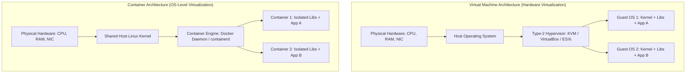
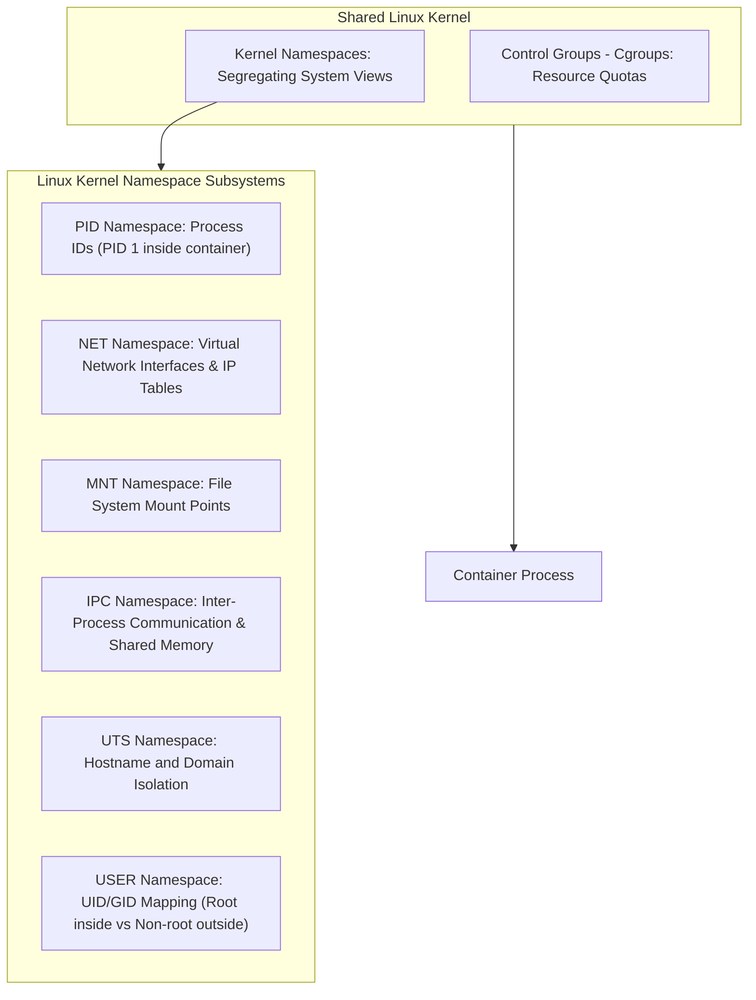

## Overview

[Intro to Containerisation](https://tryhackme.com/room/introtocontainerisation) marks the beginning of Section 4 (Container Security) in TryHackMe's DevSecOps Learning Path. Traditional software deployment long suffered from the "works on my machine" dilemma: variations in operating system libraries, conflicting language runtimes, and differing kernel configurations frequently caused software to behave unpredictably between development and production environments.

Containerisation revolutionized this landscape by packaging applications alongside their exact dependencies, system libraries, and configuration files into lightweight, immutable runtime units.

This walkthrough investigates the mechanics of containerisation, comparing hypervisor-based Virtual Machines (VMs) with OS-level virtualization (Docker), dissecting Linux kernel isolation primitives (**namespaces** and **cgroups**), analyzing process hierarchy and PID scoping, and completing the hands-on container deployment challenge.

---

## 1. Virtual Machines vs Containers: Architectural Comparison

Before container engines, hardware virtualization isolated workloads by running completely independent guest operating systems on top of a hypervisor.



### Key Differences

| Feature | Virtual Machines (VMs) | Containers (Docker) |
|---|---|---|
| **Virtualization Level** | Hardware-level abstraction (virtualized CPU, RAM, disks) | Operating System-level abstraction (shared host kernel) |
| **Startup Time** | Minutes (boots a complete operating system) | Milliseconds (instantiates an isolated process tree) |
| **Storage Footprint** | Gigabytes per VM (e.g., 1GB to 20GB disk image) | Megabytes per image (e.g., ~78MB minimal Ubuntu base) |
| **Resource Efficiency** | High overhead due to duplicate guest OS kernels | Extremely low overhead; executes directly on host hardware |
| **Isolation Boundary** | Strong hardware virtualization boundary (VT-x/AMD-V) | Kernel namespace boundaries; kernel vulnerabilities affect host |

---

## 2. The Evolution and Architecture of Docker

While the conceptual roots of process isolation trace back to **Unix V7** in 1979 (which introduced the `chroot` system call), modern containerisation became broadly accessible through Docker.

### Historical Milestones
- **1979 (Unix V7):** Introduction of `chroot` (change root), isolating filesystem views for specific processes.
- **2008 (LXC):** Linux Containers unified cgroups and namespaces into an early container runtime.
- **2013 (Docker):** Created by **Solomon Hykes** as an internal project at **dotCloud** (a PaaS vendor) and unveiled at **PyCon 2013** before transitioning into an open-source standard.

### Docker Engine Components

The Docker platform is composed of three primary operational tiers:
1. **Docker Daemon (`dockerd`):** The persistent background service managing images, containers, networks, and storage volumes.
2. **REST API:** The control interface through which programs and the CLI interact with the daemon.
3. **Docker CLI (`docker`):** The client binary executing commands (e.g., `docker run`, `docker build`, `docker ps`).

Applications packaged for Docker are compiled into immutable **Images** built from text instructions (**Dockerfiles**), and coordinated into multi-container topologies using **YAML** manifests (Docker Compose).

---

## 3. How Containerisation Works: Linux Kernel Namespaces (Task 6)

Containers are not virtual machines; they are ordinary Linux processes isolated by kernel-level security primitives.



### The 6 Core Linux Namespaces

1. **PID (Process ID):** Assigns a private process tree. Inside the container, the primary application runs as PID 1, while on the host it maps to an arbitrary high unprivileged PID.
2. **NET (Network):** Provides independent loopback interfaces, IP routing tables, port bindings, and firewall rules.
3. **MNT (Mount):** Isolates filesystem mount tables, ensuring the container cannot see the host root filesystem outside its declared root.
4. **IPC (Inter-Process Communication):** Prevents containers from reading shared memory segments or message queues of other containers.
5. **UTS (UNIX Timesharing System):** Allows containers to declare their own hostnames without changing the host system name.
6. **USER (User ID):** Maps user and group IDs between namespaces, enabling a user to run as root (`UID 0`) inside the container while mapped to a non-privileged UID on the host system.

### Process Inspection: `ps aux`
Under normal conditions, processes running inside one container cannot see or interact with processes in another container. 

On the host, process ID #0 is the swapper/idle task created at kernel boot. The first process initialized by the kernel is **PID 1** (the init system, typically `systemd`), which fathers all subsequent background daemons and user processes.

Using the command `ps aux`, an administrator on the host can inspect every running process across all namespaces. Conversely, executing `ps aux` inside an isolated container displays only the isolated application processes bound to that container's private PID namespace.

---

## 4. Practical Exercise: Containerizing the Application (Task 7)

In Task 7, we access the static site challenge, packaging the application components (web front-end, API services, and supporting libraries) into a standardized container image.

Building and running the application container validates the dependency requirements, isolates the execution environment, and outputs the challenge completion flag:

```text
THM{APPLICATION_SHIPPED}
```

---

## 5. Question, Answer, and Flag Summary

| Task # | Task Title | Question / Challenge | Answer / Flag |
|---|---|---|---|
| **Task 1** | Introduction | Complete this question and progress to next task. | *No answer needed* |
| **Task 2** | What is Containerisation | What is the name of the kernel feature allowing processes to use OS resources without interacting with others? | `namespace` |
| **Task 2** | What is Containerisation | In a normal configuration, can other containers interact with each other? (yay/nay) | `nay` |
| **Task 3** | Introducing Docker | What does an application become when it is published using Docker? Format: An xxxxx | `An Image` |
| **Task 3** | Introducing Docker | What is the abbreviation of the programming syntax language that Docker uses? | `YAML` |
| **Task 4** | The History of Docker | In what year was Docker originally created? | `2013` |
| **Task 4** | The History of Docker | Where was Docker first showcased? | `PyCon` |
| **Task 4** | The History of Docker | What version of Unix had the first concepts of containerisation? | `Unix V7` |
| **Task 5** | The Benefits & Features of Docker | Read me! | *No answer needed* |
| **Task 6** | How does Containerisation Work? | What command can we use to view a list of running processes? | `ps aux` |
| **Task 7** | Practical | Containerise the applications in the static site. What is the flag? | `THM{APPLICATION_SHIPPED}` |

---

## You can find me online at:


- **GitHub:** [Mhdomer](https://github.com/Mhdomer)
- **LinkedIn:** [mhd3omar](https://www.linkedin.com/in/mhd3omar/)
- **Tryhackme:** [nonlouy](https://tryhackme.com/p/nonlouy)
