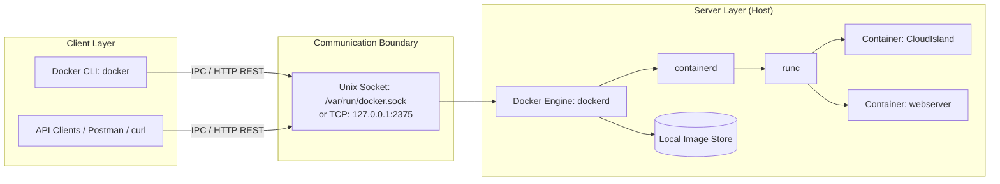

---
layout: post
title: "Intro to Docker - Image Lifecycle, Dockerfiles, Compose Orchestration, and Socket Architecture"
date: 2026-05-31T16:00:00+03:00
categories:
  - TryHackMe
  - DevSecOps
tags:
  - tryhackme
  - devsecops
  - container-security
  - docker
  - dockerfile
  - docker-compose
  - docker-socket
  - ipc
author: muhammed
description: Comprehensive technical walkthrough of TryHackMe Intro to Docker covering image manipulation, container runtime flags, Dockerfile layer optimization, multi-container orchestration with Docker Compose, and Docker socket IPC architecture.
toc: true
pin: false
math: false
mermaid: true
image:
---

## Overview

[Intro to Docker](https://tryhackme.com/room/introdocker) is the second room in Section 4 (Container Security) of the TryHackMe DevSecOps learning path. Building on the foundational containerisation concepts from the previous room, this lab covers the core operational mechanics of the Docker platform.

This walkthrough covers:
- Docker client-server architecture and Interprocess Communication (IPC) via the Docker socket
- Image registry operations, tagging models, and local storage management
- Container lifecycle management and critical runtime parameters (`-it`, `-d`, `-p`, `-v`, `--rm`, `--name`)
- Dockerfile instruction syntax, build context resolution, and layer optimization
- Declarative multi-container orchestration using Docker Compose
- Hands-on deployment of an isolated web server container to solve the Task 7 practical challenge

---

## 1. Docker Architecture & The Docker Socket

Docker uses a client-server architecture. The CLI client does not execute containers directly. Instead, it sends REST API requests to a background daemon (`dockerd`).



### The Client-Server Model & IPC

When you run a command such as `docker run helloworld`, execution follows a defined chain:
1. The **Docker Client** (`docker`) formats your input into an HTTP request.
2. The request transmits across an Interprocess Communication (IPC) channel, by default the Unix socket located at `/var/run/docker.sock`.
3. The **Docker Server** (`dockerd`) receives the request, evaluates local image caches, pulls missing layers from the registry, sets up namespaces and cgroups via `containerd` and `runc`, and initializes container execution.

Because the daemon communicates over an HTTP REST API, developers can query the engine using standard HTTP clients like `curl` or Postman:

```bash
# Querying the local Docker socket via curl
curl --unix-socket /var/run/docker.sock http://localhost/images/json
```

### Security Implications of the Docker Socket

Access to `/var/run/docker.sock` provides root-equivalent access to the host. Any user or container with write permissions to this socket can instruct the daemon to create privileged containers, mount the host root filesystem (`-v /:/host`), and compromise the host kernel. Exposing the daemon over unauthenticated TCP ports (such as `2375`) similarly allows remote unauthenticated users to gain root code execution on the underlying host.

---

## 2. Managing Docker Images & Tags

Images are read-only templates composed of layered filesystems. They define the files, dependencies, and startup configuration required to execute an application.

### Image Pulling and Tag Mechanics

Images are pulled from remote registries (such as Docker Hub) using `docker pull`:

```bash
# Pulls latest available tag by default
docker pull nginx

# Pulls specific distribution version
docker pull ubuntu:22.04
```

Tags act as pointers to specific image digests. If no tag is specified, Docker defaults to `:latest`. Relying on `:latest` in production introduces build instability because upstream maintainers can push breaking changes under that tag at any time.

```text
Registry/Repository : Tag
      ubuntu        : 22.04
      tryhackme     : 1337
```

### Local Image Inventory & Pruning

Commands for managing images stored on the local host include:

```bash
# List all images present locally
docker image ls

# Remove an image by tag or image ID
docker image rm ubuntu:22.04
```

---

## 3. Container Runtime Lifecycle & CLI Flags

The `docker run` command instantiates a container from an image. The general syntax is:

```bash
docker run [OPTIONS] IMAGE [COMMAND] [ARGUMENTS...]
```

```text
docker run -it helloworld /bin/bash
```

### Critical Runtime Options

| Option | Flag Name | Technical Function |
|---|---|---|
| `-it` | Interactive + TTY | Allocates a pseudo-TTY connected to the container standard input (`stdin`), enabling terminal interaction. |
| `-d` | Detached | Runs the container as a background daemon process, freeing the terminal. |
| `-p` | Port Publishing | Maps a host port to an exposed container port (`hostPort:containerPort`). Example: `-p 80:80`. |
| `-v` | Volume Mount | Binds a host directory or named volume into the container filesystem (`hostPath:containerPath`). |
| `--rm` | Ephemeral Cleanup | Automatically deletes the container and its anonymous volumes when it stops. |
| `--name` | Named Container | Assigns a custom identifier instead of Docker randomly generated names. |

### Inspecting Container States

Docker tracks running and stopped containers separately:

```bash
# View only actively running containers
docker ps

# View all containers across all states (running, paused, exited)
docker ps -a
```

Output includes Container ID, base image, execution command, creation timestamp, uptime status, published ports, and assigned names.

---

## 4. Authoring and Optimizing Dockerfiles

A Dockerfile is an instruction manifest used to assemble container images. Each directive represents an operation that Docker executes to construct an immutable filesystem layer.

### Core Instruction Set

| Instruction | Operational Purpose | Example |
|---|---|---|
| `FROM` | Declares the base operating system image and initializes the build stage. Must be the first non-comment instruction. | `FROM ubuntu:22.04` |
| `WORKDIR` | Sets the working directory inside the container for subsequent instructions (`RUN`, `CMD`, `COPY`). | `WORKDIR /app` |
| `COPY` | Transfers files from the host build context into the container filesystem. | `COPY . /app` |
| `RUN` | Executes commands inside the container during build time and commits the result as a new filesystem layer. | `RUN apt-get update && apt-get install -y apache2` |
| `EXPOSE` | Documents the network ports on which the container listens at runtime. | `EXPOSE 80` |
| `CMD` | Defines the default command or executable invoked when the container starts. Can be overridden at runtime. | `CMD ["apache2ctl", "-D", "FOREGROUND"]` |

### Building an Image

To build an image using a local Dockerfile:

```bash
docker build -t helloworld .
```

The `-t` flag applies a repository name and optional tag. The `.` denotes the build context path sent to the Docker daemon.

### Layer Optimization & Cache Efficiency

Every `RUN`, `COPY`, and `ADD` directive creates a distinct read-only layer in the image union filesystem. Bloated layers increase storage costs, download latency, and container start times.

#### Unoptimized Dockerfile (Multiple Layers)

```dockerfile
FROM ubuntu:latest
RUN apt-get update -y
RUN apt-get upgrade -y
RUN apt-get install apache2 -y
RUN apt-get install net-tools -y
```

This configuration writes package indexes, upgrade caches, and temporary files across four separate layers.

#### Optimized Dockerfile (Chained Single Layer)

```dockerfile
FROM ubuntu:22.04
RUN apt-get update -y && \
    apt-get install --no-install-recommends -y apache2 net-tools && \
    apt-get clean && \
    rm -rf /var/lib/apt/lists/*
EXPOSE 80
CMD ["apache2ctl", "-D", "FOREGROUND"]
```

Chaining commands with `&&` executes package retrieval, installation, and cache cleanup within a single layer, preventing deleted files from lingering in intermediate layer history.

---

## 5. Multi-Container Orchestration with Docker Compose

Running microservice architectures using standalone `docker run` commands requires manual network creation, manual volume binding, and rigid startup ordering:

```bash
# Manual multi-container setup
docker network create ecommerce
docker run -d --name database --net ecommerce -e MYSQL_ROOT_PASSWORD=secret mysql:latest
docker run -d --name webserver --net ecommerce -p 80:80 webserver
```

Docker Compose replaces this procedural workflow with a declarative YAML configuration file (`docker-compose.yml`).

### Sample `docker-compose.yml` Architecture

```yaml
version: '3.3'

services:
  web:
    build: ./web
    networks:
      - ecommerce
    ports:
      - '80:80'

  database:
    image: mysql:latest
    networks:
      - ecommerce
    environment:
      - MYSQL_DATABASE=ecommerce
      - MYSQL_USERNAME=root
      - MYSQL_ROOT_PASSWORD=helloword

networks:
  ecommerce:
```

### Key Compose Commands

| Command | Purpose |
|---|---|
| `docker-compose up` | Builds, creates, and starts all containers, networks, and volumes declared in the configuration. |
| `docker-compose up -d` | Starts the entire Compose stack in the background (detached mode). |
| `docker-compose start` | Starts existing stopped containers without rebuilding images. |
| `docker-compose stop` | Stops running services without removing containers or networks. |
| `docker-compose down` | Stops containers and removes all associated containers, networks, and default volumes. |
| `docker-compose build` | Rebuilds container images defined by `build:` directives without starting them. |

---

## 6. Practical Lab Walkthrough (Task 7)

### Step 1: Identifying the Running Container

We connect to the lab machine and inspect the current container inventory using `docker ps`:

```bash
cmnatic@thm-intro-to-docker:~$ docker ps
CONTAINER ID   IMAGE                 COMMAND   CREATED         STATUS         PORTS     NAMES
3a9f1b2c4d5e   cmnatic/island:v1.0   "sleep"   5 minutes ago   Up 5 minutes             CloudIsland
```

The actively running container is named **CloudIsland**.

### Step 2: Deploying the Web Server Container

The practical scenario requires starting a container using the local `webserver` image, publishing port 80 to the host:

```bash
cmnatic@thm-intro-to-docker:~$ docker run -d --name web -p 80:80 webserver
```

Verifying that the container initialized successfully:

```bash
cmnatic@thm-intro-to-docker:~$ docker ps
CONTAINER ID   IMAGE       COMMAND                  CREATED         STATUS         PORTS                NAMES
b1e2f3a4c5d6   webserver   "apache2ctl -D FORE…"   2 seconds ago   Up 1 second    0.0.0.0:80->80/tcp   web
3a9f1b2c4d5e   ...         ...                      ...             ...            ...                  CloudIsland
```

### Step 3: Flag Retrieval

Connecting to the web server URL via the browser displays the active service page and the practical challenge flag:

```text
THM{WEBSERVER_CONTAINER}
```

---

## 7. Question, Answer, and Flag Summary

| Task # | Task Title | Question / Challenge | Answer / Flag |
|---|---|---|---|
| **Task 1** | Introduction | Complete this question before progressing to the next task. | *No answer needed* |
| **Task 2** | Managing Docker Images | If we wanted to pull a docker image, what would our command look like? | `docker pull` |
| **Task 2** | Managing Docker Images | If we wanted to list all images on a device running Docker, what would our command look like? | `docker image ls` |
| **Task 2** | Managing Docker Images | Let's say we wanted to pull the image "tryhackme" (no quotations); what would our command look like? | `docker pull tryhackme` |
| **Task 2** | Managing Docker Images | Let's say we wanted to pull the image "tryhackme" with the tag "1337" (no quotations). What would our command look like? | `docker pull tryhackme:1337` |
| **Task 3** | Running Your First Container | What would our command look like if we wanted to run a container interactively? (Assume no image specified) | `docker run -it` |
| **Task 3** | Running Your First Container | What would our command look like if we wanted to run a container in "detached" mode? (Assume no image specified) | `docker run -d` |
| **Task 3** | Running Your First Container | Let's say we want to run a container that will run and bind a webserver on port 80. What would our command look like? (Assume no image specified) | `docker run -p 80:80` |
| **Task 3** | Running Your First Container | How would we list all running containers? | `docker ps` |
| **Task 3** | Running Your First Container | Now, how would we list all containers (including stopped)? | `docker ps -a` |
| **Task 4** | Intro to Dockerfiles | What instruction would we use to specify what base image the container should be using? | `FROM` |
| **Task 4** | Intro to Dockerfiles | What instruction would we use to tell the container to run a command? | `RUN` |
| **Task 4** | Intro to Dockerfiles | What docker command would we use to build an image using a Dockerfile? | `build` |
| **Task 4** | Intro to Dockerfiles | Let's say we want to name this image; what argument would we use? | `-t` |
| **Task 5** | Intro to Docker Compose | I want to use docker-compose to start up a series of containers. What argument allows me to do this? | `up` |
| **Task 5** | Intro to Docker Compose | I want to use docker-compose to delete the series of containers. What argument allows me to do this? | `down` |
| **Task 5** | Intro to Docker Compose | What is the name of the .yml file that docker-compose uses? | `docker-compose.yml` |
| **Task 6** | Intro to the Docker Socket | What does the term "IPC" stand for? | `Interprocess Communication` |
| **Task 6** | Intro to the Docker Socket | What technology can the Docker Server be equalled to? | `API` |
| **Task 7** | Practical | Connect to the machine. What is the name of the container that is currently running? | `CloudIsland` |
| **Task 7** | Practical | What is the flag? | `THM{WEBSERVER_CONTAINER}` |

---

## You can find me online at:


- **GitHub:** [Mhdomer](https://github.com/Mhdomer)
- **LinkedIn:** [mhd3omar](https://www.linkedin.com/in/mhd3omar/)
- **Tryhackme:** [nonlouy](https://tryhackme.com/p/nonlouy)
