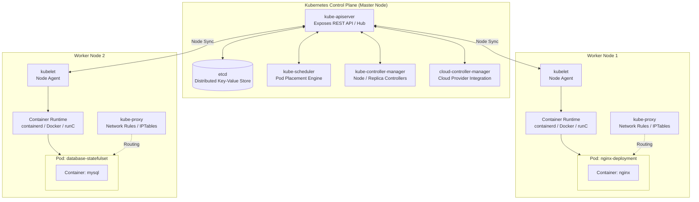

## Overview

[Intro to Kubernetes](https://tryhackme.com/room/introtok8s) is the third room in Section 4 (Container Security) of the TryHackMe DevSecOps learning path. As containerized architectures scale from individual host daemons to distributed clusters, managing container lifecycles, traffic distribution, and resilient state manually becomes untenable. Kubernetes provides an automated container orchestration framework to handle deployment, scaling, healing, and network routing across physical or virtual compute nodes.

This walkthrough covers:
- Core drivers behind microservices and container orchestration
- Control plane and worker node internal components
- Cluster abstraction primitives: Pods, ReplicaSets, Deployments, StatefulSets, Services, and Ingress
- Declarative YAML manifests (`apiVersion`, `kind`, `metadata`, `spec`)
- Cluster administration with `kubectl` (`apply`, `get`, `describe`, `logs`, `exec`, `port-forward`)
- DevSecOps hardening: Pod Security Standards (PSS), Pod Security Admission (PSA), Secrets management, and Role-Based Access Control (RBAC)
- Hands-on exploitation of unencrypted Secrets and remediation using scoped ServiceAccounts and RoleBindings

---

## 1. Kubernetes Architecture

Kubernetes clusters follow a master-worker topology where a centralized control plane manages scheduling, desired state convergence, and API requests across worker compute nodes.



### Control Plane Components

1. **kube-apiserver**: Front-end REST gateway for the cluster. All internal components and external clients (`kubectl`) communicate exclusively through the API server.
2. **etcd**: Consistent, highly available distributed key-value database storing all cluster state configurations, metadata, and runtime status.
3. **kube-scheduler**: Watches for unscheduled pods and assigns them to optimal worker nodes based on resource availability, affinity rules, and constraints.
4. **kube-controller-manager**: Runs controller processes that continuously reconcile current cluster state against desired state (Node Lifecycle Controller, ReplicaSet Controller, Endpoint Controller).
5. **cloud-controller-manager**: Decouples cloud-provider-specific logic (load balancers, storage volumes, node routing) from core Kubernetes operations.

### Worker Node Components

1. **kubelet**: Node-level agent that receives PodSpecifications (`PodSpecs`) from `kube-apiserver` and ensures declared containers are healthy and running.
2. **kube-proxy**: Network proxy running on each node that maintains IP packet filtering rules (using `iptables` or IPVS) to direct traffic to pods backing a Service.
3. **Container Runtime**: Underlying software executing containers inside pods (`containerd`, `CRI-O`, `Docker`).

---

## 2. Abstraction Primitives

| Primitive | Architectural Scope | Key Characteristics |
|---|---|---|
| **Pod** | Smallest compute unit | Colocated group of one or more containers sharing network namespaces (`localhost`), IPC, and storage volumes. |
| **ReplicaSet** | Pod availability guarantee | Ensures a specified number of identical pod replicas remain operational simultaneously. |
| **Deployment** | Declarative lifecycle manager | Manages ReplicaSets and provides declarative rollouts, rollbacks, and self-healing for stateless workloads. |
| **StatefulSet** | Stateful workload manager | Provides stable network identities (e.g., `db-0`, `db-1`) and ordered volume attachment for databases. |
| **Service** | Static access abstraction | Stable virtual IP (`ClusterIP`, `NodePort`, `LoadBalancer`) mapping traffic across ephemeral pods via label selectors. |
| **Ingress** | HTTP/S application router | Application-layer routing rules (host, path, TLS termination) mapping external traffic to internal Services. |

---

## 3. Declarative Manifest Construction

Kubernetes configurations require four top-level schema fields:
- `apiVersion`: Version of the Kubernetes API schema used for object validation.
- `kind`: Target resource type (e.g., `Deployment`, `Service`, `Role`).
- `metadata`: Identification data including `name`, `namespace`, and descriptive `labels`.
- `spec`: Desired operational state of the target resource.

### Service Definition (`nginx-service.yaml`)

```yaml
apiVersion: v1
kind: Service
metadata:
  name: example-nginx-service
spec:
  type: ClusterIP
  selector:
    app: nginx
  ports:
    - protocol: TCP
      port: 8080
      targetPort: 80
```

`port: 8080` defines the external port exposed by the service, while `targetPort: 80` specifies the internal listening port of the pod container.

### Deployment Definition (`nginx-deployment.yaml`)

```yaml
apiVersion: apps/v1
kind: Deployment
metadata:
  name: example-nginx-deployment
spec:
  replicas: 3
  selector:
    matchLabels:
      app: nginx
  template:
    metadata:
      labels:
        app: nginx
    spec:
      containers:
        - name: nginx
          image: nginx:latest
          ports:
            - containerPort: 80
```

The `spec.selector.matchLabels` block pairs directly with `spec.template.metadata.labels` and the Service's `spec.selector`.

---

## 4. Kubectl Command Mechanics

`kubectl` translates CLI commands into structured JSON REST calls against `kube-apiserver`.

```bash
# Apply declarative manifest to create or update resources
kubectl apply -f nginx-deployment.yaml

# Query status of resources across namespaces
kubectl get pods -A
kubectl get svc -n default

# Inspect detailed object metadata, status, and lifecycle events
kubectl describe pod example-pod -n default

# Stream stdout and stderr logs from a container
kubectl logs example-pod -n default

# Open an interactive shell inside a container
kubectl exec -it example-pod -n default -- sh

# Forward a local port to a cluster service
kubectl port-forward service/example-nginx-service 8090:8080
```

---

## 5. Security & Cluster Hardening Principles

Securing Kubernetes environments requires defense-in-depth across compute, network, identity, and data layers:

1. **Pod Security Standards (PSS) & Admission (PSA):** Replaces legacy `PodSecurityPolicies` (deprecated in v1.25) with three compliance profiles:
   - `Privileged`: Unrestricted execution, allowing known privilege escalation vectors.
   - `Baseline`: Default out-of-the-box configuration preventing common privilege escalation mechanisms.
   - `Restricted`: Hardened profile requiring non-root execution, dropped capabilities, and read-only root filesystems.
2. **Secrets Encryption at Rest:** Kubernetes Secrets are base64-encoded strings stored in `etcd`. Without configuring `EncryptionConfiguration` with KMS providers, any process with read access to `etcd` or the Secret API can retrieve plaintext credentials.
3. **Role-Based Access Control (RBAC):** Restricts API access using `Roles` (namespace-scoped) or `ClusterRoles` (cluster-scoped), bound to subjects (Users, Groups, ServiceAccounts) via `RoleBindings`.

---

## 6. Hands-On Practical Walkthrough (Task 8)

### Phase One: Cluster Exploration & Deployment

We begin by initializing the local Minikube environment:

```bash
minikube start
```

Inspecting baseline system pods across all namespaces:

```bash
kubectl get pods -A
```

Navigating to `~/Desktop/configuration`, we inspect `nginx-service.yaml` and `nginx-deployment.yaml`, applying the service first followed by the deployment:

```bash
cd ~/Desktop/configuration
kubectl apply -f nginx-service.yaml
kubectl apply -f nginx-deployment.yaml
```

Verifying that the pod initialized:

```bash
kubectl get pods
```

### Phase Two: Port Forwarding & Secret Enumeration

The web application exposes port 80 internally, mapped to service port 8080. We establish a local port forward from host port 8090 to service port 8080:

```bash
kubectl port-forward service/nginx-service 8090:8080
```

Navigating to `http://localhost:8090/` displays a login portal prompting for authentication credentials.

In a second terminal window, we query existing Secrets in the default namespace:

```bash
kubectl get secrets
```

The output reveals a secret named `terminal-creds`. Inspecting its structure:

```bash
kubectl describe secret terminal-creds
```

The secret stores two data keys: `username` and `password`. Because Kubernetes Secrets are base64 encoded rather than encrypted by default, we extract and decode the values directly:

```bash
kubectl get secret terminal-creds -o jsonpath='{.data.username}' | base64 --decode
kubectl get secret terminal-creds -o jsonpath='{.data.password}' | base64 --decode
```

Submitting the decoded credentials into the web interface logs in successfully and retrieves the challenge flag:

```text
THM{k8s_k3nno1ssarus}
```

### Phase Three: Hardening Secrets via RBAC

Unrestricted secret reading poses an immediate lateral movement hazard. We implement least privilege access by binding access to a dedicated ServiceAccount.

First, we create two ServiceAccounts:

```bash
kubectl create sa terminal-user
kubectl create sa terminal-admin
```

Next, we inspect the RBAC configurations in `~/Desktop/configuration/rbac`:

#### `role.yaml`
```yaml
apiVersion: rbac.authorization.k8s.io/v1
kind: Role
metadata:
  name: secret-admin
rules:
  - apiGroups: [""]
    resources: ["secrets"]
    resourceNames: ["terminal-creds"]
    verbs: ["get"]
```

#### `role-binding.yaml`
```yaml
apiVersion: rbac.authorization.k8s.io/v1
kind: RoleBinding
metadata:
  name: secret-admin-binding
subjects:
  - kind: ServiceAccount
    name: terminal-admin
    namespace: default
roleRef:
  kind: Role
  name: secret-admin
  apiGroup: rbac.authorization.k8s.io
```

Applying the RBAC manifests:

```bash
kubectl apply -f role.yaml
kubectl apply -f role-binding.yaml
```

Finally, we validate the authorization boundary using `kubectl auth can-i`:

```bash
# Verify unprivileged user cannot retrieve the secret
kubectl auth can-i get secret/terminal-creds --as=system:serviceaccount:default:terminal-user
# Output: no

# Verify designated admin account can retrieve the secret
kubectl auth can-i get secret/terminal-creds --as=system:serviceaccount:default:terminal-admin
# Output: yes
```

The RBAC rule successfully restricts access to the designated identity, fulfilling the security hardening objective.

---

## 7. Question, Answer, and Flag Summary

| Task # | Task Title | Question / Challenge | Answer / Flag |
|---|---|---|---|
| **Task 1** | Introduction | Let's go! | *No answer needed* |
| **Task 2** | Kubernetes 101 | Which benefit of Kubernetes means that it can run anywhere on any type of infrastructure? | `highly portable` |
| **Task 2** | Kubernetes 101 | Fill in the blank: "Kubernetes is a _________ _____________ system". | `container orchestration` |
| **Task 3** | Kubernetes Architecture | What is the smallest deployable unit of computing you can create in Kubernetes? | `pod` |
| **Task 3** | Kubernetes Architecture | Which control plane component is a key/value store which contains data pertaining to the cluster and its current state? | `etcd` |
| **Task 3** | Kubernetes Architecture | Which worker node component is responsible for network communication within the cluster? | `kube-proxy` |
| **Task 4** | Kubernetes Landscape | Which Kubernetes component exposes pods and serves as an access point? | `Services` |
| **Task 4** | Kubernetes Landscape | Which Kubernetes component can guarantee the availability of X number of pods? | `ReplicaSet` |
| **Task 4** | Kubernetes Landscape | What Kubernetes component is used to define a desired state? | `Deployments` |
| **Task 5** | Kubernetes Configuration | In a config file, you have just declared that you want 4 nginx pods. In which one of the 'required fields' has this been declared? | `spec` |
| **Task 5** | Kubernetes Configuration | The configuration file is for a deployment. In which one of the 'required fields' is this declared? | `kind` |
| **Task 5** | Kubernetes Configuration | In the service configuration file, the target port was set to 80. What should you put as the 'containerPort'? | `80` |
| **Task 6** | Kubectl | ...troubleshoot a pod by gathering some details about it? | `describe` |
| **Task 6** | Kubectl | ...access the container's shell? | `exec` |
| **Task 6** | Kubectl | ...check the status of running pods? | `get` |
| **Task 6** | Kubectl | ...turn a defined configuration (YAML file) into a running process? | `apply` |
| **Task 7** | Kubernetes & DevSecOps | Which best container security practice is used to regulate access to a Kubernetes cluster and its resources? | `RBAC` |
| **Task 7** | Kubernetes & DevSecOps | What is used to define security policies at 3 levels? | `Pod Security Standards` |
| **Task 7** | Kubernetes & DevSecOps | What enforces these policies? | `Pod Security Admission` |
| **Task 7** | Kubernetes & DevSecOps | What Kubernetes object can be used to store sensitive information and should, therefore, be managed securely? | `secret` |
| **Task 8** | Hands-on with Kubernetes | Can you master the basics of Kubernetes and retrieve the flag? | `THM{k8s_k3nno1ssarus}` |
| **Task 8** | Hands-on with Kubernetes | What apiVersion is used for the RoleBinding? | `rbac.authorization.k8s.io/v1` |

---

## You can find me online at:


- **GitHub:** [Mhdomer](https://github.com/Mhdomer)
- **LinkedIn:** [mhd3omar](https://www.linkedin.com/in/mhd3omar/)
- **Tryhackme:** [nonlouy](https://tryhackme.com/p/nonlouy)
