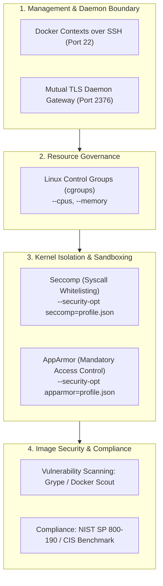

## Overview

[Container Hardening](https://tryhackme.com/room/containerhardening) is the fifth and final room in Section 4 (Container Security) of the TryHackMe DevSecOps learning path. In the previous rooms, we explored how container breakouts exploit over-privileged flags, exposed Unix sockets, and shared host namespaces. This room shifts from exploitation to remediation, detailing the multi-layered defensive controls required to harden container runtimes, host daemons, and image supply chains.

This walkthrough covers:
- Securing remote Docker daemon access using SSH Docker Contexts and mutual TLS (mTLS)
- Mitigating resource exhaustion and denial-of-service with Linux control groups (cgroups)
- Restricting kernel syscalls using customized Seccomp JSON profiles
- Enforcing filesystem and network Mandatory Access Control (MAC) using AppArmor profiles
- Reviewing Docker image layers and tracking compliance against NIST SP 800-190 and CIS Docker Benchmarks
- Conducting static vulnerability audits of images and exported container archives using Grype

---

## 1. Container Defense-in-Depth Architecture

Securing containerized workloads requires applying controls at the management interface, runtime engine, host kernel, and image supply chain:



---

## 2. Securing the Docker Daemon

By default, the Docker daemon does not listen on a network port. In CI/CD pipelines and remote administration environments, however, teams frequently expose the daemon. Securing this interface is critical to prevent unauthenticated host compromise.

### Docker Contexts over SSH

Docker Contexts allow administrators to store and switch between client configurations. Rather than exposing an unauthenticated TCP port, administrators can tunnel Docker commands over an encrypted SSH connection:

```bash
# Create a new remote Docker context targeting an SSH host
docker context create --docker host=ssh://myuser@remotehost --description="Development Environment" development-environment-host

# Switch active execution context
docker context use development-environment-host

# Revert back to local daemon execution
docker context use default
```

Commands run while a context is active execute directly against the remote daemon over an encrypted SSH tunnel.

### Mutual TLS (mTLS) on Port 2376

When HTTP/S communication is required for automation tools, the daemon must enforce mutual TLS. Under this configuration, the daemon listens on port **2376** and rejects any connection that does not present a client certificate signed by a designated Certificate Authority (CA).

#### Daemon Server Configuration

```bash
dockerd --tlsverify \
  --tlscacert=myca.pem \
  --tlscert=myserver-cert.pem \
  --tlskey=myserver-key.pem \
  -H=0.0.0.0:2376
```

#### Client Execution

```bash
docker --tlsverify \
  --tlscacert=myca.pem \
  --tlscert=client-cert.pem \
  --tlskey=client-key.pem \
  -H=SERVERIP:2376 info
```

- `--tlscacert`: Root CA certificate validating client and server trust.
- `--tlscert`: Public certificate authenticating the endpoint.
- `--tlskey`: Private key decrypting session traffic.

---

## 3. Implementing Control Groups (Cgroups)

Without resource constraints, a compromised or runaway container can consume all available CPU and RAM, starving critical host processes and inducing a system crash.

Linux control groups (cgroups) allocate and limit hardware resource consumption per container:

| Resource | Runtime Flag | Example Command |
|---|---|---|
| **CPU** | `--cpus` | `docker run -d --cpus="1" mycontainer` |
| **Memory** | `--memory` | `docker run -d --memory="20m" mycontainer` |

### Dynamic Quota Adjustments & Inspection

Resource limits can be updated on live containers without restarting them:

```bash
docker update --memory="40m" mycontainer
```

To verify the resource limits applied to a container:

```bash
docker inspect apache
```

Inspect output includes keys such as `"Memory": 0` and `"CpuQuota": 0`. A value of `0` indicates that no boundary has been configured.

---

## 4. Preventing Over-Privileged Containers: Seccomp vs AppArmor

Securing container operations requires distinguishing between system call filtering and path-based resource access control:

```text
+--------------------------------------------------------------------------+
| Seccomp: Operates inside program context; filters kernel system calls.   |
| (e.g., blocking execve, socket, or clock_adjtime)                       |
+--------------------------------------------------------------------------+
| AppArmor: Operates at the OS layer; enforces Mandatory Access Control.   |
| (e.g., restricting filesystem paths and network sockets)                 |
+--------------------------------------------------------------------------+
```

### Seccomp (Secure Computing Mode)

Seccomp inspects system calls made by a container process and returns actions such as `SCMP_ACT_ALLOW` or `SCMP_ACT_ERRNO` (which denies the call and returns an error code):

```json
{
  "defaultAction": "SCMP_ACT_ALLOW",
  "architectures": ["SCMP_ARCH_X86_64"],
  "syscalls": [
    {
      "names": ["socket", "connect", "bind", "listen", "accept"],
      "action": "SCMP_ACT_ERRNO"
    }
  ]
}
```

Applying the profile at runtime:

```bash
docker run --rm -it --security-opt seccomp=/path/to/profile.json mycontainer
```

### AppArmor (Mandatory Access Control)

AppArmor defines what filesystem paths, raw capabilities, and network protocols an application binary can interact with.

Checking whether AppArmor is active:

```bash
sudo aa-status
```

Sample profile snippet restricting Apache to its web directory and denying access to system binaries:

```text
/usr/sbin/httpd {
  /var/www/** r,
  /var/log/apache2/** rw,
  network tcp,
  deny /bin/**,
  deny /usr/**,
  deny /sbin/**
}
```

Parsing and applying the profile:

```bash
# Parse and load profile into the Linux kernel
sudo apparmor_parser -r -W /path/to/profile

# Launch container with the loaded AppArmor profile
docker run --rm -it --security-opt apparmor=/path/to/profile mycontainer
```

---

## 5. Compliance Frameworks & Image Auditing

### Standards and Benchmarks

- **NIST SP 800-190:** National Institute of Standards and Technology Application Container Security Guide, outlining threats across images, registries, orchestrators, and host OS layers.
- **CIS Docker Benchmark:** Concrete security configuration checks developed by the Center for Internet Security to evaluate daemon configuration, container runtime flags, and host security.
- **ISO 27001:** International standard governing Information Security Management Systems (ISMS).

### Tooling Landscape

- **Docker Scout:** Docker native analysis tool providing vulnerability detection and software bill of materials (SBOM) generation.
- **Dive:** CLI utility for exploring container image layers, discovering wasted space, and auditing file modifications between build steps.
- **OpenSCAP:** Multi-framework compliance assessment engine.
- **Grype:** Standalone vulnerability scanner from Anchore tailored for container images and filesystem archives.

---

## 6. Practical Lab Walkthrough (Task 8)

### Step 1: Listing Running Containers

Connecting to the lab host, we check the active container inventory using `docker ps`:

```bash
user@thm-container-hardening:~$ docker ps
CONTAINER ID   IMAGE       COMMAND                  CREATED         STATUS         PORTS      NAMES
7d8e9f1a2b3c   couchdb     "tini -- /docker-en…"   10 minutes ago  Up 10 minutes  5984/tcp   couchdb
```

The currently running container is named **couchdb**.

### Step 2: Scanning the Struts2 Image with Grype

We execute a full-layer vulnerability scan against the local `struts2` container image using Grype:

```bash
user@thm-container-hardening:~$ grype struts2 --scope all-layers
```

Reviewing the vulnerability findings, a Critical severity finding is highlighted against the core framework package:

```text
NAME          INSTALLED       FIXED-IN   TYPE  VULNERABILITY    SEVERITY
struts2-core  2.3.15.1                   java  CVE-2017-5638    Critical
```

The library marked as Critical is **struts2-core**.

### Step 3: Auditing Exported Container Filesystem (`/root/container.tar`)

Grype can scan exported tar archives generated via `docker save`. We target `/root/container.tar` to locate CVE-2023-45853:

```bash
user@thm-container-hardening:~$ grype /root/container.tar
```

Filtering the output for `CVE-2023-45853`:

```text
CVE-2023-45853   Critical   MiniZip in zlib allows integer overflow
```

The severity rating for CVE-2023-45853 is **critical**.

---

## 7. Question, Answer, and Flag Summary

| Task # | Task Title | Question / Challenge | Answer / Flag |
|---|---|---|---|
| **Task 1** | Introduction | Read the above before proceeding to the next task! | *No answer needed* |
| **Task 2** | Protecting the Docker Daemon | What would the command be if we wanted to create a Docker profile? | `docker context create` |
| **Task 2** | Protecting the Docker Daemon | What would the command be if we wanted to switch to a Docker profile? | `docker context use` |
| **Task 3** | Implementing Control Groups | What argument would we provide when running a Docker container to enforce how many CPU cores the container can utilise? | `--cpus` |
| **Task 3** | Implementing Control Groups | What would the command be if we wanted to inspect a docker container named "Apache"? | `docker inspect apache` |
| **Task 4** | Preventing "Over-Privileged" Containers | If we wanted to enforce the container to only be able to read files located in /home/tryhackme, what type of profile would we use? | `AppArmor` |
| **Task 4** | Preventing "Over-Privileged" Containers | If we wanted to disallow the container from a system call (such as clock_adjtime), what type of profile would we use? | `Seccomp` |
| **Task 4** | Preventing "Over-Privileged" Containers | Finally, what command would we use if we wanted to list the status of AppArmor? | `aa-status` |
| **Task 6** | Reviewing Docker Images | I understand how I can review both Dockerfiles and Docker images! | *No answer needed* |
| **Task 7** | Compliance & Benchmarking | What is the name of the framework published by the National Institute of Standards and Technology? | `NIST SP 800-190` |
| **Task 7** | Compliance & Benchmarking | What is the name of the analysis tool provided by Docker? | `Docker Scout` |
| **Task 8** | Practical | Use Docker to list the running containers on the system. What is the name of the container that is currently running? | `couchdb` |
| **Task 8** | Practical | Use Grype to analyse the "struts2" image. What is the name of the library marked as "Critical"? | `struts2-core` |
| **Task 8** | Practical | Use Grype to analyse the exported container filesystem located at /root/container.tar. What severity is the "CVE-2023-45853" rated as? | `critical` |

---

## You can find me online at:


- **GitHub:** [Mhdomer](https://github.com/Mhdomer)
- **LinkedIn:** [mhd3omar](https://www.linkedin.com/in/mhd3omar/)
- **Tryhackme:** [nonlouy](https://tryhackme.com/p/nonlouy)
