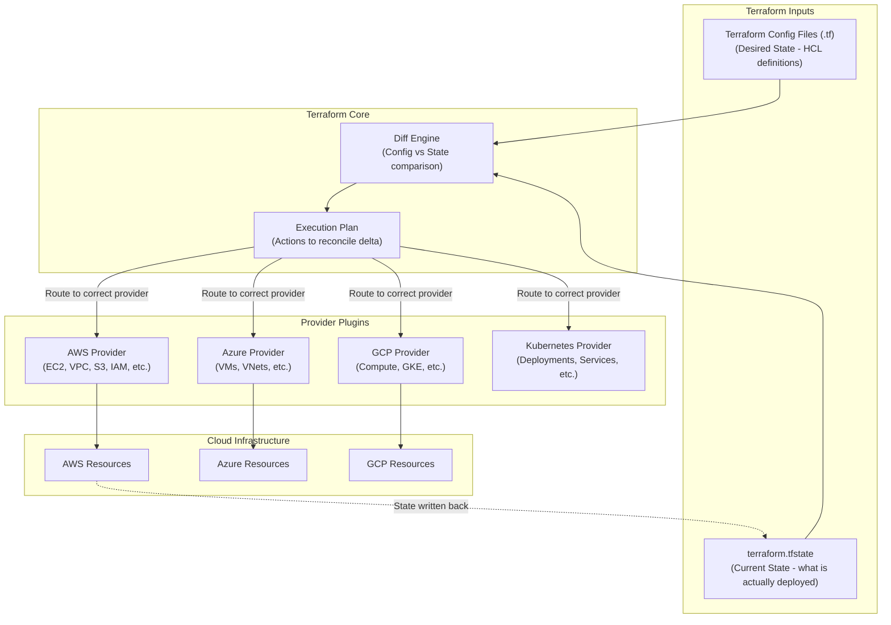
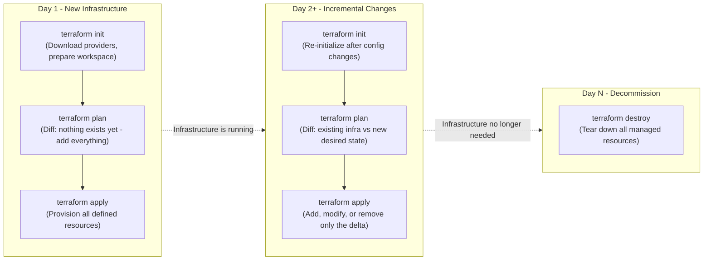
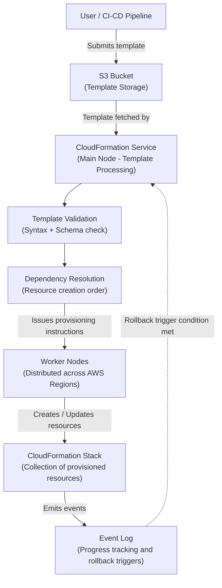
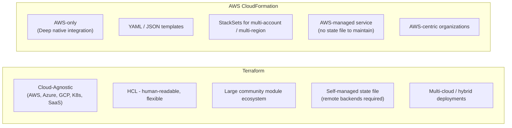

---
layout: post
title: "Cloud-based IaC - Terraform, AWS CloudFormation, and Secure IaC Practices"
date: 2026-06-03T18:00:00+03:00
categories:
  - TryHackMe
  - DevSecOps
tags:
  - tryhackme
  - devsecops
  - iac
  - infrastructure-as-code
  - terraform
  - cloudformation
  - aws
  - hcl
  - cloud-security
author: muhammed
description: Technical walkthrough of TryHackMe Cloud-based IaC covering Terraform architecture and HCL configuration, AWS CloudFormation templates and stacks, Terraform vs CloudFormation trade-offs, and secure IaC best practices for cloud deployments.
toc: true
pin: false
math: false
mermaid: true
image:
---

## Overview

[Cloud-based IaC](https://tryhackme.com/room/cloudbasediac) is the third and final room in Section 5 (Infrastructure as Code) of the TryHackMe DevSecOps learning path. The previous room demonstrated how on-premises IaC pipelines are built and exploited. This room shifts focus to the cloud, examining how Terraform and AWS CloudFormation enable declarative, version-controlled infrastructure provisioning against cloud provider APIs.

This walkthrough covers:
- Terraform architecture (Core, State file, Providers) and the relationship between the three components
- Writing Terraform configuration in HCL: resource blocks, variable files, and modular file structure
- The Terraform workflow: `terraform init`, `terraform plan`, `terraform apply`, and `terraform destroy` across Day 1, Day 2+, and Day N scenarios
- AWS CloudFormation architecture (main-worker model, template processing, event-driven model)
- CloudFormation template structure: sections, intrinsic functions, change sets, and cross-stack references
- Direct comparison of Terraform vs CloudFormation across key decision criteria
- Secure IaC best practices for both tools: secrets management, least privilege, backend state encryption, and stack policies
- Hands-on interactive practical flag retrieval

---

## 1. Terraform Architecture

Terraform is a declarative, agentless, immutable infrastructure provisioning tool that manages resources across multiple cloud providers through a plugin-based provider system.



### Core Components

- **Terraform Core:** The central orchestration engine responsible for reading configuration files, comparing them against the stored state, computing the minimum required changes to reach the desired state, and directing the appropriate provider to execute those changes.
- **Terraform Config Files (`.tf`):** Written in HashiCorp Configuration Language (HCL), these files declare the desired infrastructure state. They define resources, their properties, dependencies, variables, and outputs.
- **State File (`terraform.tfstate`):** A JSON document Terraform maintains to track the current deployed state of managed infrastructure. The Core compares this against the config files to determine what actions are needed. By default, this file lives in the working directory and must be protected carefully (it can contain plaintext secrets).
- **Providers:** Plugin libraries that translate Terraform resource definitions into API calls against specific cloud platforms or services. Installing providers happens during `terraform init`.

The key insight into Terraform's value is provider breadth: a single `.tf` codebase can provision resources across AWS, Azure, GCP, Kubernetes, and many SaaS tools simultaneously, eliminating multi-tool complexity in heterogeneous environments.

---

## 2. Terraform Configuration (HCL)

HCL is human-readable and declarative, designed specifically for resource definition rather than general-purpose scripting.

### Resource Blocks

Each cloud object is declared as a resource block specifying the resource type (which maps to a specific provider API object) and a local reference name:

```hcl
provider "aws" {
  region = "eu-west-2"
}

# Create a VPC
resource "aws_vpc" "flynet_vpc" {
  cidr_block = "10.0.0.0/16"
  tags = {
    Name = "flynet-vpc"
  }
}
```

### Resource Dependencies and Cross-References

Resources can reference properties of other resources using the format `resource_type.resource_name.attribute`. Terraform automatically resolves dependency ordering from these references:

```hcl
resource "aws_security_group" "example_security_group" {
  name        = "example-security-group"
  description = "Example Security Group"
  vpc_id      = aws_vpc.flynet_vpc.id  # Reference to the VPC defined above

  ingress {
    from_port   = 22
    to_port     = 22
    protocol    = "tcp"
    cidr_blocks = [aws_vpc.flynet_vpc.cidr_block]
  }
}
```

Because `aws_security_group` references `aws_vpc.flynet_vpc`, Terraform knows to create the VPC first before attempting to create the security group.

### Modular File Structure

Large infrastructure codebases are split into module files rather than one monolithic `.tf` file:

```
tfconfig/
  main.tf              # Central config: references all modules
  variables.tf         # Shared variable definitions and defaults
  flynet_vpc_security.tf
  other_module.tf
```

Variables are declared in `variables.tf` and referenced with the `var.` prefix throughout other files:

```hcl
# variables.tf
variable "vpc_cidr_block" {
  description = "CIDR block for the VPC"
  type        = string
  default     = "10.0.0.0/16"
}

# flynet_vpc_security.tf
cidr_block = var.vpc_cidr_block

# main.tf
module "flynet_vpc_security" {
  source = "./flynet_vpc_security.tf"
}

module "other_module" {
  source = "./Other_module.tf"
}
```

This pattern decouples infrastructure definition from configuration values, allowing the same module definitions to be reused across environments by simply swapping variable input files.

---

## 3. Terraform Workflow

The Terraform workflow changes depending on whether infrastructure is being provisioned from scratch, modified, or torn down.



### Command Reference

| Command | Purpose |
|---|---|
| `terraform init` | Downloads provider plugins, sets up backend storage, prepares working directory. Must be run first and after any provider or backend changes. |
| `terraform plan` | Reads config and state, computes a diff, and prints the planned execution (additions, modifications, deletions) without making any changes. Recommended before every apply. |
| `terraform apply` | Executes the actions from the plan. If `terraform plan` was not run first, Terraform generates a plan automatically and requests approval. Updates the state file on completion. |
| `terraform destroy` | Generates a destroy plan for all managed resources and tears them down after approval. |

The `terraform plan` output is particularly valuable in Day 2+ scenarios: it shows exactly which existing resources will be modified or replaced (and whether modification will cause resource recreation), preventing accidental destruction of stateful systems like databases.

---

## 4. AWS CloudFormation Architecture

CloudFormation is AWS's native, fully managed IaC service. Users submit YAML or JSON templates; CloudFormation handles all orchestration internally.



### Processing Flow

1. **Template Submission:** User uploads a YAML or JSON template defining desired AWS resources. Templates can be stored in S3 for versioning and access control.
2. **Template Validation:** CloudFormation parses the template, validates syntax, and verifies that resource property values conform to AWS resource specifications.
3. **Main Node Processing:** The main node determines resource creation order by analyzing dependency relationships declared in the template.
4. **Resource Provisioning:** Worker nodes distributed across AWS regions execute the actual API calls to provision, update, or delete resources.
5. **Stack Formation:** Provisioned resources are grouped into a logical unit called a Stack. Stacks are the atomic unit of CloudFormation operations: create, update, and delete all apply at the stack level.
6. **Event-Driven Model:** CloudFormation emits events at each provisioning step. Users and monitoring tools can track these events in real time to observe progress or diagnose failures.
7. **Rollback Triggers:** If a resource fails to provision during stack creation or update, CloudFormation can automatically roll back the entire stack to its last stable state. Custom rollback triggers can be defined in the template to specify conditions under which rollback should occur.

### Cross-Stack References

Complex architectures often split across multiple stacks (e.g., networking in one stack, compute in another). Cross-stack references allow one stack to export values and another to import them via `!ImportValue`, enabling loose coupling between independently managed stacks.

---

## 5. CloudFormation Template Structure

### Key Template Sections

```yaml
AWSTemplateFormatVersion: '2010-09-09'
Description: 'Example CloudFormation Template'

Parameters:
  InstanceType:
    Type: String
    Default: t2.micro
    AllowedValues: [t2.micro, t3.small]

Resources:
  MyEC2Instance:
    Type: 'AWS::EC2::Instance'
    Properties:
      ImageId: 'ami-12345678'
      InstanceType: !Ref InstanceType
      KeyName: 'my-key-pair'

  MyS3Bucket:
    Type: 'AWS::S3::Bucket'
    Properties:
      BucketName: 'my-s3-bucket'

Outputs:
  EC2InstanceId:
    Description: 'ID of the EC2 instance'
    Value: !Ref MyEC2Instance
  PublicDnsName:
    Value: !GetAtt MyEC2Instance.PublicDnsName
```

| Section | Purpose |
|---|---|
| `AWSTemplateFormatVersion` | Template syntax version (always `'2010-09-09'`). |
| `Description` | Human-readable description of the template. |
| `Parameters` | Input values supplied at stack creation time (e.g., instance type, environment name). Enables reusable templates across environments. |
| `Resources` | Required section. Declares every AWS resource to be provisioned. Each resource has a logical name, a `Type`, and `Properties`. |
| `Outputs` | Declares values to expose after stack creation (e.g., instance IDs, DNS names). Used with cross-stack references. |

### Intrinsic Functions

CloudFormation intrinsic functions are built-in helpers that resolve values dynamically during template evaluation:

| Function | Description | Example Usage |
|---|---|---|
| `!Ref` | Returns the default value of a resource (usually its ID or ARN). | `!Ref MyEC2Instance` returns the instance ID. |
| `!GetAtt` | Returns a specific attribute of a resource. | `!GetAtt MyEC2Instance.PublicDnsName` |
| `!Sub` | String substitution with variable injection. | `!Sub "Hello, ${AWS::StackName}"` |
| `!ImportValue` | Imports an exported output value from another stack (cross-stack reference). | `!ImportValue SharedVPCId` |

### Change Sets

Before executing a stack update, CloudFormation can generate a Change Set: a preview showing exactly which resources will be added, modified, or replaced by the update. Change Sets prevent accidental destruction of critical resources (like databases or stateful EC2 instances) that would otherwise be silently replaced by a configuration change.

---

## 6. Terraform vs CloudFormation

The choice between the two tools is primarily driven by cloud strategy and organizational context, not raw capability.



| Decision Factor | Terraform | AWS CloudFormation |
|---|---|---|
| **Cloud Coverage** | Multi-cloud and agnostic (AWS, Azure, GCP, Kubernetes, and hundreds of SaaS providers via community providers). | AWS-only. No support for other cloud providers. |
| **Configuration Language** | HCL (HashiCorp Configuration Language): readable, flexible, supports modules natively. | YAML or JSON templates. JSON can be verbose for complex configurations. |
| **State Management** | User-managed state file (`terraform.tfstate`). Requires remote backend setup for team collaboration. | AWS manages state internally. No state file for the user to maintain or secure. |
| **Community Ecosystem** | Massive public module registry (Terraform Registry). Community-contributed modules for almost every service. | Limited to AWS-provided templates and samples. |
| **Deep AWS Integration** | Broad AWS support, but new AWS services sometimes lag behind CloudFormation support. | Immediate support for all AWS services, including day-0 support for new resource types. |
| **Best Fit** | Multi-cloud environments, hybrid architectures, organizations with heterogeneous cloud footprints. | AWS-centric organizations, teams already invested in the AWS ecosystem, users who want AWS to manage the orchestration overhead. |

---

## 7. Secure IaC Best Practices

Both Terraform and CloudFormation are subject to the same class of security risks when configuration practices are lax.

### Universal Practices (Both Tools)

| Practice | Rationale |
|---|---|
| **Version Control** | All IaC code lives in Git. Changes are tracked, reviewed via pull requests, and tagged for rollback. |
| **Least Privilege** | The IAM role or service principal used to execute IaC operations must only have the exact permissions required to create the defined resources, nothing broader. |
| **Parameterize Sensitive Data** | Never hardcode passwords, API keys, or certificates directly into `.tf` files or CloudFormation templates. Use parameter references that pull values from secure stores at runtime. |
| **Secure Credential Management** | Use AWS Secrets Manager, HashiCorp Vault, or environment variables to inject secrets. Secrets stored in version-controlled config files will eventually leak. |
| **Audit Trails** | Enable CloudTrail (AWS) or audit logging on Terraform state backends to maintain a record of every infrastructure change and who made it. |
| **Code Reviews** | Mandatory peer review of all IaC changes before merge, the same as application source code. |

### Terraform-Specific Controls

- **Backend State Encryption:** By default, `terraform.tfstate` is stored in plaintext in the local working directory. Production deployments must use a remote backend (e.g., S3 with server-side encryption) with access restricted by IAM policies.
- **Remote Backends:** S3 + DynamoDB (for state locking) is the standard AWS setup. State locking prevents concurrent `terraform apply` operations from corrupting the state file.
- **Variable Encryption:** Sensitive Terraform variables should never appear in `.tfvars` files committed to source control. Use HashiCorp Vault dynamic secrets or AWS SSM Parameter Store with `SecureString` type.
- **Provider Credential Security:** Use IAM roles (instance profiles or OIDC federation) instead of long-term access keys when running Terraform in CI/CD pipelines.

### CloudFormation-Specific Controls

- **IAM Roles for Stacks:** Each CloudFormation stack should execute with an IAM service role scoped to only the permissions needed to manage the resources in that stack.
- **Secure Template Storage:** Store templates in S3 buckets with bucket policy enforcement, encryption at rest, and versioning enabled.
- **Stack Policies:** Stack policies are JSON documents attached to a stack that control which resources can be updated or replaced during stack updates. They function as guardrails preventing unintentional modification of critical resources like production databases.

---

## 8. Interactive Practical (Task 9)

Task 9 presents an interactive static site simulating a three-phase Terraform workflow against an insecure cloud infrastructure definition. The exercise is modeled on a Scratch-style configuration builder where blank fields in a YAML config file must be filled with the correct security controls.

### Phase Breakdown

**Review Phase:** The site displays a barebones YAML infrastructure definition with no security controls applied: open ingress rules, no encryption, hardcoded credentials in configuration blocks, and no access control policies. The task is to identify the security gaps before applying fixes.

**Implement Phase:** The exercise presents clickable blanks in the configuration file. Each blank corresponds to a missing security control that should be injected: parameterized credentials, restricted ingress CIDR blocks, encrypted storage backends, and least-privilege IAM role attachments. Once all controls are applied:
- `terraform init` is simulated (provider plugins downloaded).
- `terraform plan` is displayed showing what the corrected configuration will provision.
- `terraform apply` provisions the secured infrastructure.

**Destroy Phase:** After successful implementation, the `terraform destroy` command tears down the provisioned resources, completing the lifecycle demonstration.

Completing all three phases successfully activates the final flag:

```text
Flag: THM{c10uD-b@z3d-1@SeE}
```

---

## 9. Question, Answer, and Flag Summary

| Task # | Task Title | Question / Challenge | Answer / Flag |
|---|---|---|---|
| **Task 1** | Introduction | Click the 'Completed' Button and Proceed to the Next Task. | *No answer needed* |
| **Task 2** | Terraform 101 | Terraform Core takes its input from two sources; this source keeps track of what the infrastructure currently looks like. What is the name of this source? | `State` |
| **Task 2** | Terraform 101 | The other source defines what you want infrastructure to look like. What is the name of this source? | `Terraform Config files` |
| **Task 2** | Terraform 101 | If there is a difference between what the infrastructure currently looks like and what you want it to look like, this will require a change. This change will be actioned by a...? | `Provider` |
| **Task 3** | Terraform Configuration | When defining the VPC (in the first example) before the resource block, what was defined? | `provider` |
| **Task 3** | Terraform Configuration | When modulating your infrastructure, what file acts as the central configuration file? | `main.tf` |
| **Task 3** | Terraform Configuration | Instead of repeatedly defining values across multiple infrastructure modules these values can be collected in one file and referenced. What is the name of this file? | `variables.tf` |
| **Task 4** | Terraform Workflow | What command would you run to action the steps outlined to take your infrastructure from the desired state to the actual state? | `terraform apply` |
| **Task 4** | Terraform Workflow | What command would you run to prepare your workspace? | `terraform init` |
| **Task 4** | Terraform Workflow | What command, when run, would provide you with a series of actions that would be required to take your infrastructure from the desired state to the actual state? | `terraform plan` |
| **Task 5** | CloudFormation 101 | What is generated during stack creation? | `Events` |
| **Task 5** | CloudFormation 101 | Can you define rollback triggers in a template? (yay or nay) | `yay` |
| **Task 5** | CloudFormation 101 | What allows you to refer to resources in another stack? | `Cross-Stack References` |
| **Task 6** | CloudFormation Configuration & Use Cases | Does CloudFormation support intrinsic functions? (yay or nay) | `yay` |
| **Task 6** | CloudFormation Configuration & Use Cases | What feature helps you understand the impact of modifications before they are applied? | `Change Sets` |
| **Task 7** | Terraform vs CloudFormation | Is CloudFormation cloud agnostic? (yay or nay) | `nay` |
| **Task 7** | Terraform vs CloudFormation | Which IaC tool has deep AWS integration? | `CloudFormation` |
| **Task 7** | Terraform vs CloudFormation | Which IaC tool has accessible community-driven modules? | `Terraform` |
| **Task 8** | Secure IaC | What can you do instead of hardcoding secrets in IaC code? | `Parameterise Sensitive Data` |
| **Task 8** | Secure IaC | What collaborative process can catch security issues early? | `Code Reviews` |
| **Task 8** | Secure IaC | What policies can you implement in CloudFormation for update controls? | `Stack Policies` |
| **Task 9** | Practical | Can you use your Cloud-based IaC knowledge to get the flag? | `THM{c10uD-b@z3d-1@SeE}` |

---

## You can find me online at:


- **GitHub:** [Mhdomer](https://github.com/Mhdomer)
- **LinkedIn:** [mhd3omar](https://www.linkedin.com/in/mhd3omar/)
- **Tryhackme:** [nonlouy](https://tryhackme.com/p/nonlouy)
