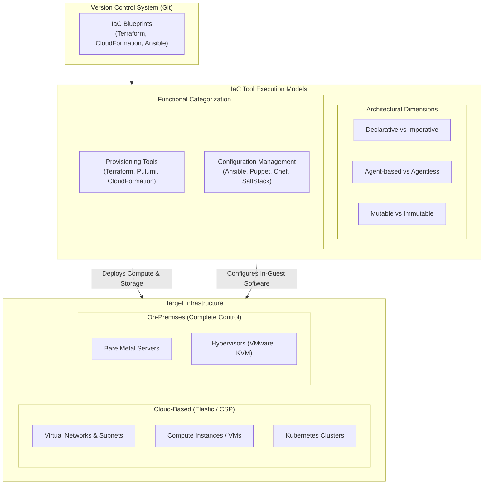
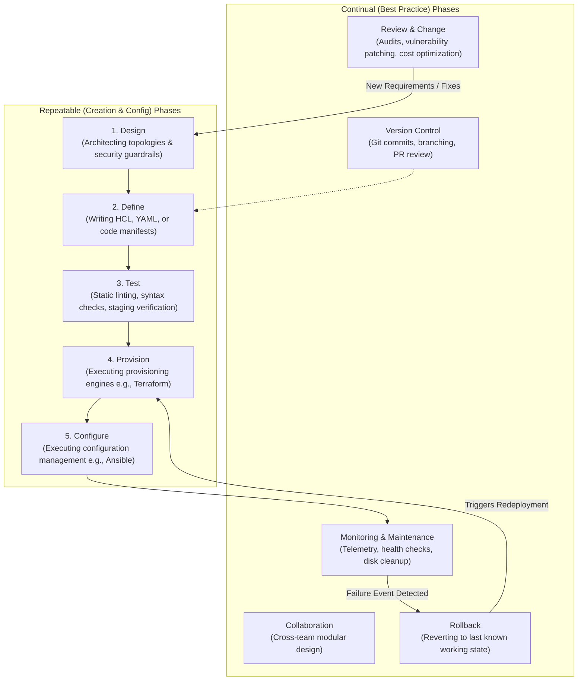

---
layout: post
title: "Intro to IaC - Declarative vs Imperative, Lifecycle, and Virtualisation Primitives"
date: 2026-06-03T10:00:00+03:00
categories:
  - TryHackMe
  - DevSecOps
tags:
  - tryhackme
  - devsecops
  - iac
  - infrastructure-as-code
  - terraform
  - ansible
  - cloudformation
  - virtualization
  - kubernetes
author: muhammed
description: Technical walkthrough of TryHackMe Intro to IaC covering declarative vs imperative models, agent vs agentless architectures, mutable vs immutable patterns, the IaCLC lifecycle, and cloud vs on-prem tradeoffs.
toc: true
pin: false
math: false
mermaid: true
image:
---

## Overview

[Intro to IaC](https://tryhackme.com/room/introtomiac) serves as the entry point for Section 5 (Infrastructure as Code) of the TryHackMe DevSecOps learning path. In preceding sections, we secured application codebases, CI/CD pipelines, and containerized runtime environments. In this module, focus shifts toward automating and securing the underlying infrastructure layers that host those workloads.

This walkthrough covers:
- Core operational problems solved by Infrastructure as Code (IaC)
- Three foundational IaC properties: Scalable, Versionable, and Repeatable
- Architectural paradigms: Declarative vs Imperative, Agent-based vs Agentless, and Mutable vs Immutable
- Separation of duties between Provisioning tools and Configuration Management tools
- The Infrastructure as Code Lifecycle (IaCLC) framework and phase triggers
- Virtualisation primitives (Hypervisor vs Containerisation) and their integration with IaC
- Trade-offs between On-Premises and Cloud-Based IaC deployments
- Walkthrough of interactive terminal challenges and flag retrievals

---

## 1. Why Infrastructure as Code Matters

Prior to IaC adoption, operations and systems administration teams managed infrastructure through manual, fragmented workflows:
- **Manual Hardware & Server Provisioning:** Racking physical servers, connecting cabling, or manually clicking through web consoles to deploy virtual machines.
- **Manual Network Topologies:** Calculating subnets, allocating IP pools, manually configuring routing tables, VLANs, and firewall ACLs.
- **OS & Software Installation:** Manually installing operating systems, applying kernel updates, and setting up runtime software (web servers, database engines, runtimes).
- **Disaster Recovery (DR) Overhead:** Standby failover environments required duplicate manual setups, manual DNS redirects, and high-risk runbooks during outages.

These manual practices produced "snowflake servers" (systems configured with unique, undocumented tweaks that could never be perfectly replicated) and severe configuration drift.

### The Three Pillars of IaC

IaC replaces manual configuration with machine-readable definition files stored in version control:

1. **Scalable:** Cloud providers bill compute and storage per second or minute. Defining infrastructure in code enables programmatic scaling up or down to absorb traffic spikes without manual hardware procurement or ticketing delays.
2. **Versionable:** Treating infrastructure configurations as source code allows teams to commit blueprints into Git. Every change has an auditable commit log, pull-request review trail, and an immediate rollback mechanism to the last known working state when a bad change breaks environments.
3. **Repeatable:** Developers, staging testers, and production systems need identical environments to avoid the classic "works on my machine" problem. IaC scripts deploy identical network topologies, firewall rules, and compute baselines across multiple environments at the push of a button.

---

## 2. Infrastructure as Code Architecture

The modern IaC landscape separates responsibilities between provisioning bare resources and configuring in-guest software:



---

## 3. IaC Architectural Dimensions & Tool Classification

Tools in the IaC domain are differentiated across four primary technical axes.

### 1. Declarative vs Imperative (Functional vs Procedural)

- **Declarative:** You define the desired end state of the infrastructure (the "what"). The IaC engine inspects the current environment, references a state file, calculates the difference, and executes the minimum actions required to reach the target state. Declarative tools are idempotent: applying the same configuration multiple times produces the exact same outcome without duplicating resources.
  - *Examples:* Terraform, AWS CloudFormation, Pulumi, Puppet.
- **Imperative:** You define explicit step-by-step commands that must execute in a strict sequence (the "how"). Imperative scripts generally lack idempotency; executing an imperative script twice on an already provisioned server can result in failed commands, duplicated resources, or service crashes.
  - *Examples:* Chef (Recipes and Cookbooks), custom Bash/PowerShell scripts, procedural SaltStack routines.
- **The Navigation Analogy:** An imperative tool gives turn-by-turn directions assuming you start from an exact baseline coordinate. If your starting point is slightly off, you end up lost. A declarative tool checks your GPS coordinates against destination X and calculates the optimal route to get you there regardless of where you currently stand.

### 2. Agent-Based vs Agentless

- **Agent-Based:** Requires a background software daemon installed on every target machine. The agent communicates periodically with a central management server to pull configurations and report compliance status.
  - *Strengths:* Provides deep telemetry, can enforce configurations even during intermittent network disconnects, and offers fine-grained local enforcement.
  - *Weaknesses:* Requires managing agent lifecycle, monitoring daemon uptime, and opening extra network ports on target machines, which increases attack surface.
  - *Examples:* Puppet, Chef, SaltStack.
- **Agentless:** Interacts directly with target systems using native remote management protocols such as SSH (Linux), WinRM (Windows), or cloud provider APIs.
  - *Strengths:* Zero footprint on target instances, faster provisioning, no agent patching overhead, and seamless integration with ephemeral, auto-scaled instances.
  - *Weaknesses:* Relies entirely on external network connectivity and credentials during execution.
  - *Examples:* Terraform, AWS CloudFormation, Pulumi, Ansible.

### 3. Mutable vs Immutable Infrastructure

- **Mutable:** Modifies existing infrastructure in-place. Updates, patches, and configuration tweaks are applied directly to running servers.
  - *Trade-off:* Saves initial provisioning time and compute overhead, which is suitable for stateful databases requiring persistent local storage. However, partial failures (e.g., two out of three packages install successfully) leave servers in untested, broken intermediate states that cause configuration drift across clusters.
- **Immutable:** Never modifies running servers. When application updates or operating system patches are released, the IaC pipeline provisions completely new servers containing the updated image, runs automated validation tests, redirects traffic (via load balancers or DNS), and tears down the old instances.
  - *Trade-off:* Requires higher temporary compute capacity to support side-by-side deployments, but completely eliminates configuration drift and guarantees that production mirrors tested staging builds.
  - *Examples:* Terraform, AWS CloudFormation, Pulumi.

### 4. Provisioning vs Configuration Management

In production DevSecOps workflows, these two categories are complementary rather than mutually exclusive:
- **Provisioning Tools:** Responsible for creating foundational cloud and network infrastructure: VPCs, subnets, internet gateways, firewall rules, compute instances, block storage, and managed database clusters (Terraform, CloudFormation, Pulumi).
- **Configuration Management Tools:** Responsible for installing software packages, configuring services, managing user accounts, deploying application code, and hardening operating systems on already provisioned compute instances (Ansible, Puppet, Chef, SaltStack).

### IaC Tools Summary Matrix

| Tool | Primary Purpose | Paradigm | Architecture | Mutability Preference | Configuration Language |
|---|---|---|---|---|---|
| **Terraform** | Provisioning | Declarative | Agentless | Immutable | HCL (HashiCorp Configuration Language) |
| **AWS CloudFormation** | Provisioning | Declarative | Agentless | Immutable | YAML / JSON |
| **Pulumi** | Provisioning | Declarative | Agentless | Immutable | General Purpose (Python, Go, JS, TS) |
| **Ansible** | Config Management | Hybrid (Procedural/Declarative) | Agentless (SSH / WinRM) | Mutable | YAML |
| **Puppet** | Config Management | Declarative | Agent-based | Mutable | Puppet DSL |
| **Chef** | Config Management | Imperative | Agent-based | Mutable | Ruby DSL |
| **SaltStack** | Config Management / Orchestration | Hybrid | Agent-based (Minions) or Agentless (Salt SSH) | Mutable | YAML / Python |

---

## 4. The Infrastructure as Code Lifecycle (IaCLC)

Because infrastructure requirements evolve constantly, IaC workflows follow a continuous lifecycle rather than a one-time linear checklist. The IaCLC splits actions into two distinct categories:



### Continual (Best Practice) Phases

These phases operate continuously throughout the lifecycle to guarantee operational stability and security hygiene:
1. **Version Control:** All manifests and configuration files reside in Git. This creates an auditable commit history and establishes rollback baselines.
2. **Collaboration:** Eliminates tribal knowledge and isolated team silos by using modular templates and standard peer review for infrastructure updates.
3. **Monitoring & Maintenance:** Observes running infrastructure for performance anomalies, security alerts, and resource saturation. Automated background jobs handle routine maintenance.
4. **Rollback:** Triggered immediately when monitoring detects post-deployment failures, returning the environment to the prior verified configuration.
5. **Review & Change:** Regular architectural and security audits identify vulnerabilities, inefficient resource allocations, or new business requirements that mandate infrastructure refactoring.

### Repeatable (Creation & Configuration) Phases

These phases execute sequentially whenever provisioning new infrastructure or altering existing deployments:
1. **Design:** Establishing architectural parameters, capacity planning, and security boundaries.
2. **Define:** Writing explicit code definitions and manifests representing the target state.
3. **Test:** Validating code using static linters (tflint, ansible-lint, cfn-lint) and deploying to an isolated staging environment to verify runtime behavior before production.
4. **Provision:** Applying manifests through a provisioning engine (e.g., running `terraform apply`) to build compute, network, and storage assets.
5. **Configure:** Applying configuration management playbooks or scripts (e.g., running `ansible-playbook`) to install packages, configure services, and harden target nodes.

---

## 5. Virtualisation Primitives and IaC Integration

IaC relies on virtualization abstractions to programmatically allocate hardware resources.

### Virtualisation Levels

- **Hypervisor-Level Virtualisation (Type 1 Bare-Metal / Type 2 Hosted):** Divides physical CPU, memory, and storage among multiple independent guest operating systems. Each virtual machine executes its own kernel and OS stack. Provides strong hardware boundary isolation, but requires higher resource overhead and slower startup times.
- **Container-Level Virtualisation (OS-Level):** Shares the host operating system kernel while isolating user space processes using Linux namespaces (PID, NET, MNT, IPC, UTS, USER) and control groups (cgroups). Extremely lightweight with near-instantaneous startup times, enabling rapid autoscaling.

### Six Core Uses of Virtualisation in IaC

1. **Scalability:** Enables IaC engines to spin up or tear down compute instances dynamically based on defined autoscaling metrics.
2. **Resource Isolation:** Enforces CPU, RAM, and I/O caps across co-located workloads so that a spike in one application does not starve neighboring processes.
3. **Testing, Snapshots, and Rollbacks:** Allows taking point-in-time snapshots of VM disks and container images, enabling instant rollbacks and reproducible staging environments.
4. **Templates:** Standardized golden images (AMIs, VM templates, base container images) serve as pre-baked baselines for automated deployment.
5. **Multi-tenancy:** Enables multiple isolated tenant workloads to run securely on shared physical hardware.
6. **Portability:** Decouples workloads from underlying physical hardware, facilitating cloud migrations and multi-cloud disaster recovery.

### Kubernetes Integration with IaC

In modern containerized stacks, IaC tools and container orchestrators operate in tandem:
- **Terraform / CloudFormation:** Provisions the physical or cloud host infrastructure, VPC networking, security groups, and the Kubernetes cluster control plane and worker nodes.
- **Kubernetes (K8s):** Manages pod lifecycles, service discovery, load balancing, and container autoscaling inside that provisioned cluster.
- Using Terraform Kubernetes or Helm providers, engineers can define both the cluster infrastructure and the deployed Kubernetes services within a single declarative repository, benefiting from unified dependency tracking.

---

## 6. On-Premises IaC vs Cloud-Based IaC

| Evaluation Axis | On-Premises IaC | Cloud-Based IaC |
|---|---|---|
| **Location** | Dedicated physical corporate facilities or rented private data centers. | Distributed cloud service provider (CSP) data centers (AWS, Azure, GCP). |
| **Tooling** | Ansible, Puppet, Chef, SaltStack, OpenStack, Vagrant. | Terraform, AWS CloudFormation, Azure ARM/Bicep, Google Cloud Deployment Manager, Pulumi. |
| **Resources** | Physical hardware (bare-metal servers, SAN/NAS storage, hardware switches). | Virtualized, elastic software-defined resources managed by the CSP. |
| **Scalability** | Slow and constrained by physical hardware procurement, delivery, and racking. | Rapid and elastic via auto-scaling groups and API-driven resource provisioning. |
| **Cost Model** | High initial CAPEX for physical hardware, maintenance contracts, power, and cooling. | OPEX pay-as-you-go model billing only for actively running resources. |
| **Primary Advantage** | Absolute control over physical hardware, hardware-level compliance, and strict data sovereignty. | Elasticity, global multi-region availability, zero physical maintenance overhead. |

---

## 7. Interactive Challenges & Terminal Walkthrough

### Task 4 Practical: FlyNet Terminal Reconnaissance

In Task 4, the scenario puts us in the shoes of Ron Connor attempting to access employee records on a FlyNet terminal to retrieve the coordinates of the secret lab complex.

1. Launching the interactive terminal presents an employee training portal interface.
2. Navigating through the terminal menus and bypassing the training prompts reveals the restricted facility coordinates.
3. Extracting the location record yields the challenge flag:

```text
Coordinates acquired: Sector 4 - Lab Complex
Flag: thm{l4b_C0mpl3x_co0rds}
```

### Task 8 Practical: Infrastructure at a Click

Task 8 simulates an interactive defensive confrontation where we deploy automated defenses against machine attacks using IaC concepts:
1. **Provision Points:** Used to instantiate defensive weapon systems, network routers, and communication nodes.
2. **Configure Points:** Used to upgrade existing defensive nodes with hardened configurations and weapon enhancements.
3. **Execution:** By balancing resource allocation between provisioning network nodes and configuring defensive firepower to protect the central server, the defense successfully repels the assault and yields the final completion flag:

```text
System Defense Stabilized. Server Intact.
Flag: thm{1Nfr4StrUctUr3_Pr0}
```

---

## 8. Question, Answer, and Flag Summary

| Task # | Task Title | Question / Challenge | Answer / Flag |
|---|---|---|---|
| **Task 1** | Introduction | I am ready to learn about IaC! | *No answer needed* |
| **Task 2** | IaC - The Concept | Your organisation is preparing to launch a new service called FlyNet. The DevSecOps team provisioned an infrastructure and tested this service in the dev environment. Which IaC characteristic will streamline the provisioning of this same infrastructure in staging and production? | `Repeatable` |
| **Task 2** | IaC - The Concept | It's the day before launch, and the latest infra change has started producing strange errors, something about "destroying humanity". Weird! Which IaC characteristic allows us to go back to the last known working version? | `Versionable` |
| **Task 2** | IaC - The Concept | It's launch day, and it couldn't have gone better; the service is almost running itself! The FlyNet launch has attracted a lot of new customers! Which IaC characteristic enables us to increase the resources available to our infrastructure to meet this increased demand with ease? | `Scalable` |
| **Task 3** | IaC - The Tools Part 1 | In the scenario given, which type of IaC tool considers where you are on the map and gives instructions to reach the desired X point? | `Declarative` |
| **Task 4** | IaC - The Tools Part 2 | Can you retrieve the location and retrieve the flag? | `thm{l4b_C0mpl3x_co0rds}` |
| **Task 5** | Infrastructure as Code Lifecycle | A DevSecOps Engineer at CyberMyne is looking for guidance on developing their next infrastructure. What type of phases provide guidance during the development or configuration of an infrastructure? | `Repeatable` |
| **Task 5** | Infrastructure as Code Lifecycle | What type of phases ensure best practices throughout infrastructure development and management? | `Continual` |
| **Task 5** | Infrastructure as Code Lifecycle | The 'Monitoring/Maintenance' continual phase can trigger which other continual phase? | `Rollback` |
| **Task 6** | Virtualisation & IaC | CyberMine is deploying the latest machine model E-1000. This model requires virtualisation at an operating system level to allow for lightweight and rapid deployment behind the scenes! What level of virtualisation would be needed for this? | `Containerisation` |
| **Task 6** | Virtualisation & IaC | CyberMine's E-100 Model is still very popular for all your extermination needs, this model requires multiple OS to run on a single machine. Which level of virtualisation would be needed for this? | `Hypervisor` |
| **Task 6** | Virtualisation & IaC | The new E-1000 model has a feature that allows it to pass through physical objects. Wild! This new feature, however, is very resource-intensive. Which 'Use of IaC' will ensure that this resource consumption won't affect the performance of the machine's other components? | `Resource Isolation` |
| **Task 6** | Virtualisation & IaC | Due to the resource consumption of this new feature, it requires rapid scaling of resources. Which container orchestration software can be used to automate this process? | `Kubernetes` |
| **Task 7** | On-Prem IaC vs. Cloud-Based IaC | Cloud-based resources are provisioned/configured in a cloud environment. Who handles the underlying infrastructure? | `cloud service provider` |
| **Task 7** | On-Prem IaC vs. Cloud-Based IaC | What category does on-prem infrastructure struggle with due to hardware limitations when facing increased traffic? | `scalability` |
| **Task 8** | IaC - The Final Push | Can you get the flag using your infrastructure as code skills? | `thm{1Nfr4StrUctUr3_Pr0}` |

---

## You can find me online at:


- **GitHub:** [Mhdomer](https://github.com/Mhdomer)
- **LinkedIn:** [mhd3omar](https://www.linkedin.com/in/mhd3omar/)
- **Tryhackme:** [nonlouy](https://tryhackme.com/p/nonlouy)
